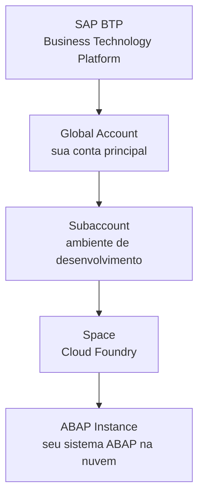

# Aula 01: Preparando o Ambiente de Desenvolvimento

## 🎯 Objetivos de Aprendizagem

Depois de completar a aula, você será capaz de:

- Criar um projeto ABAP Cloud.

---

## Preparando o Ambiente de Desenvolvimento ABAP

### Antes de começar: o que é ABAP e onde ele "roda"?

**ABAP** é a linguagem de programação
nativa dos sistemas SAP. É com ela que se constroem relatórios, transações,
interfaces e aplicações que rodam dentro do ecossistema SAP (como o S/4HANA).

> 💡 **Analogia .NET:** ABAP está para SAP assim como C# está para o ecossistema
> Microsoft/.NET. Só que em vez de usar Visual Studio, usamos o **Eclipse** com um
> plugin chamado **ADT** (_ABAP Development Tools_).

---

### 🔧 O que você vai instalar e configurar

| Ferramenta                         | Para que serve                                     | Análogo no mundo .NET                   |
| ---------------------------------- | -------------------------------------------------- | --------------------------------------- |
| **Eclipse IDE**                    | Editor de código para ABAP                         | Visual Studio / VS Code                 |
| **ADT** (_ABAP Development Tools_) | Plugin que transforma o Eclipse em uma IDE ABAP    | Extensão C# Dev Kit no VS Code          |
| **ABAP Cloud Project**             | Conexão entre seu Eclipse e o sistema SAP na nuvem | Conectar VS Code a um Azure App Service |

---

### 📋 Pré-requisitos

Antes de começar, você precisa de:

1. **Um computador** (Windows, macOS ou Linux) com pelo menos 8 GB de RAM.
2. **Acesso à internet** — o sistema ABAP que usaremos fica na nuvem (SAP BTP).
3. **Uma conta no SAP Learning Hub** — para acessar o sistema de prática hands-on.
   - Se ainda não tiver, crie em: [https://learning.sap.com](https://learning.sap.com)
4. **A URL do SAP BTP ABAP Environment** (também chamada de _Service Instance URL_)
   — você receberá essa URL ao reservar o ambiente de prática no curso.

---

### 🪜 Passo 1: Instalar o Eclipse IDE

O Eclipse é a base. O ADT funciona dentro dele.

1. Acesse [https://www.eclipse.org/downloads/](https://www.eclipse.org/downloads/)
2. Baixe o **Eclipse IDE for Java Developers** (versão mais estável para ADT).
3. Execute o instalador e siga as instruções padrão.
4. Ao terminar, abra o Eclipse para confirmar que funciona.

> ⚠️ **Importante:** O Eclipse **não** é um editor leve como o VS Code. Ele pode
> demorar um pouco para abrir na primeira vez. Isso é normal.

---

### 🪜 Passo 2: Instalar o plugin ADT (ABAP Development Tools)

Agora vamos "ensinar" o Eclipse a falar ABAP.

1. No Eclipse, vá ao menu: **Help → Install New Software...**
2. No campo **Work with**, cole a URL abaixo:

   ```
   https://tools.hana.ondemand.com/latest
   ```

3. Pressione **Enter** e aguarde o Eclipse buscar os pacotes disponíveis.
4. Na lista que aparece, expanda **ABAP Development Tools**.
5. Selecione **ABAP Development Tools for Eclipse**.
6. Clique em **Next** até chegar na tela de licenças.
7. Aceite os termos e clique em **Finish**.
8. O Eclipse fará o download e a instalação. Isso pode levar alguns minutos.
9. Quando solicitado, **reinicie o Eclipse**.

> 💡 **Dica:** Se a URL `https://tools.hana.ondemand.com/latest` não funcionar,
> verifique a [página oficial de instalação do ADT](https://developers.sap.com/tutorials/abap-install-adt.html)
> para a URL mais atualizada.

---

### 🪜 Passo 3: Abrir a perspectiva ABAP

Depois de instalar o ADT e reiniciar o Eclipse:

1. No menu superior, vá em **Window → Perspective → Open Perspective → Other...**
2. Na janela que abrir, procure por **ABAP** e dê duplo clique.
3. O layout do Eclipse mudará — agora você está na **perspectiva ABAP**, otimizada
   para desenvolvimento SAP.

> 💡 **Analogia:** "Perspectiva" no Eclipse é como "Layout" no VS Code. É um
> conjunto pré-configurado de painéis e ferramentas para um tipo específico de
> trabalho.

---

### 🪜 Passo 4: Criar um ABAP Cloud Project

Este é o objetivo principal da aula: conectar seu Eclipse ao sistema ABAP na nuvem.

#### 4.1 Localize o sistema ABAP na SAP BTP (entendendo a estrutura)

Antes de criar o projeto, é útil entender onde o sistema ABAP "mora":



> 💡 **Analogia .NET/Azure:**
>
> - **SAP BTP** = Azure (plataforma de nuvem)
> - **Global Account** = Assinatura Azure (_subscription_)
> - **Subaccount** = Resource Group
> - **ABAP Instance** = App Service onde seu código ABAP roda

#### 4.2 Criar o projeto no Eclipse

1. No Eclipse, vá em **File → New → ABAP Cloud Project**.
2. Uma janela de configuração se abrirá. Você tem duas opções:

   **Opção A — Usando a Service Instance URL (recomendado):**
   - Cole a URL fornecida no campo **ABAP Service Instance URL**.
   - Clique em **Next**.

   **Opção B — Usando um arquivo Service Key:**
   - Selecione **Extract**.
   - Clique em **Import...** e selecione o arquivo da Service Key.
   - Após importar, clique em **Copy to Clipboard**.
   - Clique em **Close**.
   - Cole no campo **ABAP Service Instance URL** (Ctrl + V).
   - Clique em **Next**.

3. Clique em **Open Logon Page in Browser**.
4. Seu navegador abrirá uma página de login da SAP. Faça login com o usuário e
   senha do **SAP Learning Hub**.
5. Após ver a mensagem _"You have been successfully logged on"_, feche o navegador
   e volte ao Eclipse.
6. Clique em **Finish**.

Se tudo der certo, você verá seu projeto ABAP Cloud na aba **Project Explorer**
no lado esquerdo do Eclipse.

---

### ✅ Verificação: deu certo?

No **Project Explorer** (lado esquerdo do Eclipse), você deve ver:

```
SeuProjeto [ABAP Cloud Project]
├── Favorite Packages
├── ...
```

Se o projeto aparecer sem erros, **parabéns!** 🎉 Você acabou de conectar seu
ambiente de desenvolvimento ao sistema ABAP na nuvem.

---

### ❓ Perguntas Frequentes

<details>
<summary><b>"Não tenho a URL do Service Instance. Onde consigo uma?"</b></summary>

Acesse o curso no SAP Learning e siga o link para reservar o sistema de prática
hands-on: [Practice Systems - Basic ABAP Programming](https://learning.sap.com/practice-systems/basic-abap-programming).
Após a reserva, você receberá a URL.

</details>

<details>
<summary><b>"O Eclipse não mostra a opção ABAP Cloud Project no menu File → New."</b></summary>

Provavelmente o plugin ADT não foi instalado ou não carregou. Verifique:

1. Vá em **Help → About Eclipse → Installation Details**.
2. Procure por _ABAP Development Tools_ na lista de plugins instalados.
3. Se não estiver, refaça o **Passo 2**.
4. Se estiver mas a opção não aparece, tente reiniciar o Eclipse com a perspectiva
ABAP aberta.
</details>

<details>
<summary><b>"Por que ABAP Cloud Project e não ABAP Project?"</b></summary>

- **ABAP Cloud Project** → conecta a sistemas ABAP na nuvem (SAP BTP ou
  S/4HANA Public Cloud). É o que usamos neste curso.
- **ABAP Project** → conecta a sistemas ABAP on-premise (servidores locais).
Não usaremos este tipo no curso básico.
</details>

---

### 📚 O que aprendemos

| Conceito                 | Significado                                            |
| ------------------------ | ------------------------------------------------------ |
| **Eclipse**              | IDE que usamos para programar em ABAP                  |
| **ADT**                  | Plugin que adiciona suporte ABAP ao Eclipse            |
| **ABAP Cloud Project**   | Conexão do Eclipse com um sistema ABAP na nuvem        |
| **SAP BTP**              | Plataforma de nuvem da SAP (como Azure para Microsoft) |
| **Service Instance URL** | Endereço do sistema ABAP na nuvem                      |

---

### 📖 Novos Termos (Glossário)

Estes são os termos do ecossistema SAP que apareceram nesta aula.
Consulte o [glossário completo](../../../GLOSSARY.md) para ver todos os termos.

| Termo | Definição rápida |
|---|---|
| [ABAP](../../../GLOSSARY.md#abap-advanced-business-application-programming) | Linguagem de programação nativa dos sistemas SAP |
| [ABAP Cloud Project](../../../GLOSSARY.md#abap-cloud-project) | Conexão do Eclipse com um sistema ABAP na nuvem |
| [ABAP Instance](../../../GLOSSARY.md#abap-instance) | Instância do sistema ABAP que executa seu código |
| [ABAP Project](../../../GLOSSARY.md#abap-project) | Conexão do Eclipse com sistema ABAP on-premise |
| [ADT](../../../GLOSSARY.md#adt-abap-development-tools) | Plugin que transforma o Eclipse em IDE ABAP |
| [Cloud Foundry](../../../GLOSSARY.md#cloud-foundry) | Plataforma de deploy na nuvem dentro da SAP BTP |
| [Eclipse IDE](../../../GLOSSARY.md#eclipse-ide) | IDE base usada para desenvolvimento ABAP |
| [Global Account](../../../GLOSSARY.md#global-account) | Conta principal na SAP BTP (equivale a Subscription) |
| [S/4HANA](../../../GLOSSARY.md#s4hana) | ERP de última geração da SAP |
| [SAP BTP](../../../GLOSSARY.md#sap-btp-business-technology-platform) | Plataforma de nuvem da SAP (análogo ao Azure) |
| [SAP Learning Hub](../../../GLOSSARY.md#sap-learning-hub) | Plataforma oficial de treinamento SAP |
| [Service Instance URL](../../../GLOSSARY.md#service-instance-url) | URL de acesso ao sistema ABAP na nuvem |
| [Service Key](../../../GLOSSARY.md#service-key) | Arquivo JSON com credenciais de acesso |
| [Space](../../../GLOSSARY.md#space) | Subdivisão de uma Subaccount no Cloud Foundry |
| [Subaccount](../../../GLOSSARY.md#subaccount) | Subdivisão de uma Global Account (equivale a Resource Group) |

---

### ⏭️ Próxima aula

[Lesson 02: Taking a First Look at ABAP](../02-taking-a-first-look-at-abap/)
— onde vamos explorar o código ABAP pela primeira vez dentro do Eclipse.
