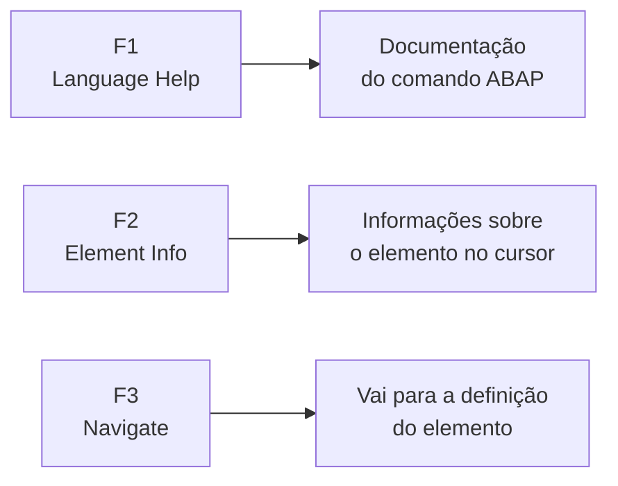

# Aula 02: Primeiro Contato com o Código ABAP

## 🎯 Objetivos de Aprendizagem

Depois de completar esta aula, você será capaz de:

- Trabalhar com um objeto de desenvolvimento (_development object_).

---

## 📖 Guia Passo a Passo: Explorando Código ABAP no Eclipse

### 🧭 Antes de começar: o que é um "objeto de desenvolvimento"?

No ecossistema SAP, tudo que você cria ou modifica — classes, programas,
tabelas, interfaces — é chamado de **objeto de desenvolvimento** (_development
object_ ou _repository object_). O conjunto completo de objetos de
desenvolvimento no sistema é chamado de **ABAP Repository** (repositório ABAP).

> 💡 **Analogia .NET:** Um _development object_ no SAP é como qualquer arquivo
> de código no .NET — uma classe `.cs`, uma interface, um arquivo `.csproj`.
> A diferença é que no SAP esses objetos ficam armazenados dentro do próprio
> sistema (no _Repository_), não em um sistema de arquivos local.

Nesta aula, você não vai escrever código — você vai **aprender a navegar e
inspecionar** código ABAP que já existe no sistema. É como aprender a usar o
_Solution Explorer_ e os atalhos de navegação do Visual Studio antes de começar
a programar de fato.

---

### 🔧 O que você vai usar

| Ferramenta/Conceito  | Para que serve                                                 | Análogo no mundo .NET                            |
| -------------------- | -------------------------------------------------------------- | ------------------------------------------------ |
| **Project Explorer** | Navegar pelos pacotes e objetos do sistema ABAP                | Solution Explorer no Visual Studio               |
| **Ctrl + Shift + A** | Atalho para abrir qualquer objeto de desenvolvimento pelo nome | Ctrl + T (_Go to All_) no VS Code                |
| **F1**               | Exibe a documentação da linguagem ABAP para o comando atual    | F1 (_Help_) no Visual Studio                     |
| **F2**               | Exibe informações sobre o elemento sob o cursor                | _Quick Info_ ao passar o mouse no VS             |
| **F3**               | Navega para a definição do elemento sob o cursor               | F12 (_Go to Definition_) no VS Code              |
| **Ctrl + F**         | Buscar texto dentro do código-fonte                            | Ctrl + F em qualquer editor                      |
| **Link with Editor** | Sincroniza o Project Explorer com o arquivo aberto no editor   | _Sync with Active Document_ no Solution Explorer |

---

### 📋 Pré-requisitos

Antes de começar esta aula, você precisa ter:

1. **Eclipse IDE** instalado com o plugin [ADT](../../../GLOSSARY.md#adt-abap-development-tools) (Aula 01).
2. Um [ABAP Cloud Project](../../../GLOSSARY.md#abap-cloud-project) criado e
   conectado ao sistema SAP BTP (Aula 01).
3. Acesso ao pacote `/DMO/FLIGHT` no sistema de prática.

---

### 🪜 Passo 1: Conhecer o Project Explorer

O **Project Explorer** é o painel principal de navegação no Eclipse. É aqui que
você encontra todos os objetos do sistema ABAP organizados em uma árvore
hierárquica.

```
Seu Projeto [ABAP Cloud Project]
├── Favorite Packages          ← seus pacotes favoritos
│   ├── ZS4D400_##            ← seu pacote pessoal
│   └── /DMO/FLIGHT            ← pacote de exemplo do curso
├── ...
```

#### 1.1 Adicionar um pacote aos favoritos

Para acessar rapidamente os objetos com os quais você mais trabalha, adicione
os pacotes à lista de **Favorite Packages** (pacotes favoritos):

1. No **Project Explorer**, clique com botão direito em **Favorite Packages**.
2. Escolha **Add Package...**.
3. Digite um termo de busca (ex: `/DMO/FLIGHT`).
4. Dê duplo clique no pacote desejado.
5. Clique em **OK**.

> 💡 **Analogia .NET:** Adicionar um pacote aos favoritos é como "pin" uma
> pasta no Quick Access do Windows Explorer, ou adicionar uma solution a um
> _favorite_ no Visual Studio.

---

### 🪜 Passo 2: Abrir um Objeto de Desenvolvimento

Existem duas formas de abrir um objeto no Eclipse:

#### Forma A — Pelo Project Explorer (navegação visual)

1. Expanda **Favorite Packages** → nome do pacote.
2. Navegue pela árvore até encontrar o objeto.
3. Dê **duplo clique** no objeto.

#### Forma B — Pelo atalho Ctrl + Shift + A (busca rápida)

1. Pressione **Ctrl + Shift + A**.
2. Digite parte do nome do objeto (ex: `/DMO/CL_FLIGHT`).
3. Selecione o objeto na lista de resultados.
4. Clique em **OK**.

> 💡 **Analogia .NET:** O `Ctrl + Shift + A` do Eclipse é idêntico ao
> `Ctrl + T` (_Go to All_) do VS Code ou `Ctrl + ,` (_Navigate To_) do Visual
> Studio. Você digita parte do nome e o sistema busca em todo o repositório.

---

### 🪜 Passo 3: As Teclas de Função Essenciais (F1, F2, F3)

Quando você está com um código ABAP aberto no editor, três teclas de função
são suas melhores amigas:



#### F1 — ABAP Language Help (Ajuda da Linguagem)

Coloque o cursor sobre qualquer **comando ABAP** (também chamado de _statement_)
e pressione **F1**. O Eclipse abrirá a documentação oficial da SAP para aquele
comando.

> 💡 **Analogia .NET:** Equivalente a pressionar F1 em cima de
> `Console.WriteLine` no Visual Studio — abre a documentação da Microsoft.

#### F2 — Element Info (Informação do Elemento)

Coloque o cursor sobre qualquer elemento (variável, tipo, tabela) e pressione
**F2**. Um popup mostrará metadados: tipo, pacote, data de criação, etc.

> 💡 **Analogia .NET:** Equivalente ao tooltip _Quick Info_ que aparece ao
> passar o mouse sobre um símbolo no Visual Studio.

#### F3 — Navigate To Definition (Navegar para Definição)

Coloque o cursor sobre um elemento e pressione **F3**. O Eclipse abrirá o
código-fonte onde aquele elemento foi definido. Para **voltar** ao ponto
anterior, use **Alt + ←** (Alt + Seta Esquerda).

> 💡 **Analogia .NET:** F12 (_Go to Definition_) no VS Code. O Alt + ← é o
> equivalente ao _Navigate Back_.

---

### 🪜 Passo 4: Exercício Prático — Analisar a Classe /DMO/CL_FLIGHT_LEGACY

Agora vamos colocar em prática tudo o que aprendemos. O objetivo é explorar
uma classe ABAP que já existe no sistema, **sem se preocupar em entender o
código** — o foco é puramente na navegação.

#### 4.1 Adicionar o pacote /DMO/FLIGHT aos favoritos

1. No **Project Explorer**, clique com botão direito em **Favorite Packages**.
2. Escolha **Add Package...**.
3. Digite `/DMO/FLIGHT`.
4. Dê duplo clique no resultado e clique em **OK**.

#### 4.2 Abrir a classe /DMO/CL_FLIGHT_LEGACY

1. Pressione **Ctrl + Shift + A**.
2. Digite `/DMO/CL_FLIGHT`.
3. Selecione `/DMO/CL_FLIGHT_LEGACY (Class)` e clique em **OK**.

A classe será aberta no editor de código ABAP.

#### 4.3 Inspecionar os metadados da classe

1. Com o cursor em qualquer lugar do código da classe, localize a aba
   **Properties** na parte inferior do editor.
2. Clique nela para ver os dados administrativos: linguagem original, data da
   última modificação, pacote, etc.

#### 4.4 Localizar a classe no Project Explorer

1. Com a classe ainda aberta, clique no ícone **Link with Editor** (duas
   setas) na barra de ferramentas do Project Explorer.
2. O Project Explorer expandirá automaticamente a árvore até mostrar onde
   `/DMO/CL_FLIGHT_LEGACY` está localizada.

#### 4.5 Buscar texto no código

1. Posicione o cursor na primeira linha do código.
2. Pressione **Ctrl + F**.
3. Digite `get_instance( )->get` (com exatamente um espaço entre os
   parênteses).
4. O editor destacará a ocorrência encontrada.

#### 4.6 Navegar com F3

1. Na linha onde `get` aparece, posicione o cursor sobre a palavra `get`.
2. Pressione **Ctrl** e clique em `get`, depois escolha
   **Navigate to Implementation**. Ou simplesmente pressione **F3**.
3. O Eclipse abrirá a implementação do método `get`.

#### 4.7 Inspecionar com F2

1. Algumas linhas abaixo, localize uma linha começando com `SELECT`.
2. Posicione o cursor sobre `/dmo/travel` (após a palavra `FROM`).
3. Pressione **F2** para ver informações sobre esse elemento.

#### 4.8 Consultar a documentação com F1

1. Na mesma linha `SELECT`, posicione o cursor sobre a palavra `SELECT`.
2. Pressione **F1**.
3. A view **ABAP Language Help** abrirá com a documentação do comando
   `SELECT`.

> ⚠️ **Importante:** Se a ajuda mostrar que o resultado não é suportado na
> versão atual da linguagem, digite `SELECT` no campo de busca da view e
> pressione Enter. Não se preocupe em entender a documentação agora.

---

### ✅ Verificação: deu certo?

Após completar o exercício, você deve ser capaz de:

- ✅ Abrir qualquer objeto de desenvolvimento usando **Ctrl + Shift + A**.
- ✅ Navegar até a definição de um elemento com **F3**.
- ✅ Ver informações de um elemento com **F2**.
- ✅ Consultar a documentação de um comando ABAP com **F1**.
- ✅ Localizar objetos no Project Explorer usando **Link with Editor**.

---

### ❓ Perguntas Frequentes

<details>
<summary><b>"Qual a diferença entre pacote e objeto de desenvolvimento?"</b></summary>

Um **pacote** é um container que agrupa objetos de desenvolvimento. Um
**objeto de desenvolvimento** é o item individual (classe, programa, tabela).
Pense no pacote como uma pasta e nos objetos como os arquivos dentro dela.

</details>

<details>
<summary><b>"Por que o curso usa a classe /DMO/CL_FLIGHT_LEGACY como exemplo?"</b></summary>

É uma classe de demonstração que a SAP disponibiliza em todos os sistemas de
treinamento. Ela contém código ABAP real e é simples o suficiente para um
iniciante explorar sem se perder. O prefixo `/DMO/` indica que é um objeto do
namespace de demonstração da SAP.

</details>

<details>
<summary><b>"Preciso entender o código da classe agora?"</b></summary>

**Não.** O objetivo desta aula é puramente aprender a **navegar** no ambiente.
Entender o que o código faz virá nas próximas aulas. O próprio curso reforça:
"_You are not required to read the code in this exercise._"

</details>

<details>
<summary><b>"Como volto para o código anterior depois de usar o F3?"</b></summary>

Use **Alt + ←** (Alt + Seta Esquerda). Funciona como o botão _Voltar_ do
navegador ou o _Navigate Back_ do Visual Studio.

</details>

---

### 📚 O que aprendemos

| Conceito                      | Significado                                                                  |
| ----------------------------- | ---------------------------------------------------------------------------- |
| **Objeto de Desenvolvimento** | Qualquer item de código no repositório ABAP (classe, programa, tabela, etc.) |
| **Project Explorer**          | Painel de navegação hierárquica do Eclipse                                   |
| **Favorite Packages**         | Lista de atalhos para pacotes que você mais usa                              |
| **Ctrl + Shift + A**          | Atalho universal para abrir qualquer objeto pelo nome                        |
| **F1**                        | Abre a documentação da linguagem ABAP para o comando atual                   |
| **F2**                        | Exibe metadados do elemento sob o cursor                                     |
| **F3**                        | Navega para a definição do elemento sob o cursor                             |
| **Link with Editor**          | Sincroniza Project Explorer com o arquivo aberto                             |

---

### 📖 Novos Termos (Glossário)

Estes são os termos do ecossistema SAP que apareceram nesta aula.
Consulte o [glossário completo](../../../GLOSSARY.md) para ver todos os termos.

| Termo                                                                                         | Definição rápida                                           |
| --------------------------------------------------------------------------------------------- | ---------------------------------------------------------- |
| [Classe ABAP](../../../GLOSSARY.md#classe-abap)                                               | Estrutura fundamental da orientação a objetos em ABAP      |
| [Objeto de Desenvolvimento](../../../GLOSSARY.md#objeto-de-desenvolvimento-repository-object) | Qualquer item de código armazenado no repositório ABAP     |
| [Project Explorer](../../../GLOSSARY.md#project-explorer)                                     | Painel de navegação hierárquica dos objetos no Eclipse ADT |
| [Repositório ABAP](../../../GLOSSARY.md#repositorio-abap-abap-repository)                     | Conjunto completo de objetos de desenvolvimento do sistema |

---

### ⏭️ Próxima aula

[Lesson 03: Understanding Software Structure and Logistics](../03-understanding-software-structure-and-logistics/)
— onde vamos entender como o código ABAP é organizado em pacotes e transportado
entre ambientes.
