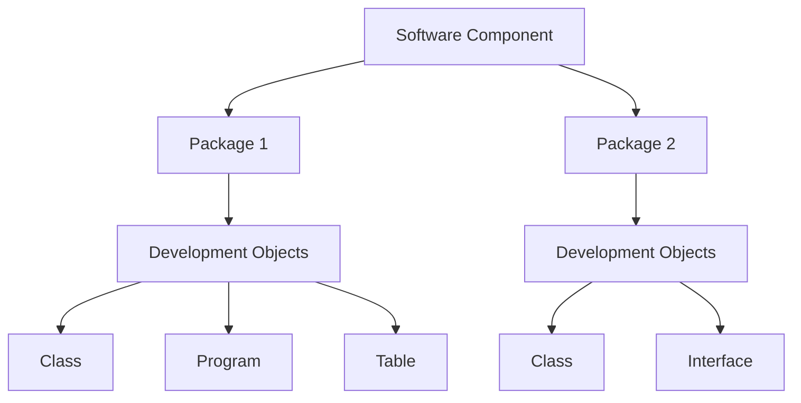
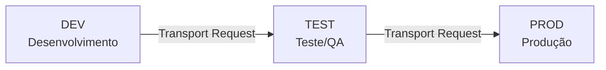

# Aula 03: Estrutura de Software e Logística de Transporte no ABAP

## 🎯 Objetivos de Aprendizagem

Depois de completar esta aula, você será capaz de:

- Criar um pacote ABAP (_ABAP package_).

---

## 📖 Guia Passo a Passo: Entendendo a Organização do Código ABAP

### 🧭 Antes de começar: como o código ABAP é organizado?

No mundo .NET, você organiza código em _projects_ (`.csproj`), _solutions_
(`.sln`) e _namespaces_. No ecossistema SAP, a organização segue uma hierarquia
própria — mas o princípio é o mesmo: agrupar código relacionado e controlar
como ele se move entre ambientes.

A hierarquia de organização do código ABAP é:



Vamos entender cada nível dessa hierarquia:

- **Software Component** (_componente de software_): a unidade máxima de
  agrupamento. Agrupa múltiplos [pacotes](../../../GLOSSARY.md#pacote-package)
  para fins de transporte e versionamento. É como uma _solution_ (`.sln`) no
  .NET — contém vários "projetos" dentro.

  > 💡 **Analogia .NET:** Um _Software Component_ está para uma _Solution_
  > (.sln) assim como um _Package_ está para um _Project_ (.csproj).

- **Package** (_pacote_): o container que agrupa objetos de desenvolvimento
  que logicamente pertencem ao mesmo contexto. Todo objeto ABAP (classe,
  programa, tabela) **precisa** estar dentro de um pacote.

  > 💡 **Analogia .NET:** Um pacote ABAP é como um _namespace_ + _project
  > folder_ no .NET. É a unidade de organização e transporte do código.

- **Development Object** (_objeto de desenvolvimento_): o item individual —
  uma classe, um programa, uma tabela, uma interface. É o equivalente a um
  arquivo `.cs` no .NET.

Nesta aula, você vai **criar seu próprio pacote** — o container onde todo o
código que você escrever neste curso será armazenado.

---

### 🔧 O que você vai usar

| Ferramenta/Conceito | Para que serve | Análogo no mundo .NET |
|---|---|---|
| **Package** | Container que agrupa objetos de desenvolvimento ABAP | Namespace + Project folder |
| **Software Component** | Agrupa pacotes para transporte e versionamento | Solution (.sln) |
| **Transport Request** | Mecanismo que transporta código entre ambientes (DEV → TEST → PROD) | Pull Request + CI/CD pipeline |
| **Superpackage** | Pacote que contém outros pacotes (subpacotes) | Solution folder no VS |
| **Favorite Packages** | Lista de atalhos para pacotes frequentes no Project Explorer | Pastas "pinadas" no Quick Access |

---

### 📋 Pré-requisitos

Antes de começar esta aula, você precisa ter:

1. **Eclipse IDE** com o plugin [ADT](../../../GLOSSARY.md#adt-abap-development-tools) instalado (Aula 01).
2. Um [ABAP Cloud Project](../../../GLOSSARY.md#abap-cloud-project) criado e
   conectado ao sistema SAP BTP (Aula 01).
3. Familiaridade com o **Project Explorer** e o atalho **Ctrl + Shift + A**
   (Aula 02).

---

### 🪜 Passo 1: Entender a Hierarquia de Organização do Código

Antes de criar um pacote, é importante entender **onde** ele se encaixa na
estrutura maior do sistema. No Eclipse, abra o **Project Explorer** e observe
a hierarquia:

```
Seu Projeto [ABAP Cloud Project]
├── ZLOCAL                          ← Software Component
│   └── ZS4D400_##                  ← Package
│       └── Classes, Programs...    ← Development Objects
├── Favorite Packages
│   └── /DMO/FLIGHT                 ← Package de demonstração
└── ...
```

Note que:
- O **Software Component** `ZLOCAL` é onde ficam os pacotes de desenvolvimento
  local (objetos com prefixo `Z*`).
- O prefixo `Z` é uma convenção SAP: objetos criados por clientes **devem**
  começar com `Z` ou `Y` para não conflitar com objetos padrão da SAP.
- O pacote `ZS4D400_##` é o pacote individual — é o equivalente ao número do
  curso (`S4D400`) seguido do seu número de aluno (`##`).

> 💡 **Analogia .NET:** O prefixo `Z` no SAP é como o namespace
> `MyCompany.` no .NET — uma convenção para separar seu código do código
> de terceiros (Microsoft, SAP, etc.).

> ⚠️ **Importante:** Substitua `##` pelo número de aluno que você recebeu
> ao reservar o sistema de prática. Exemplo: se você é o aluno 03, use
> `ZS4D400_03`.

---

### 🪜 Passo 2: Criar um Novo Pacote ABAP

Agora vamos criar o pacote que será o "container" de todo o código que você
escreverá neste curso.

1. No **Project Explorer**, clique com botão direito no nome do seu projeto
   ABAP Cloud.

2. Navegue até: **New → ABAP Package**.

3. Na janela que abrir, preencha:

   | Campo | Valor | Explicação |
   |---|---|---|
   | **Name** | `ZS4D400_##` | Nome do pacote (substitua `##` pelo seu número) |
   | **Description** | `Package for Basic ABAP Programming` | Descrição livre |
   | **Superpackage** | `ZLOCAL` | O pacote "pai" |

   > ℹ️ **Nota:** No ABAP Cloud (SAP BTP), o **Software Component** não aparece
   > como campo separado na tela de criação — ele é herdado automaticamente do
   > superpackage. Se você estiver curioso sobre a diferença entre os dois
   > conceitos:
   >
   > - **Superpackage** = pacote que contém outros pacotes (hierarquia).
   > - **Software Component** = unidade de transporte e versionamento.
   >
   > No nosso caso, `ZLOCAL` atua como ambos. Você não precisa se preocupar
   > com essa distinção agora.

4. Clique em **Next**.

5. Na próxima tela, você verá os detalhes do pacote. Mantenha as opções
   padrão e clique em **Next**.

6. Na tela de **Transport Request**, você tem duas opções:

   **Opção A — Criar um novo Transport Request:**
   - Clique no ícone **Create** (folha com sinal de +).
   - Dê uma descrição significativa, como: `Transport for package ZS4D400_##`.
   - Clique em **OK**.

   **Opção B — Usar um Transport Request existente:**
   - Selecione um Transport Request da lista.
   - Clique em **Finish**.

7. Clique em **Finish**.

Se tudo deu certo, você verá o pacote `ZS4D400_##` aparecer no **Project
Explorer**, dentro do superpackage `ZLOCAL`.

> 💡 **Analogia .NET:** Criar um pacote ABAP é como criar um novo projeto
> dentro de uma solution. O Transport Request é o mecanismo que empacota
> suas mudanças para movê-las entre ambientes — similar a um _Pull Request_
> que, ao ser aprovado, dispara uma _CI/CD pipeline_.

---

### 🪜 Passo 3: Adicionar o Pacote aos Favoritos

Para acessar rapidamente seu pacote durante o curso:

1. No **Project Explorer**, clique com botão direito em **Favorite Packages**.
2. Escolha **Add Package...**.
3. Digite `ZS4D400_##` (com seu número de aluno).
4. Dê duplo clique no pacote encontrado.
5. Clique em **OK**.

Agora seu pacote aparece na seção **Favorite Packages** — igual ao
`/DMO/FLIGHT` que você adicionou na Aula 02.

---

### ✅ Verificação: deu certo?

No **Project Explorer**, você deve ver:

```
Favorite Packages
├── ZS4D400_##          ← seu pacote recém-criado
├── /DMO/FLIGHT          ← pacote de demonstração
```

Para confirmar que o pacote foi criado corretamente:

1. Expanda `ZS4D400_##` no Project Explorer.
2. Você verá as subpastas vazias: **Classes**, **Programs**, **Tables**, etc.
   — prontas para receber seus objetos de desenvolvimento nas próximas aulas.

---

### 🧭 Entendendo a Logística de Transporte

Agora que você criou um pacote, vamos entender **como o código viaja** entre
ambientes no mundo SAP. Este é um conceito fundamental que permeia todo o
desenvolvimento ABAP.

#### O Transport Request

Um **Transport Request** (_TR_) é o mecanismo que registra e transporta
mudanças entre ambientes SAP. Pense nele como um "container de mudanças" —
tudo que você cria ou modifica é atribuído a um TR.



> 💡 **Analogia .NET:** O Transport Request é como um _Pull Request_ +
> _CI/CD pipeline_ combinados. Ele:
> - Agrupa mudanças relacionadas (como um PR).
> - Controla o fluxo entre ambientes (como uma pipeline DevOps).
> - Bloqueia objetos para evitar conflitos de edição (como um _lock_ de arquivo).

#### Por que isso importa?

No ecossistema SAP, você **nunca** edita código diretamente em produção. O
fluxo típico é:

1. **DEV** (Desenvolvimento): você cria/modifica objetos no pacote. Tudo fica
   registrado em um Transport Request.
2. **TEST** (Teste/QA): o Transport Request é "liberado" e importado no
   ambiente de teste. Testes são executados.
3. **PROD** (Produção): após aprovação, o mesmo Transport Request é importado
   em produção.

Durante este curso, trabalharemos apenas no ambiente de desenvolvimento
(**DEV**), mas é importante saber que cada mudança que você faz está sendo
registrada em um Transport Request — pronto para ser transportado quando
necessário.

> ⚠️ **Importante:** Enquanto um objeto está em um Transport Request **não
> liberado**, ele fica bloqueado para edição por outros desenvolvedores. Isso
> evita conflitos em projetos com múltiplos times — similar ao _lock_ de
> arquivos em sistemas de controle de versão.

---

### ❓ Perguntas Frequentes

<details>
<summary><b>"Qual a diferença entre Package e Software Component?"</b></summary>

Um **Software Component** é a unidade máxima de agrupamento — contém múltiplos
pacotes e define regras de versionamento e transporte. Um **Package** é o
container onde você coloca seus objetos de desenvolvimento (classes, programas,
tabelas).

> 💡 **Analogia .NET:** Software Component = Solution (.sln), Package = Project
> (.csproj).

</details>

<details>
<summary><b>"Por que meu pacote precisa começar com Z?"</b></summary>

A SAP reserva os nomes sem prefixo `Z` ou `Y` para seus próprios objetos.
Qualquer objeto criado por cliente **deve** começar com `Z` ou `Y`. Isso
garante que seu código nunca conflitará com objetos padrão da SAP, mesmo após
atualizações do sistema.

> 💡 **Analogia .NET:** É como a convenção de usar `System.` para namespaces
> da Microsoft e `MyCompany.` para namespaces da sua empresa.

</details>

<details>
<summary><b>"Preciso me preocupar com Transport Request agora?"</b></summary>

**Não.** No ambiente de treinamento, o Transport Request é gerenciado
automaticamente. Você só precisa criá-lo uma vez (ao criar o pacote) e o
sistema o reutilizará para todos os objetos seguintes. O conceito é importante
para o mundo real, mas durante o curso você não precisa gerenciar Transport
Requests manualmente.

</details>

<details>
<summary><b>"E se eu errar o nome do pacote?"</b></summary>

Você pode deletar o pacote e criar um novo. No Project Explorer, clique com
botão direito no pacote → **Delete**. Confirme a exclusão. Depois, refaça o
**Passo 2** com o nome correto.

</details>

<details>
<summary><b>"O que é um Superpackage?"</b></summary>

Um **Superpackage** (_pacote estrutural_) é um pacote que contém outros
pacotes — similar a uma pasta que contém subpastas. Ele serve apenas para
organização hierárquica e **não** pode conter objetos de desenvolvimento
diretamente (apenas subpacotes).

> 💡 **Analogia .NET:** Um Superpackage é como uma _Solution Folder_ no Visual
> Studio — agrupa projetos, mas não contém código diretamente.

</details>

---

### 📚 O que aprendemos

| Conceito | Significado |
|---|---|
| **Package** | Container que agrupa objetos de desenvolvimento ABAP. Todo objeto precisa de um pacote |
| **Software Component** | Unidade máxima de agrupamento — contém pacotes e define regras de transporte |
| **Transport Request** | Mecanismo que transporta mudanças entre ambientes (DEV → TEST → PROD) |
| **Superpackage** | Pacote que contém outros pacotes (subpacotes), não objetos diretamente |
| **Prefixo Z** | Convenção SAP: todo objeto criado por cliente deve começar com `Z` ou `Y` |
| **ZLOCAL** | Software Component padrão para desenvolvimento local no ambiente de treinamento |

---

### 📖 Novos Termos (Glossário)

Estes são os termos do ecossistema SAP que apareceram nesta aula.
Consulte o [glossário completo](../../../GLOSSARY.md) para ver todos os termos.

| Termo | Definição rápida |
|---|---|
| [Pacote](../../../GLOSSARY.md#pacote-package) | Container que agrupa objetos de desenvolvimento ABAP |
| [Software Component](../../../GLOSSARY.md#software-component) | Unidade máxima de agrupamento para transporte e versionamento |
| [Transport Request](../../../GLOSSARY.md#transport-request) | Mecanismo de transporte de código entre ambientes SAP |
| [Objeto de Desenvolvimento](../../../GLOSSARY.md#objeto-de-desenvolvimento-development-object--repository-object) | Qualquer item de código armazenado no repositório ABAP |

---

### ⏭️ Próxima aula

[Aula 04: Desenvolvendo Sua Primeira Aplicação ABAP](../04-developing-your-first-abap-application/) — crie uma aplicação "Hello World" em ABAP.
