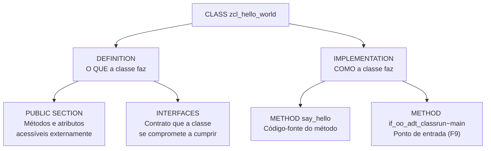

# Aula 04: Desenvolvendo Sua Primeira Aplicação ABAP

## 🎯 Objetivos de Aprendizagem

Depois de completar esta aula, você será capaz de:

- Criar uma aplicação "Hello World".

---

## 📖 Guia Passo a Passo: Criando uma Classe ABAP do Zero

### 🧭 Antes de começar: o que significa "criar uma aplicação" no mundo ABAP?

No mundo .NET, quando você diz "vou criar uma aplicação", você pensa em um
projeto com um `Program.cs`, um `dotnet run` e uma saída no console. No
ecossistema ABAP, a lógica é similar — mas com uma diferença fundamental:
**todo código ABAP vive dentro do sistema SAP**, não em arquivos soltos no
seu computador.

Uma "aplicação" ABAP pode ser de vários tipos: um **programa** (_report_), uma
**classe** (_class_), um **módulo de função** (_function module_), entre
outros. No ABAP Cloud moderno (que usamos neste curso), a unidade fundamental
de código é a **classe ABAP** ([ABAP Class](../../../GLOSSARY.md#classe-abap-abap-class)).

> 💡 **Analogia .NET:** Uma classe ABAP é conceitualmente idêntica a uma
> classe C#. Ela tem uma seção de definição (equivalente à assinatura da
> classe e seus membros públicos) e uma seção de implementação (o corpo dos
> métodos). A diferença é que, em vez de um arquivo `.cs`, a classe fica
> armazenada no [Repositório ABAP](../../../GLOSSARY.md#repositorio-abap-abap-repository).

Nesta aula, você vai criar sua primeira classe ABAP — um "Hello World" que
retorna uma mensagem de saudação. É o equivalente ABAP do clássico
`Console.WriteLine("Hello World!")` do C#.

---

### 🔧 O que você vai usar

| Ferramenta/Conceito | Para que serve | Análogo no mundo .NET |
|---|---|---|
| **Classe ABAP** (_ABAP Class_) | Unidade fundamental de código: encapsula dados e comportamentos | Classe C# (`.cs`) |
| **DEFINITION** | Seção que declara os membros públicos da classe (métodos, atributos) | Assinatura da classe + interface pública |
| **IMPLEMENTATION** | Seção que contém o código-fonte dos métodos | Corpo dos métodos em C# |
| **METHOD** | Função ou procedimento dentro de uma classe ABAP | Método em C# |
| **INTERFACES** | Permite que uma classe implemente uma interface ABAP — como `IF_OO_ADT_CLASSRUN` | `: ISomeInterface` em C# |
| **IF_OO_ADT_CLASSRUN** | Interface que dá à classe um ponto de entrada `main` para executar via F9 | `static void Main()` no .NET |
| **Class Builder** | Ferramenta visual no Eclipse/ADT para criar e editar classes | _Add New Class_ no Visual Studio |
| **Ativação** (_Activation_) | Processo de compilar e registrar um objeto no repositório ABAP | `dotnet build` — compila e torna o código executável |

---

### 📋 Pré-requisitos

Antes de começar esta aula, você precisa ter:

1. **Eclipse IDE** com o plugin [ADT](../../../GLOSSARY.md#adt-abap-development-tools) instalado (Aula 01).
2. Um [ABAP Cloud Project](../../../GLOSSARY.md#abap-cloud-project) criado e
   conectado ao sistema SAP BTP (Aula 01).
3. Seu [pacote](../../../GLOSSARY.md#pacote-package) `ZS4D400_##` criado e
   adicionado aos **Favorite Packages** (Aula 03).

---

### 🪜 Passo 1: Criar uma Nova Classe ABAP

Vamos criar a classe que será nossa primeira aplicação ABAP. No Eclipse com
ADT, isso é feito através do **Class Builder** — uma ferramenta que gera a
estrutura básica da classe para você.

1. No **Project Explorer**, clique com botão direito no seu pacote
   `ZS4D400_##` (dentro de **Favorite Packages**).

2. Navegue até: **New → ABAP Class**.

3. Na janela que abrir, preencha:

   | Campo | Valor | Explicação |
   |---|---|---|
   | **Name** | `ZCL_HELLO_WORLD` | Nome da classe (prefixo `ZCL_` = classe customizada) |
   | **Description** | `My first ABAP class` | Descrição livre |

   > ℹ️ **Convenção de nomenclatura:** Classes ABAP seguem prefixos padronizados:
   > - `ZCL_` ou `YCL_` → classe criada por cliente (_custom_).
   > - `CL_` → classe padrão SAP.
   > - `Z` e `Y` são os únicos prefixos reservados para código de cliente —
   >   garantem que seu código nunca entre em conflito com objetos SAP.

   > 💡 **Analogia .NET:** O prefixo `ZCL_` é como a convenção de namespace
   > `MyCompany.` — um identificador visual de que o código é seu, não do
   > framework.

4. Clique em **Next**.

5. Na próxima tela, verifique as configurações:

   | Configuração | Valor padrão | Significado |
   |---|---|---|
   | **Visibility** | `PUBLIC` | A classe pode ser usada por qualquer outro código |
   | **Final** | marcado (`true`) | A classe não pode ser herdada |
   | **Create Public** | marcado (`true`) | Outros códigos podem instanciar (`NEW`) esta classe |

   Mantenha os valores padrão e clique em **Next**.

6. Na tela de **Transport Request**, selecione o Transport Request que você
   criou na Aula 03 (ou crie um novo).

7. Clique em **Finish**.

O Eclipse abrirá o editor de classe ABAP com a estrutura básica gerada
automaticamente:

```abap
CLASS zcl_hello_world DEFINITION
  PUBLIC
  FINAL
  CREATE PUBLIC.

  PUBLIC SECTION.

ENDCLASS.

CLASS zcl_hello_world IMPLEMENTATION.

ENDCLASS.
```

> 💡 **Analogia .NET:** Esta estrutura gerada é similar ao _scaffolding_ do
> .NET — quando você usa `dotnet new class` ou o template _Add → Class_ no
> Visual Studio obtém um esqueleto inicial. A diferença é que no ABAP a classe
> sempre tem duas partes explicitamente separadas: `DEFINITION` (o que a
> classe expõe) e `IMPLEMENTATION` (como ela faz).

---

### 🪜 Passo 2: Entender a Estrutura de uma Classe ABAP

Antes de escrevermos código, vamos entender as duas seções que compõem toda
classe ABAP:



- **`DEFINITION`**: A "interface pública" da classe. Aqui você declara os
  métodos, atributos e constantes que outros códigos podem acessar. Pense
  nela como a "assinatura" ou o "contrato".

- **`IMPLEMENTATION`**: O "corpo" da classe. Aqui você escreve o código-fonte
  de cada método declarado na definição. É onde a lógica realmente acontece.

- **`PUBLIC SECTION`**: Dentro da definição, é a subseção onde você coloca
  membros acessíveis por qualquer outro código. Similar a métodos `public`
  em C#.

> 💡 **Analogia .NET:** No C#, uma classe tem a interface pública (métodos
> `public`) e a implementação no mesmo arquivo. No ABAP, essas duas
> preocupações são **fisicamente separadas** em dois blocos distintos —
> `DEFINITION` e `IMPLEMENTATION`. É como se o `.h` (header) e o `.cpp` do
> C++ estivessem no mesmo arquivo, mas explicitamente delimitados.

---

### 🪜 Passo 3: Adicionar uma Interface e um Método à Classe

Agora vamos preparar a classe para ser executável e adicionar um método que
retorna uma mensagem de saudação. Trabalharemos em duas etapas: primeiro a
**definição** (o contrato) e depois a **implementação** (o código).

#### 3.1 Declarar a interface e o método na seção DEFINITION

Na seção `PUBLIC SECTION` da `DEFINITION`, adicione a interface
`if_oo_adt_classrun` e o método `say_hello`:

```abap
CLASS zcl_hello_world DEFINITION
  PUBLIC
  FINAL
  CREATE PUBLIC.

  PUBLIC SECTION.
    INTERFACES if_oo_adt_classrun.
    METHODS say_hello
      RETURNING VALUE(rv_message) TYPE string.

ENDCLASS.
```

**Entendendo os novos elementos:**

| Elemento | Significado |
|---|---|
| `INTERFACES if_oo_adt_classrun.` | A classe se compromete a implementar a interface `IF_OO_ADT_CLASSRUN`. Essa interface exige o método `main`, que será o ponto de entrada quando você pressionar F9 |
| `METHODS` | Palavra-chave para declarar um método (similar a `public` em C#) |
| `say_hello` | Nome do método (use `snake_case` — convenção ABAP) |
| `RETURNING VALUE(rv_message)` | O método retorna um valor; `rv_message` é o nome do parâmetro de retorno |
| `TYPE string` | O tipo do valor retornado é `string` (texto) |

> 💡 **Analogia .NET:** A interface `IF_OO_ADT_CLASSRUN` no ABAP é o
> equivalente ao ponto de entrada `static void Main()` no .NET — é o que
> torna a classe "executável" via F9. Sem ela, o ADT não sabe por onde
> começar a execução.
>
> Já o método `say_hello` é equivalente a:
> ```csharp
> public string SayHello()
> ```

#### 3.2 Implementar os métodos na seção IMPLEMENTATION

Agora, na seção `IMPLEMENTATION`, escreva o código de ambos os métodos:

```abap
CLASS zcl_hello_world IMPLEMENTATION.

  METHOD if_oo_adt_classrun~main.
    out->write( say_hello( ) ).
  ENDMETHOD.

  METHOD say_hello.
    rv_message = 'Hello, ABAP World!'.
  ENDMETHOD.

ENDCLASS.
```

**Entendendo o código:**

- `METHOD if_oo_adt_classrun~main.`: implementa o método `main` exigido pela
  interface. O `~` (til) é o operador de escopo de interface — significa
  "método `main` **da interface** `if_oo_adt_classrun`". O parâmetro implícito
  `out` é um objeto que representa o console de saída.
- `out->write( say_hello( ) )`: chama nosso método `say_hello` e escreve o
  resultado no console. O `->` é o operador de acesso a membros de instância
  (equivalente ao `.` do C#).
- `METHOD say_hello.` e `ENDMETHOD.`: delimitam o início e fim da
  implementação do método — similar às chaves `{ }` em C#.
- `rv_message = 'Hello, ABAP World!'` atribui a string ao parâmetro de
  retorno. Em ABAP, strings literais usam **aspas simples** (`'...'`), não
  aspas duplas.

> ⚠️ **Importante:** Em ABAP, strings são delimitadas por **aspas simples**
> (`'texto'`), não aspas duplas. Esta é uma das diferenças mais comuns que
> desenvolvedores .NET enfrentam no início. Aspas duplas em ABAP têm outro
> significado (delimitam identificadores com caracteres especiais).

> 💡 **Analogia .NET:**
> ```csharp
> // C# — o equivalente do que estamos fazendo em ABAP:
> public class HelloWorld : IAdtClassRun
> {
>     public void Main(IConsoleOutput output)
>     {
>         output.Write(SayHello());
>     }
>
>     public string SayHello()
>     {
>         return "Hello, ABAP World!";
>     }
> }
> ```
>
> As diferenças principais:
> - ABAP usa `METHOD`/`ENDMETHOD` em vez de chaves `{ }`.
> - O `~` (til) em `if_oo_adt_classrun~main` indica que o método pertence à
>   interface — o C# usa `IAdtClassRun.Main()` para o mesmo fim.
> - Não há `return` explícito — o valor é atribuído ao parâmetro `rv_message`.

---

### 🪜 Passo 4: Ativar a Classe (_Activation_)

No mundo ABAP, escrever o código não é suficiente — você precisa **ativar**
(_activate_) o objeto. A ativação é o processo que compila o código-fonte e o
registra no [Repositório ABAP](../../../GLOSSARY.md#repositorio-abap-abap-repository),
tornando-o executável.

1. No editor de código, pressione **Ctrl + F3** (atalho para ativar).

   **Alternativa:** Clique com botão direito no editor e selecione
   **Activate**, ou clique no ícone de ativação na barra de ferramentas
   (ícone com _play_ ou círculo).

2. O Eclipse mostrará uma janela de confirmação com os objetos a serem
   ativados. Verifique se sua classe `ZCL_HELLO_WORLD` está listada.

3. Clique em **OK**.

4. Aguarde a mensagem de sucesso no canto inferior direito: _"Activation
   completed successfully"_.

> ⚠️ **Importante:** Se houver erros de sintaxe, a ativação **falhará** e o
> Eclipse exibirá os erros no painel **Problems** (parte inferior da tela).
> Corrija os erros e pressione **Ctrl + F3** novamente.

> 💡 **Analogia .NET:** A ativação (`Ctrl + F3`) no ABAP é equivalente ao
> `dotnet build` — compila o código e gera o executável. A diferença é que no
> ABAP o resultado da compilação fica armazenado dentro do próprio sistema
> SAP, não em uma pasta `bin/Debug/`.

---

### 🪜 Passo 5: Executar a Classe com F9

Graças à interface `IF_OO_ADT_CLASSRUN`, sua classe já tem um ponto de entrada
— o método `main`. Basta um atalho para executá-la:

1. Com a classe `ZCL_HELLO_WORLD` aberta no editor, pressione **F9**.

   **Alternativa:** Clique com botão direito na classe no **Project Explorer**
   → **Run As → ABAP Application Console**.

2. O Eclipse abrirá o **ABAP Application Console** e executará automaticamente
   o método `if_oo_adt_classrun~main`.

3. Você verá a saída no console:

   ```
   Hello, ABAP World!
   ```

**Por que isso funciona?** Quando você pressiona F9, o ADT procura na classe
uma implementação da interface `IF_OO_ADT_CLASSRUN`. Se encontrar, ele chama
automaticamente o método `main`, que por sua vez chama `say_hello()` e escreve
o resultado no console com `out->write(...)`.

> 💡 **Analogia .NET:** F9 no ADT é como `dotnet run` no .NET — o runtime
> localiza o ponto de entrada (`Main` em C#, `if_oo_adt_classrun~main` em
> ABAP) e executa.

---

### ✅ Verificação: deu certo?

Sua primeira aplicação ABAP está funcionando se:

1. A classe `ZCL_HELLO_WORLD` aparece no **Project Explorer**, dentro do seu
   pacote `ZS4D400_##`.
2. A ativação (`Ctrl + F3`) foi concluída **sem erros** (sem ícones
   vermelhos no código).
3. Ao executar no **ABAP Application Console**, você vê a mensagem:
   ```
   Hello, ABAP World!
   ```

Se os três itens acima estão certos, **parabéns!** 🎉 Você acaba de criar,
compilar e executar sua primeira aplicação ABAP!

---

### ❓ Perguntas Frequentes

<details>
<summary><b>"Por que criar uma classe e não um programa (report)?"</b></summary>

No ABAP tradicional (on-premise), o "Hello World" costuma ser um **report**
(`REPORT zhello_world.` com `WRITE`). No ABAP Cloud (que usamos neste curso), o
paradigma moderno é orientado a objetos — classes são a unidade fundamental de
código. Reports ainda existem, mas classes são a prática recomendada para novo
desenvolvimento no SAP BTP e S/4HANA.

</details>

<details>
<summary><b>"O que significa o prefixo lv_ e lo_ nas variáveis?"</b></summary>

São **convenções de nomenclatura húngara** do ABAP:

| Prefixo | Significado | Exemplo |
|---|---|---|
| `lv_` | _local variable_ (variável local) | `lv_message` |
| `lo_` | _local object_ (objeto/instância local) | `lo_hello` |
| `rv_` | _returning value_ (valor de retorno) | `rv_message` |
| `iv_` | _importing value_ (parâmetro de entrada) | `iv_name` |

Não são obrigatórias, mas fortemente recomendadas — facilitam a leitura do
código e são usadas em todo código SAP padrão.

</details>

<details>
<summary><b>"Posso usar aspas duplas (") em vez de aspas simples (')?"</b></summary>

Em ABAP, aspas simples (`'...'`) delimitam strings literais. Aspas duplas
(`"..."`) delimitam **comentários de linha** — equivalente ao `//` do C#. Usar
aspas duplas onde deveria usar simples causará erro de sintaxe.

</details>

<details>
<summary><b>"Ao pressionar F9 aparece: 'For console output, a class must implement IF_OO_ADT_CLASSRUN'."</b></summary>

Sua classe não está implementando a interface que o ADT precisa para executar.
Adicione na `PUBLIC SECTION`:

```abap
INTERFACES if_oo_adt_classrun.
```

E na `IMPLEMENTATION`, adicione o método `main`:

```abap
METHOD if_oo_adt_classrun~main.
  out->write( say_hello( ) ).
ENDMETHOD.
```

Isso cria o ponto de entrada que o F9 procura. Sem essa interface, o ADT não
sabe "por onde começar" a execução da sua classe.

</details>

<details>
<summary><b>"Dá erro na ativação: 'Object ZCL_HELLO_WORLD already exists'."</b></summary>

Você já tem uma classe com esse nome no sistema. Delete a classe existente
(botão direito → **Delete**) e tente criar novamente, ou escolha um nome
diferente.
</details>

<details>
<summary><b>"O que significa o operador ~ (til) em if_oo_adt_classrun~main?"</b></summary>

O `~` é o **operador de escopo de interface**. Ele indica que o método `main`
pertence à interface `if_oo_adt_classrun`, não à própria classe. É necessário
porque uma classe pode implementar várias interfaces, e duas interfaces
diferentes podem ter métodos com o mesmo nome.

> 💡 **Analogia .NET:** Em C# você usaria `IAdtClassRun.Main()` (_explicit
> interface implementation_) para o mesmo propósito.
</details>

---

### 📚 O que aprendemos

| Conceito | Significado |
|---|---|
| **Classe ABAP** | Unidade fundamental de código que encapsula dados e comportamentos |
| **DEFINITION** | Seção que declara a interface pública da classe (o "contrato") |
| **IMPLEMENTATION** | Seção que contém o código-fonte dos métodos (o "como") |
| **METHOD** | Função ou procedimento dentro de uma classe ABAP |
| **INTERFACES** | Declara que a classe implementa uma interface ABAP — como `IF_OO_ADT_CLASSRUN` |
| **IF_OO_ADT_CLASSRUN** | Interface que fornece o ponto de entrada `main` para executar a classe via F9 |
| **`~` (til)** | Operador de escopo de interface — `if_oo_adt_classrun~main` = método `main` da interface |
| `out->write(...)` | Escreve no console de saída do ADT |
| **Ativação** (_Activation_) | Compilar e registrar um objeto no repositório para torná-lo executável |
| `->` | Operador de acesso a membros de instância (equivalente ao `.` do C#) |

---

### 📖 Novos Termos (Glossário)

Estes são os termos do ecossistema SAP que apareceram nesta aula.
Consulte o [glossário completo](../../../GLOSSARY.md) para ver todos os termos.

| Termo | Definição rápida |
|---|---|
| [Ativação](../../../GLOSSARY.md#ativação-activation) | Processo de compilar e registrar um objeto no repositório ABAP |
| [ABAP Application Console](../../../GLOSSARY.md#abap-application-console) | Console interativo no Eclipse/ADT para executar e testar código ABAP |
| [IF_OO_ADT_CLASSRUN](../../../GLOSSARY.md#if_oo_adt_classrun) | Interface que fornece o ponto de entrada `main` para executar classes via F9 |
| [Convenção de Nomenclatura Húngara ABAP](../../../GLOSSARY.md#convenção-de-nomenclatura-húngara-abap) | Sistema de prefixos (`lv_`, `lo_`, `rv_`, `iv_`) que identifica o tipo e função de cada variável |

---

### ⏭️ Próxima aula

[Aula 05: Amplificando o Desenvolvimento ABAP com IA](../05-amplifying-abap-development-with-ai/) — entenda como as capacidades de IA auxiliam desenvolvedores ABAP e como o ABAP AI SDK adiciona recursos de IA a aplicações de negócio.
