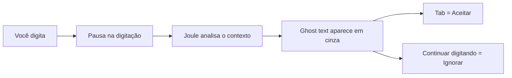
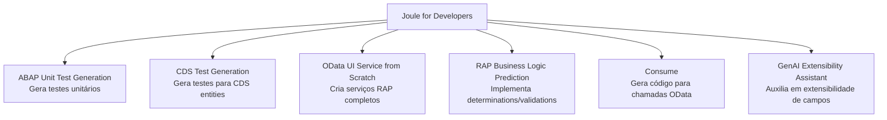
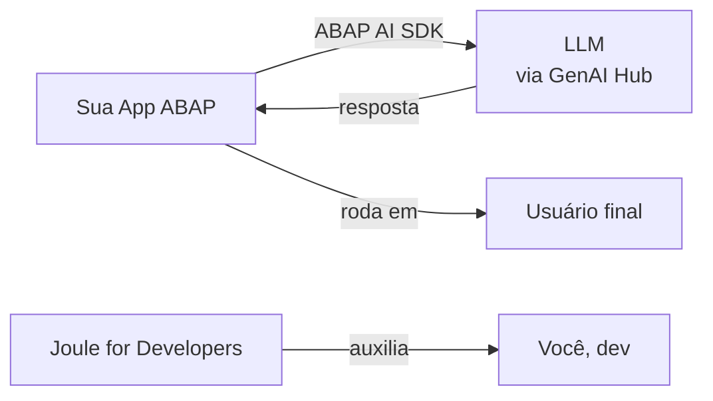

# Aula 05: Amplificando o Desenvolvimento ABAP com IA

## 🎯 Objetivos de Aprendizagem

Depois de completar esta aula, você será capaz de:

- Explicar como as capacidades de IA do ABAP (_ABAP AI Capabilities_) auxiliam
  desenvolvedores durante o desenvolvimento de aplicações.
- Descrever brevemente como o ABAP AI SDK pode ser usado para adicionar
  recursos de IA a aplicações de negócio.

---

## 📖 Guia Passo a Passo: Explorando a IA no Ecossistema ABAP

### 🧭 Antes de começar: IA não é só ChatGPT — está dentro da sua IDE ABAP

Se você já usou o **GitHub Copilot** no VS Code, sabe como é ter uma IA que
sugere código, explica trechos complexos e responde perguntas sem sair do
editor. A SAP oferece uma experiência equivalente dentro do Eclipse com ADT: o
**Joule for Developers**.

**Joule** é o assistente de IA generativa da SAP, integrado diretamente nas
**ABAP Development Tools** ([ADT](../../../GLOSSARY.md#adt-abap-development-tools)).
Ele entende o contexto do seu código ABAP e pode ajudar em tarefas como
explicar código, gerar testes e completar trechos automaticamente.

> 💡 **Analogia .NET:** Joule está para o Eclipse/ADT assim como o GitHub
> Copilot está para o VS Code — é um assistente de IA integrado que sugere
> código, explica trechos e responde perguntas em linguagem natural. A
> diferença é que o Joule é específico para o ecossistema SAP e entende
> profundamente ABAP, [CDS](../../../GLOSSARY.md#cds-core-data-services) e
> [RAP](../../../GLOSSARY.md#rap-restful-application-programming-model).

Além do assistente dentro da IDE, a SAP também oferece o **ABAP AI SDK** — um
kit de desenvolvimento que permite a você, como desenvolvedor, embutir
funcionalidades de IA (como chamadas a LLMs) diretamente nas suas aplicações
ABAP. É o equivalente a usar o **Azure OpenAI Service** dentro de uma aplicação
.NET.

---

### 🔧 O que você vai usar

| Ferramenta/Conceito | Para que serve | Análogo no mundo .NET |
|---|---|---|
| **Joule for Developers** | Assistente de IA integrado ao Eclipse/ADT para desenvolvedores ABAP | GitHub Copilot no VS Code |
| **Joule Chat** | Conversa com IA em linguagem natural para tirar dúvidas e gerar código | Chat do Copilot / ChatGPT |
| **Predictive Code Completion** | Sugestão de código inline (_ghost text_) enquanto você digita | IntelliCode / Copilot inline suggestions |
| **Explain** | Explica trechos de código ou objetos ABAP selecionados | Copilot Explain / F1 com IA |
| **ABAP Unit Test Generation** | Geração automática de testes unitários ABAP | Copilot `/tests` ou IntelliTest |
| **ABAP AI SDK** | Biblioteca para adicionar chamadas a LLMs dentro de aplicações ABAP | Azure OpenAI SDK / Semantic Kernel |

---

### 📋 Pré-requisitos

Antes de começar esta aula, você precisa ter:

1. **Eclipse IDE** com o plugin [ADT](../../../GLOSSARY.md#adt-abap-development-tools) instalado (Aula 01).
2. Um [ABAP Cloud Project](../../../GLOSSARY.md#abap-cloud-project) criado e
   conectado ao sistema SAP BTP (Aula 01).
3. Sua classe `ZCL_HELLO_WORLD` ativada e funcional (Aula 04) — vamos usá-la
   para testar as capacidades de IA.

> ⚠️ **Atenção sobre o sistema de prática:** O Joule for Developers **não está
> disponível** nos sistemas trial do SAP Learning Hub usados neste curso
> (sistemas prefixados com `TRL`). Se o painel do Joule mostrar
> _"No open project that supports Joule"_ mesmo com você logado, o sistema
> simplesmente não tem o Joule habilitado. Isso é esperado.
>
> Esta aula é **conceitual** — o que importa é entender o que cada ferramenta
> faz. Você terá acesso ao Joule quando trabalhar em projetos reais no SAP BTP
> ou S/4HANA Cloud com a feature ativada.

---

### 🪜 Passo 1: Conhecer o Joule Chat — Seu Copiloto ABAP

O **Joule Chat** é uma janela de conversa dentro do Eclipse onde você pode
fazer perguntas em linguagem natural sobre desenvolvimento ABAP.

#### 1.1 Abrir o Joule Chat

1. No Eclipse, vá ao menu: **Window → Show View → Other...**
2. Na janela de busca, digite `Joule`.
3. Selecione **Joule** e clique em **Open**.

O chat do Joule aparecerá como um novo painel no Eclipse.

#### 1.2 Fazer sua primeira pergunta

No campo de entrada do Joule Chat, digite uma pergunta simples:

```
What is an ABAP class?
```

O Joule responderá com uma explicação sobre classes ABAP, incluindo exemplos
de código. Você pode continuar a conversa com perguntas de follow-up:

```
Show me an example of a class with a method that returns a string.
```

> 💡 **Analogia .NET:** O Joule Chat é idêntico ao chat do GitHub Copilot no
> VS Code — você conversa com a IA em linguagem natural para tirar dúvidas,
> pedir exemplos de código ou entender conceitos, sem sair do editor.

> ⚠️ **Importante:** Os resultados de IA podem variar. **Sempre revise** o
> código gerado por IA antes de usá-lo — verifique se está correto e atende
> aos seus requisitos.

---

### 🪜 Passo 2: Usar Predictive Code Completion (Ghost Text)

O **Predictive Code Completion** é uma funcionalidade que sugere código
enquanto você digita, exibindo o texto sugerido em cinza (_ghost text_) no
editor. Funciona para **classes**, **interfaces** e **programas** ABAP.

#### 2.1 Verificar se está ativado

O recurso vem **ativado por padrão**. Para verificar ou alternar:

1. Na barra de ferramentas do ADT, localize o ícone
   **Toggle Automatic Triggering of Predictive Code Completion**.
2. Se estiver ativo, o ghost text aparecerá automaticamente quando você pausar
   a digitação.

#### 2.2 Testar com sua classe

1. Abra a classe `ZCL_HELLO_WORLD` no editor (a que você criou na Aula 04).
2. No final do método `say_hello`, pressione Enter para criar uma nova linha.
3. Comece a digitar um novo método:

   ```abap
   METHODS say_goodbye
   ```

4. Faça uma pausa. Se o predictive completion estiver ativo, o Joule sugerirá
   o restante do código em cinza (_ghost text_).

5. Para **aceitar** a sugestão, pressione **Tab**.

6. Para **ignorar**, continue digitando normalmente.



> 💡 **Analogia .NET:** É exatamente igual às sugestões inline do GitHub
> Copilot — texto cinza aparece enquanto você digita, Tab para aceitar, Esc
> ou continuar digitando para ignorar.

---

### 🪜 Passo 3: Usar Explain para Entender Código

O **Explain** é uma das capacidades mais úteis do Joule: você seleciona um
trecho de código (ou um objeto inteiro) e pede para a IA explicar o que ele
faz. É como ter um desenvolvedor sênior sentado ao seu lado.

#### 3.1 Explicar um trecho de código

1. Abra a classe `ZCL_HELLO_WORLD` no editor.
2. Selecione algumas linhas do método `say_hello`.
3. Clique com botão direito na seleção.
4. Navegue até: **Joule → Explain**.

   **Alternativa:** Abra o Joule Chat e digite `/explain` no campo de entrada.

#### 3.2 Interagir com a explicação

A resposta do Explain aparecerá no Joule Chat, marcada com `/explain`. Você
pode:

- Fazer **perguntas de follow-up** para aprofundar o entendimento.
- Usar **quick replies** (respostas rápidas) que aparecem no final da
  explicação — por exemplo, "more detailed" ou "with examples".
- Especificar em linguagem natural como quer a explicação: _"Explain this
  code in simple terms, with a diagram"_.

> 💡 **Analogia .NET:** O Explain do Joule é equivalente ao Copilot Explain
> (`Ctrl+Shift+I` ou `/explain` no chat) — seleciona código, pede explicação,
> recebe uma análise detalhada do que o código faz.

---

### 🪜 Passo 4: Conhecer Outras Capacidades de IA do Joule

Além do Chat, Predictive Completion e Explain, o Joule oferece funcionalidades
avançadas para tarefas específicas de desenvolvimento ABAP:



| Funcionalidade | O que faz |
|---|---|
| **ABAP Unit Test Generation** | Gera automaticamente testes unitários para suas classes ABAP |
| **CDS Test Generation** | Cria classes de teste para [CDS](../../../GLOSSARY.md#cds-core-data-services) entities, garantindo a qualidade das suas views |
| **OData UI Service from Scratch** | Cria todos os objetos de repositório de um serviço [RAP](../../../GLOSSARY.md#rap-restful-application-programming-model) a partir de uma descrição em linguagem natural |
| **RAP Business Logic Prediction** | Implementa _determinations_ e _validations_ na classe de comportamento |
| **Consume** | Gera código ABAP e requisições OData para consumir APIs via OData Client Proxy |
| **GenAI Extensibility Assistant** | Auxilia em tarefas de extensibilidade de campos customizados |

> ℹ️ **Nota:** Estas são capacidades avançadas. Você as explorará em detalhes
> nos módulos mais avançados do curso. Por enquanto, o importante é saber que
> elas existem e estarão disponíveis quando você chegar lá.

> 💡 **Analogia .NET:** No ecossistema .NET, você precisaria de várias
> ferramentas separadas para cobrir o que o Joule faz integrado:
> - GitHub Copilot (geração de código)
> - IntelliTest / xUnit scaffolds (testes)
> - Semantic Kernel / Azure OpenAI SDK (IA em apps)
>
> O Joule unifica tudo em uma única experiência dentro do Eclipse/ADT.

---

### 🪜 Passo 5: Conhecer o ABAP AI SDK — IA Dentro das Suas Aplicações

Enquanto o Joule ajuda **você, desenvolvedor**, a escrever código, o **ABAP AI
SDK** (_Software Development Kit_) permite que você coloque IA **dentro das
suas aplicações** — ou seja, suas apps ABAP podem chamar modelos de linguagem
(LLMs) para gerar texto, classificar dados ou responder perguntas.



#### Principais funcionalidades do ABAP AI SDK

| API | Para que serve |
|---|---|
| **Completion API** | Envia um _prompt_ (texto de entrada) para um LLM e recebe uma resposta gerada |
| **Prompt Library API** | Usa templates de prompt pré-definidos para gerar novos prompts |
| **Tracing** | Permite iniciar um _ABAP Cross Trace_ para depurar problemas nas chamadas à API |

#### Pré-requisitos para usar

Para usar o ABAP AI SDK, seu administrador de sistema precisa:

1. Configurar conexões entre o sistema SAP BTP e o **Generative AI Hub**.
2. Como desenvolvedor, você define qual LLM será usado e cria _intelligent
   scenarios_ e modelos.

> 💡 **Analogia .NET:** O ABAP AI SDK é equivalente ao **Azure OpenAI SDK**
> ou ao **Semantic Kernel** no .NET — é uma biblioteca que permite chamar
> modelos de IA generativa diretamente do seu código de negócio. A diferença
> é que ele roda nativamente dentro do ambiente ABAP, integrado ao SAP BTP.

---

### ✅ Verificação: deu certo?

Esta é uma aula conceitual — não há código para compilar. Você concluiu o
objetivo se:

1. Sabe o que é o **Joule for Developers** e como ele se compara ao GitHub
   Copilot.
2. Entende a diferença entre:
   - **Joule for Developers** (assistente para o dev dentro da IDE) e
   - **ABAP AI SDK** (biblioteca para colocar IA dentro das aplicações).
3. Sabe listar pelo menos **3 capacidades** do Joule (ex: Chat, Predictive
   Completion, Explain).

> ℹ️ **Nota:** Se o seu sistema de prática for um trial (`TRL`), o Joule
> não estará disponível e isso não é um erro. O importante é o conhecimento
> conceitual — você aplicará essas ferramentas em sistemas reais no futuro.

---

### ❓ Perguntas Frequentes

<details>
<summary><b>"Joule é gratuito? Preciso de licença extra?"</b></summary>

O Joule for Developers está disponível como parte do SAP BTP ABAP Environment
e do S/4HANA Cloud. O acesso depende da sua assinatura e da configuração do
seu ambiente de prática no SAP Learning Hub.

</details>

<details>
<summary><b>"O Joule funciona offline?"</b></summary>

Não. O Joule é um serviço na nuvem — requer conexão com a internet para
funcionar, pois as chamadas de IA são processadas nos servidores da SAP.

</details>

<details>
<summary><b>"Posso confiar 100% no código gerado pelo Joule?"</b></summary>

**Não.** A SAP explicitamente recomenda: _AI results may vary. Always check
AI-generated code for correctness._ Trate o código gerado por IA como um
**rascunho inicial** — revise, teste e valide antes de usar em produção.

</details>

<details>
<summary><b>"O Joule mostra 'No open project that supports Joule' mesmo eu estando logado."</b></summary>

Isso significa que o sistema ABAP ao qual você está conectado **não tem o Joule
habilitado**. Os sistemas de prática do SAP Learning Hub (prefixo `TRL`) são
ambientes limitados que não incluem todos os serviços de IA. Isso é esperado —
esta aula é conceitual e você não precisa de acesso ao Joule para cumpri-la.

Em um projeto real no SAP BTP ou S/4HANA Cloud com o Joule ativado, o painel
reconheceria seu projeto automaticamente.

</details>

<details>
<summary><b>"Qual a diferença entre Joule e GitHub Copilot?"</b></summary>

Ambos são assistentes de IA para código, mas:

| Joule | GitHub Copilot |
|---|---|
| Integrado ao Eclipse/ADT | Integrado ao VS Code / Visual Studio |
| Específico para ABAP, CDS, RAP | Multi-linguagem (C#, Python, JS, etc.) |
| Entende contexto SAP (pacotes, transportes) | Entende contexto de projetos .NET/web |
| Oferece funcionalidades SAP-específicas (CDS tests, OData gen) | Oferece funcionalidades genéricas de código |

</details>

---

### 📚 O que aprendemos

| Conceito | Significado |
|---|---|
| **Joule for Developers** | Assistente de IA generativa integrado ao Eclipse/ADT para desenvolvedores ABAP |
| **Joule Chat** | Chat em linguagem natural para tirar dúvidas e gerar exemplos de código |
| **Predictive Code Completion** | Sugestão de código inline (_ghost text_) que aparece enquanto você digita |
| **Explain** | Funcionalidade que explica trechos de código ou objetos ABAP selecionados |
| **ABAP AI SDK** | Kit de desenvolvimento para embutir chamadas a LLMs dentro de aplicações ABAP |
| **Completion API** | API do SDK que envia prompts para LLMs e recebe respostas geradas |
| **Prompt Library API** | API do SDK para usar templates de prompt pré-definidos |

---

### 📖 Novos Termos (Glossário)

Estes são os termos do ecossistema SAP que apareceram nesta aula.
Consulte o [glossário completo](../../../GLOSSARY.md) para ver todos os termos.

| Termo | Definição rápida |
|---|---|
| [Joule](../../../GLOSSARY.md#joule) | Assistente de IA generativa da SAP integrado ao Eclipse/ADT |
| [ABAP AI SDK](../../../GLOSSARY.md#abap-ai-sdk) | Kit de desenvolvimento para adicionar IA a aplicações ABAP |
| [CDS](../../../GLOSSARY.md#cds-core-data-services) | Framework de modelagem de dados semântica da SAP para HANA |
| [RAP](../../../GLOSSARY.md#rap-restful-application-programming-model) | Modelo de programação de aplicações RESTful do ABAP Cloud |

---

### ⏭️ Próximo módulo

[Módulo 02: Aplicando Técnicas e Conceitos Básicos](../../02-basic-techniques-and-concepts/) — entenda a sintaxe básica do ABAP, tipos de dados e estruturas de controle.
