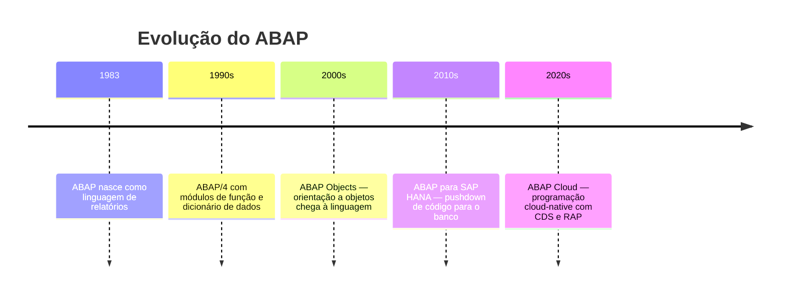
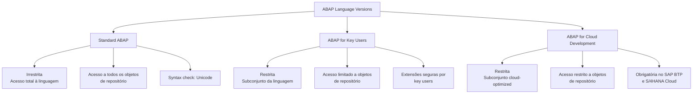
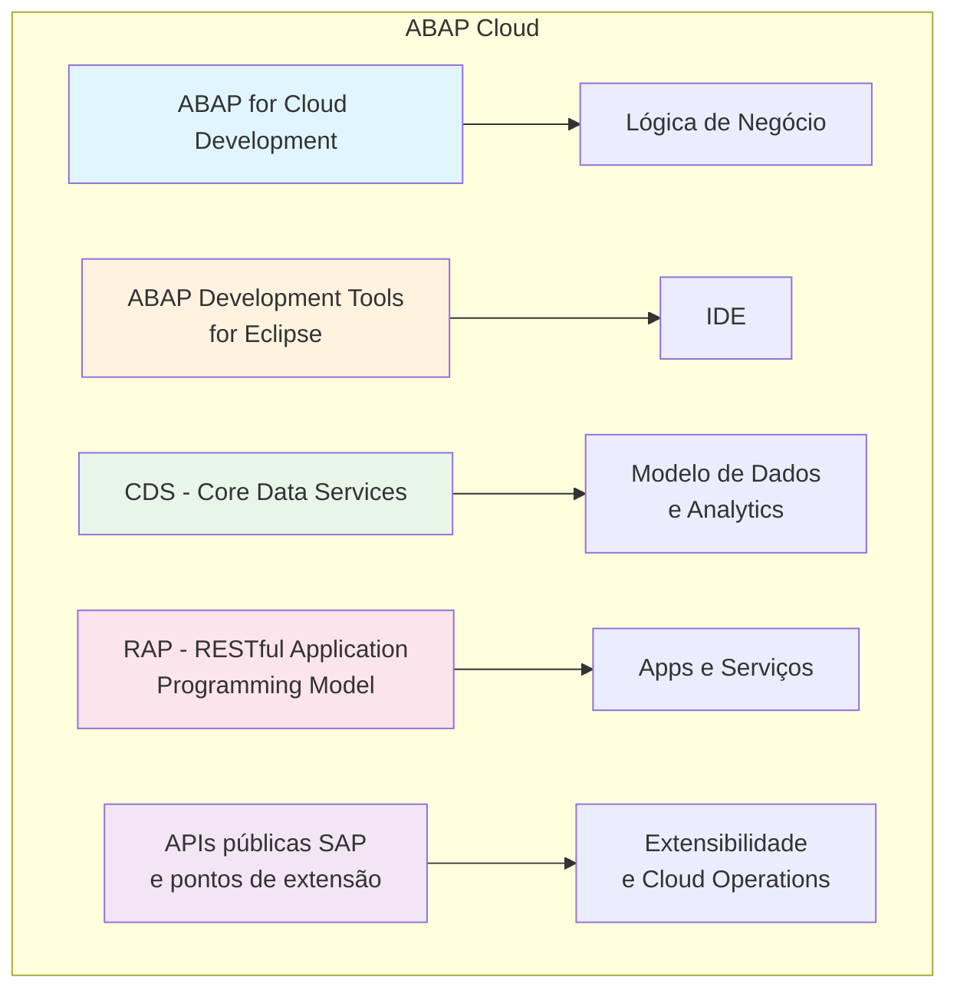

# Aula 01: Entendendo os Fundamentos do ABAP

## 🎯 Objetivos de Aprendizagem

Depois de completar esta aula, você será capaz de:

- Descrever a evolução do ABAP.
- Descrever os fundamentos da sintaxe ABAP.

---

## 📖 Guia Passo a Passo: Dos Fundamentos Históricos à Sintaxe Básica

### 🧭 Antes de começar: de onde veio o ABAP e por que isso importa

ABAP (_Advanced Business Application Programming_) nasceu dentro da SAP nos
anos 80 como uma linguagem para construir aplicações de negócio no ambiente SAP.
Originalmente, ela foi projetada para gerar **relatórios** — daí o nome
original _Allgemeiner Berichts-Aufbereitungs-Prozessor_ (alemão para "Processador
Genérico de Preparação de Relatórios"). Com o tempo, evoluiu para uma linguagem
completa, com orientação a objetos, acesso a banco de dados, serviços web e —
mais recentemente — programação na nuvem.

> 💡 **Analogia .NET:** A evolução do ABAP é parecida com a do C#. O C# 1.0
> era uma linguagem simples, fortemente tipada, para aplicações Windows. Hoje,
> o C# 12 suporta programação funcional, cloud-native, padrões modernos e
> roda em múltiplas plataformas. Da mesma forma, o ABAP moderno tem classes,
> interfaces, CDS Views e suporte nativo a REST — muito além do ABAP original
> de 1983.

Nesta aula, você não vai programar — você vai **entender o panorama** da
linguagem: suas versões, seu papel na nuvem e as regras básicas de sintaxe
que toda linha de código ABAP segue.

---

### 🔧 O que você vai usar

| Ferramenta/Conceito | Para que serve | Análogo no mundo .NET |
|---|---|---|
| **Standard ABAP** | Versão universal e irrestrita do ABAP, com acesso a toda a linguagem | C# completo (sem restrições de perfil) |
| **ABAP for Key Users** | Versão restrita para _key users_ criarem extensões seguras | Low-code / Power Platform (Power Apps) |
| **ABAP for Cloud Development** | Versão otimizada para nuvem, obrigatória no SAP BTP e S/4HANA Cloud | .NET para Azure (cloud-optimized, com restrições) |
| **ABAP Cloud** | Paradigma de desenvolvimento cloud-ready completo (linguagem + ferramentas + modelo) | .NET + Azure + ASP.NET Core (ecossistema completo para cloud) |

---

### 📋 Pré-requisitos

Antes de começar esta aula, você precisa ter:

1. Entendimento do que é o ecossistema SAP e o papel do [ABAP](../../../GLOSSARY.md#abap-advanced-business-application-programming) ([Aula 01 do Módulo 01](../../01-getting-started/01-preparing-the-development-environment/)).
2. Familiaridade com o Eclipse e o [ADT](../../../GLOSSARY.md#adt-abap-development-tools) ([Aulas 01 e 02 do Módulo 01](../../01-getting-started/01-preparing-the-development-environment/)).
3. Um [ABAP Cloud Project](../../../GLOSSARY.md#abap-cloud-project) configurado e conectado ao sistema de prática.

---

### 🪜 Passo 1: Entender a evolução do ABAP

O ABAP passou por várias transformações desde sua criação. Os marcos principais:



Hoje, o ABAP convive em três "sabores" diferentes, dependendo de **onde** e
**para quem** você está desenvolvendo.

---

### 🪜 Passo 2: Conhecer as três versões da linguagem ABAP

Cada programa ABAP tem um **atributo de programa** (_program attribute_)
chamado "ABAP language version" (versão da linguagem ABAP). Essa versão
determina:

- Quais elementos da linguagem você pode usar.
- Quais [objetos de repositório](../../../GLOSSARY.md#objeto-de-desenvolvimento-development-object--repository-object) você pode acessar.
- Quais regras de sintaxe se aplicam.



#### Standard ABAP

É a versão **universal e irrestrita**. Cobre todo o escopo da linguagem e
permite acesso a todos os objetos de repositório (exceto os bloqueados pelo
[conceito de pacotes](../../../GLOSSARY.md#pacote-package)). A verificação de
sintaxe (_syntax check_) é feita como **Unicode check** — o requisito mínimo
para um [sistema Unicode](#unicode-system).

> 💡 **Analogia .NET:** Standard ABAP é como o C# completo em um projeto
> .NET Framework/.NET 8 tradicional — você tem acesso a todas as APIs, todas
> as bibliotecas, sem restrições de plataforma.

#### ABAP for Key Users

Versão **restrita**, projetada para que _key users_ (usuários-chave de negócio,
não desenvolvedores) possam implementar **extensões seguras** dentro dos limites
definidos pela SAP. Só um subconjunto muito limitado de elementos da linguagem
está disponível.

> 💡 **Analogia .NET:** Equivalente ao Power Apps / Power Automate da Microsoft
> — permite que usuários de negócio criem personalizações sem acesso completo
> ao código.

#### ABAP for Cloud Development

Versão **restrita e otimizada para nuvem**. É a versão obrigatória para
desenvolvimento no [SAP BTP ABAP Environment](../../../GLOSSARY.md#sap-btp-business-technology-platform)
e no [S/4HANA Cloud ABAP Environment](../../../GLOSSARY.md#s4hana). Apenas um
subconjunto dos elementos da linguagem está disponível e o acesso a objetos de
repositório é restrito.

> ⚠️ **Importante:** Este curso introduz apenas elementos de sintaxe e
> funcionalidades disponíveis em **todas as três versões**. A exceção é o
> [RAP](../../../GLOSSARY.md#rap-restful-application-programming-model), que
> não faz parte do ABAP for Key Users.

> 💡 **Analogia .NET:** Similar ao .NET para Azure — você usa o mesmo C#,
> mas com um subconjunto de APIs otimizado para execução em nuvem, seguindo
> padrões como _cloud-native_ e _twelve-factor app_.

---

### 🪜 Passo 3: Entender o conceito de ABAP Cloud

**ABAP Cloud** não é apenas uma versão da linguagem — é um **paradigma completo**
de desenvolvimento cloud-ready. O ABAP for Cloud Development é a peça central,
mas o ABAP Cloud inclui também:



#### Onde o ABAP Cloud é obrigatório vs. recomendado

| Ambiente | ABAP Cloud | Por quê |
|---|---|---|
| **SAP BTP** | 🔴 Obrigatório | Plataforma de nuvem pura |
| **S/4HANA Cloud, public edition** | 🔴 Obrigatório | ERP na nuvem pública |
| **S/4HANA Cloud, private edition** | 🟡 Fortemente recomendado | Nuvem privada, mas segue princípios cloud |
| **S/4HANA on-premise** | 🟡 Fortemente recomendado | On-premise, mas prepara para futuro cloud |

> 💡 **Analogia .NET:** É como a diferença entre escrever um app .NET qualquer
> vs. escrever um app **cloud-native para Azure**. No segundo caso, você adota
> padrões específicos (configuração via variáveis de ambiente, _health checks_,
> _managed identity_, etc.). ABAP Cloud faz o mesmo: garante que seu código é
> _cloud-ready by default_.

#### Clean Core

Um princípio fundamental do ABAP Cloud é o **Clean Core**: você desenvolve
extensões e aplicações **sem modificar o núcleo do sistema SAP**. Isso é
essencial para que atualizações e operações na nuvem funcionem sem
interrupções.

> 💡 **Analogia .NET:** No Azure, você não modifica o código do runtime do
> App Service — você faz deploy da sua aplicação em cima de uma plataforma
> gerenciada. Clean Core é o mesmo princípio: seu código roda "ao lado" do
> SAP, sem alterar o que é padrão.

---

### 🪜 Passo 4: Conhecer os fundamentos da sintaxe ABAP

Agora que você entende o panorama da linguagem, vamos ver como o código ABAP
realmente se parece.

#### Características básicas da linguagem

O ABAP tem algumas características marcantes que você perceberá imediatamente
ao ler código:

| Característica | Descrição | Exemplo |
|---|---|---|
| **Palavras-chave em inglês** | Comandos como `DATA`, `IF`, `LOOP`, `SELECT` | `DATA lv_name TYPE string.` |
| **Fim explícito de bloco** | Blocos terminam com `END` + comando | `IF...ENDIF`, `LOOP...ENDLOOP` |
| **Case-insensitive** | `DATA` = `data` = `Data` (mas convenção é UPPERCASE para palavras-chave) | `DATA lv_value TYPE i.` |
| **Ponto final** | Todo comando termina com `.` (ponto) | `WRITE 'Hello'.` |
| **Asterisco para comentários** | `*` no início da linha = linha inteira comentada | `* Isto é um comentário` |
| **Aspas duplas** | `"` no meio da linha = comentário até o fim da linha | `WRITE 'Olá'. " comentário` |

> 💡 **Analogia .NET:** O ponto final (`.`) no ABAP tem o mesmo papel do
> ponto e vírgula (`;`) no C# — ele encerra uma instrução. A diferença é que
> no ABAP você **precisa** dele em toda instrução, e esquecê-lo é um dos erros
> mais comuns de iniciantes.

#### Estrutura de um programa ABAP simples

```abap
*&---------------------------------------------------------------------*
*& Report ZMEU_PRIMEIRO_PROGRAMA
*&---------------------------------------------------------------------*
REPORT zmeu_primeiro_programa.

DATA: lv_nome   TYPE string VALUE 'Gabriel',
      lv_idade  TYPE i      VALUE 28.

START-OF-SELECTION.
  WRITE: / 'Nome:', lv_nome.
  WRITE: / 'Idade:', lv_idade.
```

Vamos destrinchar cada parte:

| Linha | O que significa |
|---|---|
| `*&...` | Bloco de comentário de documentação (cabeçalho padrão SAP) |
| `REPORT zmeu_primeiro_programa.` | Declara que este é um programa do tipo **report** com nome `ZMEU_PRIMEIRO_PROGRAMA` |
| `DATA: lv_nome TYPE string...` | Declara variáveis com tipo e valor inicial |
| `START-OF-SELECTION.` | Evento padrão — o código abaixo executa quando o programa roda |
| `WRITE: / 'Nome:', lv_nome.` | Escreve no console. `/` pula uma linha |

> 💡 **Analogia .NET:** `REPORT` está para ABAP como `class Program { static
> void Main() }` está para um console app em C#. `WRITE` é o equivalente
> do `Console.WriteLine()`.
>
> Já `START-OF-SELECTION` é como o método `Main` — é o ponto de entrada
> padrão quando o programa é executado.

---

### 🪜 Passo 5: Aprender a comentar código ABAP

Comentários são essenciais em qualquer linguagem. No ABAP, você tem duas
formas:

#### Comentário de linha inteira: `*`

```abap
* Este é um comentário que ocupa a linha inteira.
* Muito usado em cabeçalhos de programa.
DATA lv_valor TYPE i.
```

#### Comentário inline (no meio da linha): `"`

```abap
DATA lv_total TYPE i VALUE 100.  " valor inicial do total
lv_total = lv_total + 50.        " incrementa em 50
```

#### Como comentar/descomentar no Eclipse com ADT

| Ação | Atalho |
|---|---|
| **Comentar** linhas selecionadas | `Ctrl + 7` |
| **Descomentar** linhas selecionadas | `Ctrl + Shift + 7` |

> ⚠️ **Importante:** O Eclipse com ADT usa `"` para comentar/descomentar
> blocos com `Ctrl + 7` — mesmo que você selecione linhas que originalmente
> usavam `*`. Ele sempre insere `"` no início de cada linha selecionada.

> 💡 **Analogia .NET:** `Ctrl + 7` no Eclipse comenta código do mesmo jeito
> que `Ctrl + K, Ctrl + C` no Visual Studio. `*` é como `//` no C# quando
> usado no início da linha. A diferença é que o ABAP tem **dois** caracteres
> de comentário com comportamentos ligeiramente diferentes: `*` (linha inteira)
> e `"` (inline ou linha inteira).

---

### ✅ Verificação: deu certo?

Para confirmar que você entendeu os conceitos desta aula, responda:

1. ❓ Qual a diferença entre **Standard ABAP** e **ABAP for Cloud Development**?
   <details>
   <summary><b>Resposta</b></summary>
   Standard ABAP é a versão irrestrita com acesso total à linguagem e objetos de repositório. ABAP for Cloud Development é uma versão restrita com um subconjunto cloud-optimized da linguagem, obrigatória no SAP BTP e S/4HANA Cloud.
   </details>

2. ❓ O que significa o princípio **Clean Core**?
   <details>
   <summary><b>Resposta</b></summary>
   Clean Core significa desenvolver extensões e aplicações sem modificar o núcleo do sistema SAP. Isso garante que atualizações e operações na nuvem funcionem sem interrupções — seu código roda "ao lado" do SAP, não "dentro" dele.
   </details>

3. ❓ Qual caractere encerra **toda** instrução ABAP?
   <details>
   <summary><b>Resposta</b></summary>
   O ponto final (`.`). Esquecer o ponto é um dos erros mais comuns de iniciantes em ABAP. No C# usamos `;`, no ABAP usamos `.`.
   </details>

4. ❓ Qual a diferença entre `*` e `"` para comentários?
   <details>
   <summary><b>Resposta</b></summary>
   `*` no início da linha comenta a linha inteira (não pode ser usado no meio). `"` pode aparecer em qualquer lugar da linha e comenta tudo até o final dela — útil para comentários inline ao lado do código.
   </details>

---

### ❓ Perguntas Frequentes

<details>
<summary><b>"Se ABAP for Cloud Development é restrito, por que eu aprenderia Standard ABAP primeiro?"</b></summary>

Porque Standard ABAP contém o conjunto completo da linguagem. Entender o todo
ajuda a entender as restrições. Além disso, muitos sistemas on-premise e
private cloud ainda usam Standard ABAP — e o mercado de trabalho valoriza
quem conhece ambos. Este curso foca no subconjunto comum a todas as versões.

</details>

<details>
<summary><b>"ABAP Cloud substitui completamente o ABAP tradicional?"</b></summary>

Em ambientes de nuvem pública (SAP BTP, S/4HANA Cloud public edition), sim —
ABAP Cloud é obrigatório. Em ambientes on-premise e private cloud, o Standard
ABAP ainda é usado, mas a SAP recomenda fortemente adotar os princípios do
ABAP Cloud para garantir que seu código esteja pronto para o futuro.

</details>

<details>
<summary><b>"Preciso decorar todos os atalhos do Eclipse agora?"</b></summary>

Não. `Ctrl + 7` para comentar/descomentar e `F3` para navegar para definição
são os que você mais usará. Os outros você internaliza com a prática. O
importante é saber que eles existem.

</details>

---

### 📚 O que aprendemos

| Conceito | Significado |
|---|---|
| **Standard ABAP** | Versão universal e irrestrita da linguagem ABAP |
| **ABAP for Key Users** | Versão restrita para usuários-chave criarem extensões seguras |
| **ABAP for Cloud Development** | Versão restrita e cloud-optimized, obrigatória em ambientes de nuvem |
| **ABAP Cloud** | Paradigma completo de desenvolvimento cloud-ready (linguagem + ferramentas + modelo) |
| **Clean Core** | Princípio de não modificar o núcleo SAP — extensões rodam "ao lado" |
| **Sintaxe ABAP** | Case-insensitive, blocos com `END`, instruções terminadas com `.` |
| **Comentários** | `*` (linha inteira) e `"` (inline), atalho `Ctrl + 7` no Eclipse |

---

### 📖 Novos Termos (Glossário)

Estes são os termos do ecossistema SAP que apareceram nesta aula.
Consulte o [glossário completo](../../../GLOSSARY.md) para ver todos os termos.

| Termo | Definição rápida |
|---|---|
| [ABAP Cloud](../../../GLOSSARY.md#abap-cloud) | Paradigma completo de desenvolvimento cloud-ready da SAP |
| [ABAP for Cloud Development](../../../GLOSSARY.md#abap-for-cloud-development) | Versão restrita e cloud-optimized da linguagem ABAP |
| [ABAP for Key Users](../../../GLOSSARY.md#abap-for-key-users) | Versão restrita do ABAP para extensões por usuários-chave |
| [Clean Core](../../../GLOSSARY.md#clean-core) | Princípio de não modificar o núcleo do sistema SAP |
| [Standard ABAP](../../../GLOSSARY.md#standard-abap) | Versão universal e irrestrita da linguagem ABAP |
| [Syntax Check](../../../GLOSSARY.md#syntax-check) | Verificação de sintaxe que todo código ABAP precisa passar |
| [Unicode System](../../../GLOSSARY.md#unicode-system) | Sistema SAP que opera com charset Unicode (requisito moderno) |

---

### ⏭️ Próxima aula

[Aula 02: Trabalhando com Objetos de Dados Básicos e Tipos de Dados](../02-working-with-basic-data-objects-and-data-types/) — você vai declarar variáveis, conhecer os tipos de dados nativos do ABAP e escrever suas primeiras instruções com dados.
