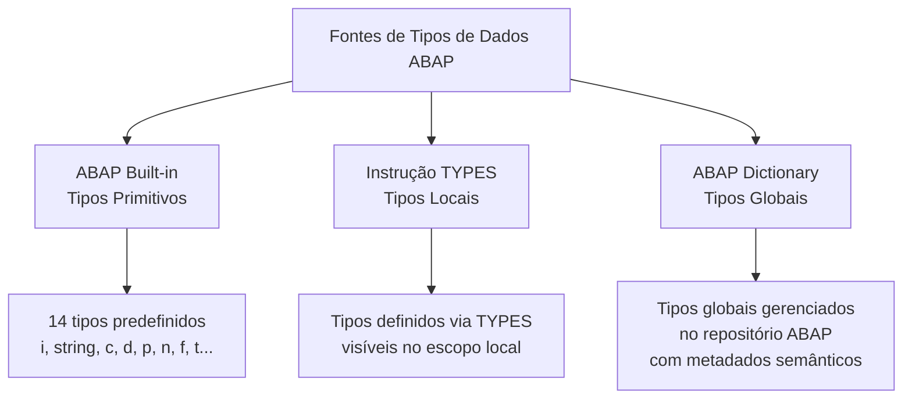
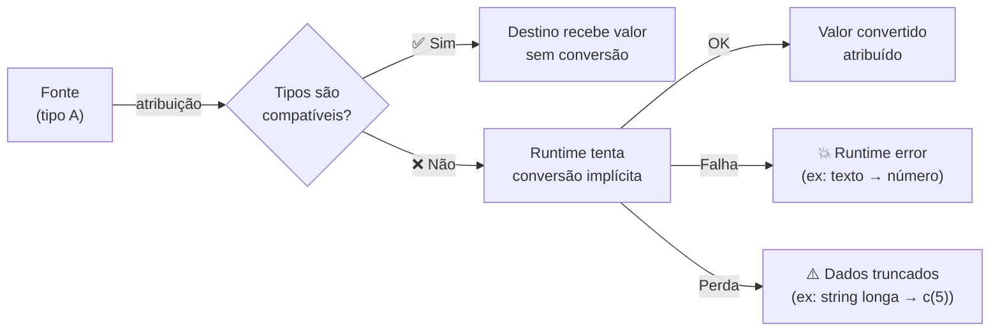

# Aula 02: Trabalhando com Objetos de Dados Básicos e Tipos de Dados

## 🎯 Objetivos de Aprendizagem

Depois de completar esta aula, você será capaz de:

- Declarar objetos de dados.
- Atribuir valores.

---

## 📖 Guia Passo a Passo: Variáveis, Constantes, Tipos e Atribuições

### 🧭 Antes de começar: o que são objetos de dados no ABAP

Na [Aula 01](../01-understanding-the-basics-of-abap/), você viu o panorama
da linguagem ABAP. Agora é hora de **escrever código que armazena e manipula
dados**. Em qualquer linguagem de programação, dados são a matéria-prima:
números, textos, datas — tudo começa com uma **variável**.

No ABAP, o conceito de "dado que ocupa memória" é chamado de **objeto de dados**
(_data object_). Um objeto de dados é uma região reservada na memória do
programa que armazena um valor. O ABAP conhece três categorias de objetos de dados:

| Categoria | Pode mudar de valor? | Tem nome? | Exemplo |
|---|---|---|---|
| **Variável** (_Variable_) | ✅ Sim, durante a execução | ✅ Sim | `DATA lv_nome TYPE string.` |
| **Constante** (_Constant_) | ❌ Não (bloqueado) | ✅ Sim | `CONSTANTS lc_pi TYPE p LENGTH 2 DECIMALS 2 VALUE '3.14'.` |
| **Literal** (_Literal_) | ❌ Não (valor fixo) | ❌ Não (é anônimo) | `'Hello'`, `` `Hello` ``, `12345` |

> 💡 **Analogia .NET:** Em C#, variáveis (`var x = 10;`), constantes
> (`const decimal PI = 3.14M;`) e literais (`"texto"`, `42`, `true`) são
> conceitos idênticos. A diferença é que no ABAP constantes e literais são
> formalmente classificados como "objetos de dados" — no C# chamamos tudo de
> "variável" informalmente. Outra diferença: em ABAP, **todo** objeto de dados
> tem um tipo fixo que não muda durante a execução. Em C#, `var` infere o tipo;
> no ABAP, você **sempre** declara o tipo explicitamente com `TYPE`.

---

### 🔧 O que você vai usar

| Ferramenta/Conceito | Para que serve | Análogo no mundo .NET |
|---|---|---|
| **Instrução DATA** | Declarar variáveis com tipo e valor inicial opcional | `var` / declaração explícita de tipo (`int x = 10;`) |
| **Instrução CONSTANTS** | Declarar constantes (valor fixo, sem alteração) | `const` em C# |
| **Instrução TYPES** | Criar tipos de dados reutilizáveis (locais ou globais) | `using alias` / tipos customizados com `record` |
| **ABAP Dictionary (DDIC)** | Repositório global de tipos de dados, tabelas e metadados | Entity Framework `DbContext` + migrações (define tipos globalmente) |
| **Instrução CLEAR** | Resetar variável para o valor inicial do tipo | `x = default;` em C# |
| **Declaração inline** | Declarar variável no ponto de uso com `DATA(...)` | `var x = expression;` em C# |

---

### 📋 Pré-requisitos

Antes de começar esta aula, você precisa ter:

1. Compreensão dos fundamentos da sintaxe ABAP ([Aula 01 do Módulo 02](../01-understanding-the-basics-of-abap/)).
2. Eclipse com [ADT](../../../GLOSSARY.md#adt-abap-development-tools) configurado e conectado ao [ABAP Cloud Project](../../../GLOSSARY.md#abap-cloud-project).
3. Saber criar uma [classe ABAP](../../../GLOSSARY.md#classe-abap-abap-class) que implementa a interface [`IF_OO_ADT_CLASSRUN`](../../../GLOSSARY.md#if_oo_adt_classrun) e executá-la com **F9**.

---

### 🪜 Passo 1: Declarar variáveis com a instrução DATA

A instrução `DATA` é a forma mais fundamental de criar um objeto de dados no
ABAP. Ela tem três partes:

```
DATA <nome> TYPE <tipo> [VALUE <valor_inicial>].
  │       │     │            │
  │       │     │            └── (opcional) valor inicial
  │       │     └── obrigatório: tipo da variável
  │       └── nome da variável (até 30 caracteres)
  └── palavra-chave DATA
```

**Exemplos básicos:**

```abap
DATA lv_nome   TYPE string.                " string de tamanho variável
DATA lv_idade  TYPE i      VALUE 25.       " inteiro com valor inicial
DATA lv_ativo  TYPE abap_bool VALUE abap_true.  " booleano
```

**Regras de nomenclatura:**
- Até 30 caracteres.
- Pode conter letras (`A-Z`), dígitos (`0-9`) e underscore (`_`).
- Deve começar com letra ou underscore.
- Por convenção, usa-se o [prefixo húngaro](../../../GLOSSARY.md#convenção-de-nomenclatura-húngara-abap): `lv_` (_local variable_), `lc_` (_local constant_), etc.

> 💡 **Analogia .NET:** `DATA lv_idade TYPE i VALUE 25.` é equivalente a
> `int idade = 25;` em C#. Note que a ordem é invertida: no ABAP, o nome
> vem antes do tipo, e a palavra `TYPE` é obrigatória. O ponto final (`.`)
> encerra a instrução — equivalente ao `;` no C#.

> ⚠️ **Importante:** Se você omitir `VALUE`, a variável é criada com o
> **valor inicial do tipo** (_type-specific initial value_). Para `i` é `0`,
> para `string` é vazio (`''`), para `d` (data) é `'00000000'`. Diferente de
> algumas linguagens, no ABAP **não existe "não inicializado"** — toda
> variável sempre tem um valor bem definido.

---

### 🪜 Passo 2: Conhecer as fontes de tipos de dados ABAP

O tipo de um objeto de dados ABAP pode vir de **três fontes** diferentes:



#### 2a. Tipos built-in (primitivos)

O ABAP tem **14 tipos de dados predefinidos**. Aqui estão os mais comuns:

| Tipo | Significado | Descrição | Valor inicial | Exemplo | Análogo C# |
|---|---|---|---|---|---|
| `i` | Integer | Inteiro de 4 bytes | `0` | `DATA lv_x TYPE i VALUE 42.` | `int` |
| `string` | String | Cadeia de caracteres de tamanho variável | `''` (vazio) | `DATA lv_nome TYPE string VALUE 'Ana'.` | `string` |
| `c` | Character | Cadeia de caracteres de tamanho fixo | `' '` (espaços) | `DATA lv_cod TYPE c LENGTH 5.` | `char[5]` |
| `n` | Numeric text | Texto numérico (só dígitos) | `'0...0'` | `DATA lv_cep TYPE n LENGTH 8.` | `string` com validação |
| `d` | Date | Data (formato `YYYYMMDD`) | `'00000000'` | `DATA lv_data TYPE d.` | `DateTime` |
| `p` | Packed | Número decimal compactado | `0` | `DATA lv_preco TYPE p LENGTH 8 DECIMALS 2.` | `decimal` |
| `abap_bool` | Boolean | Booleano (`abap_true` / `abap_false`) | `abap_false` | `DATA lv_flag TYPE abap_bool.` | `bool` |

> ⚠️ **Importante:** `c` (character) **sempre** precisa de `LENGTH`. Se você
> esquecer, o compilador atribui `LENGTH 1` por padrão — o que provavelmente
> não é o que você quer.

> 💡 **Analogia .NET:** A diferença mais impactante para quem vem do .NET é
> o tipo `c` vs. `string`. Em C#, `string` é o padrão. No ABAP, `c` é um
> array de caracteres de tamanho **fixo** preenchido com espaços — como um
> `char[10]` no C#. Já `string` no ABAP é de tamanho variável, como `string`
> no C#. A recomendação moderna é: use `string` a menos que você precise de
> tamanho fixo (ex: códigos padronizados como campos de tabela).

#### 2b. Tipos locais: instrução TYPES

Com `TYPES`, você define seus próprios tipos de dados **dentro do escopo atual**:

```abap
TYPES: meu_tipo_numero   TYPE i,
       meu_tipo_texto    TYPE string,
       meu_tipo_preco    TYPE p LENGTH 6 DECIMALS 2.

DATA lv_valor TYPE meu_tipo_preco VALUE '99.90'.
```

> 💡 **Analogia .NET:** `TYPES` é como `using Preco = decimal;` (alias) no
> C#. Você não cria um tipo novo — você dá um nome semântico a um tipo
> existente. Tipos definidos com `TYPES` são **locais** (escopo do programa
> ou classe). Para tipos **globais** (visíveis em todo o sistema), você usa
> o ABAP Dictionary.

#### 2c. Tipos globais: ABAP Dictionary (DDIC)

O [ABAP Dictionary](../../../GLOSSARY.md#abap-dictionary-ddic) é um
repositório central dentro do sistema SAP que armazena **tipos de dados
globais**, tabelas e metadados. Tipos definidos no dicionário estão
disponíveis em qualquer programa ABAP do sistema.

```abap
" Usando um tipo global do ABAP Dictionary
DATA lv_aeroporto TYPE /dmo/airport_id VALUE 'FRA'.
```

> 💡 **Analogia .NET:** O ABAP Dictionary é similar ao **Entity Framework Core**
> com `code-first`: você define entidades e tipos em um catálogo central, e
> elas ficam disponíveis globalmente com validação, anotações semânticas e
> integração com a camada de UI. A diferença é que no SAP, o DDIC é o
> "coração" do sistema — tabelas, tipos, visões e estruturas de dados **reais**
> do negócio vivem lá.

---

### 🪜 Passo 3: Executar o primeiro exercício prático — Tipos Primitivos

Vamos colocar a mão no código. O exercício oficial da SAP explora os tipos
primitivos (`string`, `i`, `d`, `c`, `n`, `p`) mostrando como cada um se
comporta com o mesmo valor.

**Instruções:**

1. No Eclipse, crie uma nova [classe ABAP](../../../GLOSSARY.md#classe-abap-abap-class) global que implementa a interface [`IF_OO_ADT_CLASSRUN`](../../../GLOSSARY.md#if_oo_adt_classrun).
2. Copie o código abaixo para o método `if_oo_adt_classrun~main( )`:

```abap
* Data Objects with Built-in Types
**********************************************************************

    " comment/uncomment the following declarations and check the output
    DATA variable TYPE string.
*    DATA variable TYPE i.
*    DATA variable TYPE d.
*    DATA variable TYPE c LENGTH 10.
*    DATA variable TYPE n LENGTH 10.
*    DATA variable TYPE p LENGTH 8 DECIMALS 2.

* Output
**********************************************************************

    out->write(  'Result with Initial Value)' ).
    out->write(   variable ).
    out->write(  '---------' ).

    variable = '19891109'.

    out->write(  'Result with Value 19891109' ).
    out->write(   variable ).
    out->write(  '---------' ).
```

3. Pressione **Ctrl + F3** para [ativar](../../../GLOSSARY.md#ativação-activation) a classe e **F9** para executar.
4. Analise a saída no console. Descomente uma declaração por vez (apague o `*` no início da linha) e execute novamente. Observe como o mesmo valor `'19891109'` é tratado de forma diferente por cada tipo.

> 💡 **Analogia .NET:** Este exercício é como explorar o comportamento de
> `int`, `string`, `DateTime`, `char[]`, e `decimal` no C# com o mesmo valor
> de entrada — você aprende que cada tipo interpreta e armazena a mesma
> informação de forma diferente. `'19891109'` como `string` é um texto; como
> `d` (date) ele vira 9 de novembro de 1989; como `n` ele preserva zeros à
> esquerda; como `i` ele causa erro porque a string não é um número inteiro
> (exercício: teste isso!).

---

### 🪜 Passo 4: Entender constantes e literais

#### Constantes: instrução CONSTANTS

Uma constante é um objeto de dados cujo valor **não pode ser alterado** durante
a execução. Qualquer tentativa de escrita gera erro de sintaxe.

```abap
CONSTANTS lc_empresa   TYPE string VALUE 'SAP SE'.
CONSTANTS lc_ano_fund  TYPE i      VALUE 1972.
CONSTANTS lc_vazio     TYPE string VALUE IS INITIAL.  " valor inicial do tipo
```

A instrução `CONSTANTS` é **idêntica** a `DATA`, com duas diferenças:

1. `VALUE` é **obrigatório** (não pode omitir).
2. O valor não pode ser alterado depois.

> 💡 **Analogia .NET:** `CONSTANTS lc_empresa TYPE string VALUE 'SAP SE'.`
> = `const string Empresa = "SAP SE";` em C#. `VALUE IS INITIAL` é como
> `= default;` — atribui o valor padrão do tipo.

#### Literais: valores anônimos

Literais são valores fixos escritos diretamente no código, **sem nome**.
O ABAP tem três tipos:

| Tipo de Literal | Sintaxe | Tipo ABAP resultante | Exemplo | Uso recomendado |
|---|---|---|---|---|
| **Number literal** | Dígitos (sem aspas) | `i` (ou `p` se valor grande) | `12345` | Valores numéricos inteiros |
| **Text literal** | Aspas simples `'...'` | `c` (tamanho fixo) | `'Hello'` | Valores para campos `c` |
| **String literal** | Back quotes `` `...` `` | `string` (tamanho variável) | `` `Hello` `` | Valores para campos `string` |

```abap
DATA lv_numero TYPE i      VALUE 12345.        " number literal → type i
DATA lv_texto  TYPE c LENGTH 10 VALUE 'ABC'.   " text literal → type c
DATA lv_nome   TYPE string VALUE `Gabriel`.    " string literal → type string
```

> ⚠️ **Importante:** Prefira **sempre** usar constantes nomeadas em vez de
> espalhar literais pelo código. Se o valor `'SAP SE'` aparece em 50 lugares
> como literal e precisa mudar para `'SAP Brasil'`, você tem 50 edições para
> fazer. Com uma constante, muda em um só lugar.

> 💡 **Analogia .NET:** `'texto'` (aspas simples) é como `"texto"` no C# para
> `char[]`, enquanto `` `texto` `` (back quotes) é como `"texto"` para
> `string`. A diferença sutil é que text literals (`'...'`) têm espaços à
> direita ignorados e tipo `c` (fixo); string literals (`` `...` ``) preservam
> tudo e têm tipo `string` (variável).

---

### 🪜 Passo 5: Executar o segundo exercício prático — Data Objects

Agora vamos consolidar tudo: tipos locais, tipos globais, constantes e literais
em um único exercício.

**Instruções:**

1. Crie uma nova classe global com `IF_OO_ADT_CLASSRUN`.
2. Copie o código abaixo para o método `if_oo_adt_classrun~main( )`:

```abap
* Example 1: Local Types
**********************************************************************

* Comment/Uncomment the following lines to change the type of my_var
    TYPES my_type TYPE p LENGTH 3 DECIMALS 2.
*    TYPES my_type TYPE i .
*    TYPES my_type TYPE string.
*    TYPES my_type TYPE n LENGTH 10.

* Variable based on local type
    DATA my_variable TYPE my_type.

    out->write(  `my_variable (TYPE MY_TYPE)` ).
    out->write(   my_variable ).

* Example 2: Global Types
**********************************************************************

* Variable based on global type .
    " Place cursor on variable and press F2 or F3
    DATA airport TYPE /dmo/airport_id VALUE 'FRA'.

    out->write(  `airport (TYPE /DMO/AIRPORT_ID )` ).
    out->write(   airport ).

* Example 3: Constants
**********************************************************************

    CONSTANTS c_text   TYPE string VALUE `Hello World`.
    CONSTANTS c_number TYPE i      VALUE 12345.

    "Uncomment this line to see syntax error ( VALUE is mandatory)
*  CONSTANTS c_text2 TYPE string.

    out->write(  `c_text (TYPE STRING)` ).
    out->write(   c_text ).
    out->write(  '---------' ).

    out->write(  `c_number (TYPE I )` ).
    out->write(   c_number ).
    out->write(  `---------` ).

* Example 4: Literals
**********************************************************************

    out->write(  '12345               ' ).    "Text Literal   (Type C)
    out->write(  `12345               ` ).    "String Literal (Type STRING)
    out->write(  12345                  ).    "Number Literal (Type I)

    "uncomment this line to see syntax error (no number literal with digits)
*    out->write(  12345.67                  ).
```

3. Pressione **Ctrl + F3** e **F9**.
4. Explore o código:
   - Alterne a declaração de `my_type` (descomente uma, comente as outras) e observe como `my_variable` muda de tipo. Use **F2** ou **F3** sobre `my_variable` para inspecionar a definição.
   - Posicione o cursor sobre `airport` e pressione **F2** para ver a definição do tipo global `/dmo/airport_id`.
   - Descomente a linha `CONSTANTS c_text2 TYPE string.` (sem `VALUE`) e veja o erro de sintaxe.
   - Descomente a linha `out->write( 12345.67 ).` e veja o erro: literais numéricos não aceitam casas decimais.

> 💡 **Analogia .NET:** **F3** (ou **Ctrl + Click**) no Eclipse = **F12**
> (Go to Definition) no Visual Studio. **F2** = hover tooltip com definição
> do tipo. Esses atalhos são seus melhores amigos para navegar em código ABAP.

---

### 🪜 Passo 6: Atribuir valores a variáveis

#### Atribuição simples

Uma vez declarada, você muda o valor de uma variável com o operador `=`:

```abap
DATA lv_nome TYPE string.
lv_nome = 'Gabriel'.   " atribuição simples
```

#### Conversão implícita de tipo (_Implicit Type Conversion_)

ABAP permite atribuir um valor de um tipo a uma variável de **outro tipo**.
O runtime tenta fazer uma conversão automática — mas isso tem riscos:

```abap
DATA lv_numero TYPE i.
lv_numero = '42'.       " OK: texto '42' vira inteiro 42
lv_numero = 'ABC'.      " 💥 Runtime error: não dá pra converter 'ABC' pra número
```



**Por que evitar conversões implícitas:**

| Risco | Exemplo | Consequência |
|---|---|---|
| **Erro em runtime** | Atribuir `'ABC'` a uma variável `TYPE i` | 💥 Programa aborta |
| **Perda de dados** | Atribuir `'Hello World'` a uma variável `TYPE c LENGTH 5` | Valor truncado para `'Hello'` |
| **Custo de performance** | Converter tipos diferentes em loops | Mais lento que atribuição direta |

> 💡 **Analogia .NET:** É como o casting implícito do C#. `int x = (int)obj;`
> pode lançar `InvalidCastException`. No ABAP, atribuir `'ABC'` a um `TYPE i`
> não compila como erro — ele passa na [verificação de sintaxe](../../../GLOSSARY.md#syntax-check),
> mas explode em runtime. A recomendação nas duas linguagens é a mesma: evite
> depender de conversões implícitas — declare os tipos corretos desde o início.

#### Resetar variáveis: instrução CLEAR

`CLEAR` redefine uma variável para o **valor inicial do tipo**,
**ignorando** qualquer `VALUE` que você tenha definido na declaração:

```abap
DATA lv_numero TYPE i VALUE 100.
lv_numero = 200.
CLEAR lv_numero.     " lv_numero agora é 0 (valor inicial de i), não 100
```

> 💡 **Analogia .NET:** `CLEAR lv_numero.` = `numero = default;` em C#.
> Mesmo se você declarou `int numero = 100;`, depois de `numero = default;`
> ele volta para `0` (valor padrão de `int`), não para `100`.

#### Declaração inline (_Inline Declaration_)

Desde o ABAP 7.40, você pode declarar uma variável **no ponto exato de uso**
com `DATA(...)` — sem precisar de uma instrução `DATA` separada antes:

```abap
" Em vez de:
DATA lv_name TYPE string.
lv_name = 'Ana'.

" Use declaração inline:
DATA(lv_name) = 'Ana'.    " tipo inferido como string
```

O tipo da variável é inferido do contexto (do lado direito da atribuição).

> 💡 **Analogia .NET:** `DATA(lv_name) = 'Ana'.` = `var name = "Ana";` em C#.
> O compilador infere o tipo a partir da expressão. A sintaxe ABAP usa
> parênteses em vez de palavra-chave — mas o conceito é o mesmo.

---

### ✅ Verificação: deu certo?

Para confirmar que você entendeu os conceitos desta aula, responda:

1. ❓ Qual é a diferença entre uma **variável**, uma **constante** e um **literal**?
   <details>
   <summary><b>Resposta</b></summary>
   Variável: tem nome e valor pode mudar. Constante: tem nome e valor NÃO pode mudar (VALUE obrigatório). Literal: é um valor anônimo escrito direto no código (ex: `'Hello'`, `12345`). Os três são objetos de dados ABAP.
   </details>

2. ❓ Por que `DATA lv_cod TYPE c.` (sem `LENGTH`) é perigoso?
   <details>
   <summary><b>Resposta</b></summary>
   Porque o compilador assume `LENGTH 1` por padrão. Se você tentar armazenar mais de 1 caractere, o valor será truncado. Sempre especifique `LENGTH` ao usar o tipo `c`.
   </details>

3. ❓ O que acontece se você declarar `CONSTANTS` sem `VALUE`?
   <details>
   <summary><b>Resposta</b></summary>
   Erro de sintaxe — `VALUE` é obrigatório para constantes. Diferente de `DATA`, onde `VALUE` é opcional (a variável recebe o valor inicial do tipo).
   </details>

4. ❓ `CLEAR lv_valor.` restaura o valor para o `VALUE` original da declaração?
   <details>
   <summary><b>Resposta</b></summary>
   Não. `CLEAR` sempre restaura para o **valor inicial do tipo** (ex: `0` para `i`, `''` para `string`), ignorando completamente o `VALUE` que você definiu na declaração.
   </details>

---

### ❓ Perguntas Frequentes

<details>
<summary><b>"Quando usar type c (character) e quando usar type string?"</b></summary>

Use `string` para a maioria dos casos — textos de tamanho variável, nomes,
descrições. Use `c` com `LENGTH` fixo apenas quando o campo exige um formato
rígido (ex: código de país `LENGTH 3`, código de transação `LENGTH 20`),
especialmente se o campo corresponde a uma coluna do [ABAP Dictionary](../../../GLOSSARY.md#abap-dictionary-ddic).

</details>

<details>
<summary><b>"Preciso decorar todos os 14 tipos built-in?"</b></summary>

Não. Comece com `i`, `string`, `c`, `d`, `p`, `n` e `abap_bool`. Esses cobrem
90% dos casos do dia a dia. Os outros (como `f` para float, `t` para hora,
`x` para binário) você consulta quando precisar.

</details>

<details>
<summary><b>"Declaração inline (DATA(...)) substitui DATA tradicional?"</b></summary>

Em grande parte, sim — é considerada uma prática moderna e recomendada. Mas
`DATA` explícito ainda é útil quando você quer declarar a variável no início
do método (para deixar a estrutura visível) ou quando precisa especificar
`LENGTH`/`DECIMALS` que não podem ser inferidos do contexto.

</details>

<details>
<summary><b>"O que significa o prefixo /DMO/ em /dmo/airport_id?"</b></summary>

`/DMO/` é um namespace de demonstração (_demo_) da SAP. Tipos globais no
[ABAP Dictionary](../../../GLOSSARY.md#abap-dictionary-ddic) podem ter
prefixos de namespace como `/DMO/`, `/SAP/` etc. `/DMO/` significa que é
um objeto de demonstração — não é produtivo, mas é real e usado para
aprendizado.

</details>

---

### 📚 O que aprendemos

| Conceito | Significado |
|---|---|
| **Objeto de dados** | Região de memória com tipo fixo: variável, constante ou literal |
| **DATA** | Instrução para declarar variáveis (`VALUE` opcional) |
| **CONSTANTS** | Instrução para declarar constantes (`VALUE` obrigatório) |
| **TYPES** | Instrução para definir tipos de dados locais reutilizáveis |
| **Tipos built-in** | 14 tipos predefinidos: `i`, `string`, `c`, `d`, `p`, `n`, `abap_bool`... |
| **ABAP Dictionary (DDIC)** | Repositório central de tipos globais, tabelas e metadados |
| **CLEAR** | Resetar variável para o valor inicial do tipo |
| **Declaração inline** | `DATA(...)` — declara variável no ponto de uso com tipo inferido |
| **Conversão implícita** | Atribuição entre tipos diferentes — risco de erro em runtime |
| **Literais** | Valores anônimos: number (`123`), text (`'abc'`), string (`` `abc` ``) |

---

### 📖 Novos Termos (Glossário)

Estes são os termos do ecossistema SAP que apareceram nesta aula.
Consulte o [glossário completo](../../../GLOSSARY.md) para ver todos os termos.

| Termo | Definição rápida |
|---|---|
| [ABAP Dictionary (DDIC)](../../../GLOSSARY.md#abap-dictionary-ddic) | Repositório global de tipos, tabelas e metadados do sistema SAP |
| [DATA](../../../GLOSSARY.md#data-statement) | Instrução ABAP para declarar variáveis |
| [CONSTANTS](../../../GLOSSARY.md#constants-statement) | Instrução ABAP para declarar constantes com valor fixo |
| [TYPES](../../../GLOSSARY.md#types-statement) | Instrução ABAP para definir tipos de dados reutilizáveis |
| [CLEAR](../../../GLOSSARY.md#clear-statement) | Instrução ABAP para resetar variável ao valor inicial do tipo |
| [Declaração Inline](../../../GLOSSARY.md#declaração-inline-inline-declaration) | Sintaxe `DATA(...)` para declarar variável no ponto de uso |
| [Conversão Implícita de Tipo](../../../GLOSSARY.md#conversão-implícita-de-tipo-implicit-type-conversion) | Atribuição entre tipos diferentes com conversão automática |

---

### ⏭️ Próxima aula

[Aula 03: Trabalhando com Estruturas de Controle](../03-working-with-control-structures/) — você vai aprender a usar condições (`IF`/`ELSE`, `CASE`) e loops (`DO`, `WHILE`, `LOOP`) para controlar o fluxo do seu programa ABAP.
