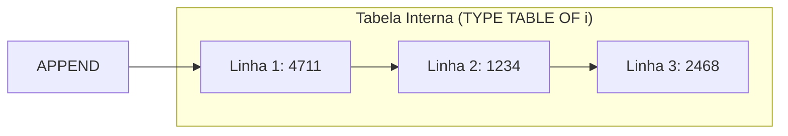

# Aula 05: Trabalhando com Tabelas Internas Simples

## 🎯 Objetivos de Aprendizagem

Depois de completar esta aula, você será capaz de:

- Definir tabelas internas simples.
- Processar dados usando tabelas internas simples.

---

## 📖 Guia Passo a Passo: Tabelas Internas — Listas em Memória

### 🧭 Antes de começar: o que é uma tabela interna e por que ela importa

Até agora, você trabalhou com **variáveis escalares** — cada variável armazena
um único valor por vez. Mas programas reais precisam lidar com **coleções de
dados**: uma lista de clientes, os itens de um pedido, os resultados de uma
consulta ao banco.

No ABAP, a estrutura de dados que resolve isso é a **tabela interna** (_internal
table_). Ela é o equivalente a uma lista ou array em outras linguagens: um
objeto de dados que armazena **múltiplos valores do mesmo tipo**, organizados
em linhas.



> 💡 **Analogia .NET:** Uma tabela interna ABAP é como uma `List<T>` em C#.
> `TYPE TABLE OF i` = `List<int>`. `APPEND ... TO` = `list.Add(...)`.
> `numbers[ 2 ]` = `numbers[1]` (índice baseado em 1 no ABAP). `LOOP AT`
> é equivalente a `foreach (var item in list)`.

---

### 🔧 O que você vai usar

| Ferramenta/Conceito | Para que serve | Análogo no mundo .NET |
|---|---|---|
| **`TYPE TABLE OF`** | Declarar tabela interna diretamente | `List<T>` |
| **`TYPES ... TYPE TABLE OF`** | Definir tipo de tabela reutilizável (local) | `using MyList = List<int>;` |
| **`APPEND ... TO`** | Adicionar uma linha ao final da tabela | `list.Add(...)` |
| **`CLEAR`** (em tabela) | Esvaziar a tabela (0 linhas) | `list.Clear()` |
| **Table expression `...[ n ]`** | Acessar linha por índice (começa em 1) | `list[n-1]` (índice 0-based) |
| **`LOOP AT ... INTO`** | Percorrer todas as linhas da tabela | `foreach (var item in list)` |
| **`sy-tabix`** | Índice da linha atual dentro de um `LOOP` | `index` em um `for` |

---

### 📋 Pré-requisitos

Antes de começar esta aula, você precisa ter:

1. Saber declarar variáveis com [`DATA`](../../../GLOSSARY.md#data-statement) e criar tipos locais com [`TYPES`](../../../GLOSSARY.md#types-statement) ([Aula 02](../02-working-with-basic-data-objects-and-data-types/)).
2. Saber usar [`DO/ENDDO`](../../../GLOSSARY.md#do-enddo-iteration) e [`sy-index`](../../../GLOSSARY.md#sy-index) para iterações ([Aula 04](../04-using-control-structures-in-abap/)).
3. Saber usar [templates de string](../../../GLOSSARY.md#template-de-string-string-template) para formatação ([Aula 03](../03-processing-data/)).

---

### 🪜 Passo 1: Declarar tabelas internas simples

Uma tabela interna simples armazena valores de um tipo escalar (como `i`,
`string`, etc.). A sintaxe mais direta:

```abap
DATA numbers TYPE TABLE OF i.       " tabela de inteiros
DATA names   TYPE TABLE OF string.  " tabela de strings
```

O valor inicial de uma tabela interna é uma **tabela vazia** (0 linhas).

#### Tipos de tabela reutilizáveis

Assim como com tipos escalares, você pode definir tipos de tabela com `TYPES`:

```abap
" Tipo local (visível no escopo atual)
TYPES tt_numbers TYPE TABLE OF i.
DATA numbers TYPE tt_numbers.

" Tipo global (do ABAP Dictionary)
DATA texts TYPE string_table.  " string_table é um tipo global pré-definido
```

> 💡 **Analogia .NET:** `TYPES tt_numbers TYPE TABLE OF i.` = `using NumberList
> = List<int>;` em C#. Tipos globais como `string_table` são como tipos do
> framework (`System.Collections.Generic.List<string>`) — já existem no sistema.

---

### 🪜 Passo 2: Adicionar dados com `APPEND`

`APPEND` adiciona uma nova linha **ao final** da tabela:

```abap
DATA numbers TYPE TABLE OF i.

APPEND 4711 TO numbers.           " linha 1: 4711
APPEND 1234 TO numbers.           " linha 2: 1234
APPEND 2 * 1234 TO numbers.       " linha 3: 2468

out->write( numbers ).            " exibe todo o conteúdo
```

> ⚠️ **Importante:** `APPEND` sempre insere no **final**. Se você precisa
> inserir em uma posição específica, use `INSERT` (aula futura).

> 💡 **Analogia .NET:** `APPEND valor TO tabela.` = `lista.Add(valor);` em C#.
> `out->write( numbers ).` aplicado a uma tabela exibe todas as linhas — é
> como `Console.WriteLine(string.Join("\n", lista));`.

---

### 🪜 Passo 3: Esvaziar com `CLEAR`

`CLEAR` em uma tabela interna remove **todas** as linhas, voltando a 0:

```abap
DATA numbers TYPE TABLE OF i.
APPEND 4711 TO numbers.
APPEND 1234 TO numbers.

out->write( numbers ).  " 2 linhas
CLEAR numbers.
out->write( numbers ).  " 0 linhas (vazia)
```

> 💡 **Analogia .NET:** `CLEAR tabela.` = `lista.Clear();` em C#.

---

### 🪜 Passo 4: Acessar linhas individuais com table expressions

Para acessar uma linha específica, use colchetes com o índice — **começando
de 1**:

```abap
DATA numbers TYPE TABLE OF i.
APPEND 100 TO numbers.
APPEND 200 TO numbers.
APPEND 300 TO numbers.

DATA(lv_valor) = numbers[ 2 ].   " acessa segunda linha → 200

" Direto em string template:
out->write( |Primeira linha: { numbers[ 1 ] }| ).
out->write( |Última: { numbers[ 3 ] }| ).
```

> ⚠️ **Importante:** A sintaxe exige **pelo menos um espaço** dentro dos
> colchetes: `[ 2 ]` ✅ — `[2]` ❌.

> 💡 **Analogia .NET:** `numbers[ 2 ]` = `numbers[1]` em C#. A diferença é
> que o ABAP é **1-based** (começa em 1) e o C# é **0-based** (começa em 0).
> Este é um dos detalhes que mais causa bugs em quem migra de .NET para ABAP.

---

### 🪜 Passo 5: Percorrer todas as linhas com `LOOP AT`

`LOOP AT` percorre cada linha da tabela, como `foreach` em C#:

```abap
DATA numbers TYPE TABLE OF i.
APPEND 100 TO numbers.
APPEND 200 TO numbers.
APPEND 300 TO numbers.

LOOP AT numbers INTO DATA(lv_num).
  out->write( |Valor: { lv_num }| ).
ENDLOOP.
```

**Com `sy-tabix`** — a variável de sistema que indica o índice da linha atual:

```abap
LOOP AT numbers INTO DATA(lv_num).
  out->write( |Linha { sy-tabix }: { lv_num }| ).
ENDLOOP.
" Saída:
" Linha 1: 100
" Linha 2: 200
" Linha 3: 300
```

| Variável | Significado | Começa em |
|---|---|---|
| `sy-index` | Contador de iteração em `DO/ENDDO` | 1 |
| `sy-tabix` | Índice da linha atual em `LOOP AT` | 1 |

> ⚠️ **Importante:** `sy-tabix` reflete a **posição real** da linha na tabela.
> Se você filtrar com `WHERE`, `sy-tabix` mostra o índice original, não uma
> recontagem sequencial — diferente de `sy-index`.

> 💡 **Analogia .NET:** `LOOP AT tabela INTO DATA(variavel). ... ENDLOOP.`
> = `foreach (var variavel in tabela) { }` em C#. `sy-tabix` = índice
> 1-based da linha atual (como `index + 1` em um `for`).

---

### 🪜 Passo 6: Executar exercício — Simple Internal Tables

1. Crie uma nova classe global com `IF_OO_ADT_CLASSRUN`.
2. Copie este código:

```abap
    " Internal tables
    DATA numbers TYPE TABLE OF i.

    "Table type (local)
    TYPES tt_strings TYPE TABLE OF string.
    DATA texts1 TYPE tt_strings.

    " Table type (global)
    DATA texts2 TYPE string_table.

    " work areas
    DATA number TYPE i VALUE 1234.

    " Example 1: APPEND
    out->write( `Example 1: APPEND` ).

    APPEND 4711       TO numbers.
    APPEND number     TO numbers.
    APPEND 2 * number TO numbers.

    out->write( numbers ).

    " Example 2: CLEAR
    out->write( `Example 2: CLEAR` ).
    CLEAR numbers.
    out->write( numbers ).

    " Example 3: Table Expression
    out->write( `Example 3: Table Expression` ).

    APPEND 4711       TO numbers.
    APPEND number     TO numbers.
    APPEND 2 * number TO numbers.

    number = numbers[ 2 ].
    out->write( |Content of row 2: { number }| ).
    out->write( |Content of row 1: { numbers[ 1 ] }| ).

    " Example 4: LOOP ... ENDLOOP
    out->write( `Example 4: LOOP ... ENDLOOP` ).

    LOOP AT numbers INTO number.
      out->write( |Row: { sy-tabix } Content { number }| ).
    ENDLOOP.

    " Example 5: Inline Declaration in LOOP
    out->write( `Example 5: Inline Declaration` ).

    LOOP AT numbers INTO DATA(number_inline).
      out->write( |Row: { sy-tabix } Content { number_inline }| ).
    ENDLOOP.
```

3. **Ctrl + F3** e **F9**.
4. Explore: observe a tabela antes/depois do `CLEAR`, teste acessar índices diferentes com `numbers[ n ]`.

---

### 🪜 Passo 7: Exercício completo — Sequência de Fibonacci

Este é o exercício oficial que consolida tabelas internas, loops e formatação.

#### Tarefa 1: Calcular os números

```abap
CONSTANTS max_count TYPE i VALUE 20.
DATA numbers TYPE TABLE OF i.

DO max_count TIMES.
  CASE sy-index.
    WHEN 1.
      APPEND 0 TO numbers.
    WHEN 2.
      APPEND 1 TO numbers.
    WHEN OTHERS.
      APPEND numbers[ sy-index - 2 ] + numbers[ sy-index - 1 ]
           TO numbers.
  ENDCASE.
ENDDO.
```

#### Tarefa 2: Formatar a saída

```abap
DATA output TYPE TABLE OF string.
DATA(counter) = 0.

LOOP AT numbers INTO DATA(number).
  counter = counter + 1.
  APPEND |{ counter WIDTH = 4 ALIGN = LEFT }: { number WIDTH = 10 ALIGN = RIGHT }|
      TO output.
ENDLOOP.
```

#### Tarefa 3: Exibir o resultado

```abap
out->write(
   data = output
   name = |The first { max_count } Fibonacci Numbers| ).
```

**Saída esperada:**
```
The first 20 Fibonacci Numbers
1   :          0
2   :          1
3   :          1
4   :          2
5   :          3
...
20  :       4181
```

> 💡 **Analogia .NET:** Este exercício é como implementar Fibonacci com
> `List<int>` e `for` em C#, depois formatar com `$"{i,-4}: {num,10}"`.
> `WIDTH = 4 ALIGN = LEFT` = `,-4` no format string do C#.

---

### ✅ Verificação: deu certo?

1. ❓ Qual a diferença entre `APPEND` e `INSERT`?
   <details>
   <summary><b>Resposta</b></summary>
   `APPEND` adiciona sempre no **final** da tabela. `INSERT` permite inserir em uma posição específica (ex: `INSERT valor INTO tabela INDEX 3.`).
   </details>

2. ❓ Por que `numbers[ 0 ]` causaria erro?
   <details>
   <summary><b>Resposta</b></summary>
   Porque tabelas internas no ABAP são **1-based** (começam em 1). O índice 0 não é válido. Isso é diferente de C#, onde arrays/listas são 0-based.
   </details>

3. ❓ O que `CLEAR` faz em uma tabela interna?
   <details>
   <summary><b>Resposta</b></summary>
   Remove **todas** as linhas, voltando a tabela ao estado inicial (0 linhas). É o equivalente a `list.Clear()` em C#.
   </details>

4. ❓ Qual a diferença entre `sy-index` e `sy-tabix`?
   <details>
   <summary><b>Resposta</b></summary>
   `sy-index` é o contador de iteração em loops `DO/ENDDO` (sempre sequencial: 1, 2, 3...). `sy-tabix` é o índice da linha atual em `LOOP AT` — reflete a posição real na tabela (pode não ser sequencial se houver filtro `WHERE`).
   </details>

---

### ❓ Perguntas Frequentes

<details>
<summary><b>"Tabela interna é como um array ou como uma lista?"</b></summary>

É mais próxima de uma **lista dinâmica** (`List<T>`) do que de um array fixo.
O número de linhas cresce dinamicamente com `APPEND`, não precisa ser
declarado antecipadamente. Internamente, o ABAP gerencia a alocação de
memória automaticamente.

</details>

<details>
<summary><b>"Posso ter tabelas dentro de tabelas?"</b></summary>

Sim — tabelas aninhadas são possíveis e são muito usadas em estruturas de
dados complexas. Você aprenderá sobre isso na [Aula 06](../06-working-with-complex-internal-tables/), quando trabalhar com tabelas que têm estruturas como tipo de linha.

</details>

<details>
<summary><b>"O que acontece se eu acessar numbers[ 10 ] em uma tabela com 3 linhas?"</b></summary>

Ocorre uma exceção `CX_SY_ITAB_LINE_NOT_FOUND`. Você pode capturá-la com
`TRY/CATCH` (como visto na [Aula 04](../04-using-control-structures-in-abap/)).
Para verificar se uma linha existe antes de acessar, use `line_exists( numbers[ 10 ] )`.

</details>

<details>
<summary><b>"Qual a diferença entre TYPE TABLE OF i e TYPE STANDARD TABLE OF i?"</b></summary>

`TYPE TABLE OF` é uma forma abreviada que cria uma **STANDARD TABLE** (tabela
padrão, não ordenada). Existem também `SORTED TABLE` (mantém ordem) e `HASHED
TABLE` (acesso por chave única). Você verá essas variações em aulas avançadas.

</details>

---

### 📚 O que aprendemos

| Conceito | Significado |
|---|---|
| **Tabela interna** | Objeto de dados que armazena múltiplos valores do mesmo tipo em linhas |
| **`TYPE TABLE OF`** | Declaração de tabela interna simples |
| **`APPEND ... TO`** | Adiciona uma linha ao final da tabela |
| **`CLEAR` (tabela)** | Remove todas as linhas (volta a 0) |
| **Table expression `...[ n ]`** | Acesso por índice 1-based a uma linha específica |
| **`LOOP AT ... INTO`** | Percorre todas as linhas com `foreach`-like |
| **`sy-tabix`** | Índice da linha atual dentro de um `LOOP AT` |
| **`WIDTH / ALIGN`** | Opções de formatação para largura e alinhamento em templates |

---

### 📖 Novos Termos (Glossário)

Estes são os termos do ecossistema SAP que apareceram nesta aula.
Consulte o [glossário completo](../../../GLOSSARY.md) para ver todos os termos.

| Termo | Definição rápida |
|---|---|
| [Tabela Interna](../../../GLOSSARY.md#tabela-interna-internal-table) | Estrutura de dados que armazena múltiplos valores do mesmo tipo em linhas |
| [APPEND](../../../GLOSSARY.md#append-statement) | Instrução para adicionar uma linha ao final de uma tabela interna |
| [LOOP / ENDLOOP](../../../GLOSSARY.md#loop-endloop) | Estrutura para percorrer todas as linhas de uma tabela interna |
| [sy-tabix](../../../GLOSSARY.md#sy-tabix) | Variável de sistema: índice da linha atual em `LOOP AT` |
| [Table Expression](../../../GLOSSARY.md#table-expression) | Sintaxe `...[ n ]` para acesso por índice a linhas de tabela interna |

---

### ⏭️ Próxima aula

[Aula 06: Debugging de um Programa ABAP](../06-debugging-an-abap-program/) — você vai aprender a inspecionar variáveis em tempo de execução, definir breakpoints e navegar pelo fluxo do seu programa.
