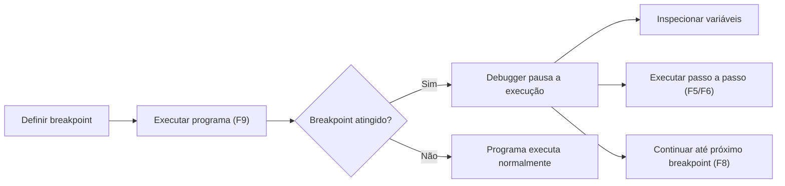
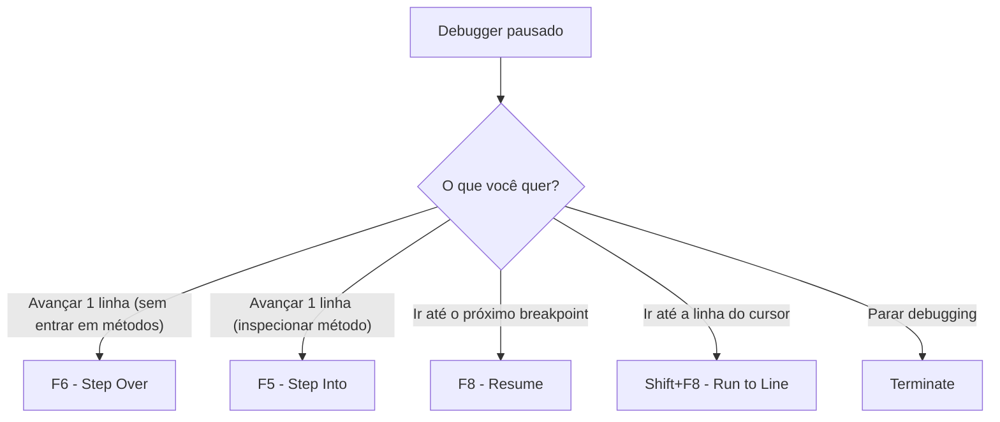

# Aula 06: Debugging de um Programa ABAP

## 🎯 Objetivos de Aprendizagem

Depois de completar esta aula, você será capaz de:

- Entrar no modo de debugging.
- Controlar a execução do código.
- Analisar o conteúdo de objetos de dados.

---

## 📖 Guia Passo a Passo: Inspecionando e Controlando a Execução

### 🧭 Antes de começar: por que aprender debugging

Você já escreveu código ABAP, mas códigos raramente funcionam perfeitamente
na primeira execução. Quando algo sai errado — um valor inesperado, um loop
que não termina, um `IF` que toma o caminho errado — você precisa de uma
ferramenta para **inspecionar o que está acontecendo dentro do programa
enquanto ele roda**.

É para isso que serve o **ABAP Debugger** (_depurador ABAP_): uma ferramenta
integrada ao Eclipse com [ADT](../../../GLOSSARY.md#adt-abap-development-tools)
que permite **pausar a execução**, **inspecionar variáveis**, **executar passo
a passo** e até **alterar valores em runtime**.

> 💡 **Analogia .NET:** O ABAP Debugger é o equivalente ao debugger do Visual
> Studio: você define breakpoints clicando na margem esquerda, inspeciona
> variáveis no Watch/Locals, usa F5 (Step Into), F10 (Step Over) e F8
> (Continue/Resume). A lógica é idêntica — o que muda são os nomes dos
> atalhos e a perspectiva (ABAP Debug perspective).

---

### 🔧 O que você vai usar

| Ferramenta/Conceito | Para que serve | Análogo no mundo .NET |
|---|---|---|
| **ABAP Debugger** | Depurador integrado ao Eclipse com ADT | Visual Studio Debugger |
| **Breakpoint** | Ponto de parada na execução (clique na margem) | Breakpoint (F9 no VS) |
| **Watchpoint** | Parar quando uma variável específica mudar de valor | Data Breakpoint / Conditional Breakpoint |
| **Step Into (F5)** | Executar a próxima instrução, entrando em sub-rotinas | F11 (Step Into) |
| **Step Over (F6)** | Executar a próxima instrução sem entrar em sub-rotinas | F10 (Step Over) |
| **Resume (F8)** | Continuar execução até o próximo breakpoint | F5 (Continue) |
| **Run to Line (Shift+F8)** | Executar até a linha do cursor | Ctrl+F10 (Run to Cursor) |

---

### 📋 Pré-requisitos

Antes de começar esta aula, você precisa ter:

1. Eclipse com [ADT](../../../GLOSSARY.md#adt-abap-development-tools) configurado e conectado.
2. Saber criar e executar classes com [`IF_OO_ADT_CLASSRUN`](../../../GLOSSARY.md#if_oo_adt_classrun) ([Aulas 01-05 do Módulo 02](../01-understanding-the-basics-of-abap/)).
3. Conhecimento de [tabelas internas](../../../GLOSSARY.md#tabela-interna-internal-table) e [`LOOP AT`](../../../GLOSSARY.md#loop-endloop) ([Aula 05](../05-working-with-simple-internal-tables/)).
4. O programa precisa estar **ativado** (Ctrl+F3) antes de aceitar breakpoints.

---

### 🪜 Passo 1: Entrar no modo de debugging

O fluxo básico para começar a debugar:

1. **Ative** a classe com **Ctrl + F3**.
2. **Defina um breakpoint**: dê um duplo clique na **margem esquerda** do editor, ao lado do número da linha onde quer pausar. Um ponto azul aparece.
3. **Execute** o programa com **F9**.
4. Quando a execução atinge o breakpoint, o Eclipse **abre a Debug Perspective** (ou pergunta se quer abrir).
5. A linha atual fica com **fundo verde** — é a próxima instrução a ser executada.

> ⚠️ **Importante:** Só é possível definir breakpoints em linhas com código
> executável — não em linhas de declaração (`DATA`, `TYPES`, `CONSTANTS`) ou
> comentários. Se tentar colocar em uma declaração, o breakpoint será movido
> automaticamente para a próxima linha executável.

> 💡 **Analogia .NET:** Duplo clique na margem esquerda = F9 no Visual Studio.
> Linha verde = seta amarela no VS. A Debug Perspective = layout de debugging
> do VS (com Locals, Watch, Call Stack abertos automaticamente).

---

### 🪜 Passo 2: Conhecer a Debug Perspective

Quando o debugger pausa, o Eclipse reorganiza a interface para mostrar:

| View | O que mostra | Análogo VS |
|---|---|---|
| **Variables** | Todas as variáveis em escopo com seus valores atuais | Locals / Autos |
| **Breakpoints** | Lista de todos os breakpoints definidos | Breakpoints window |
| **ABAP Internal Table** | Conteúdo das tabelas internas (estrutura tabular) | DataTip expandido para coleções |
| **Editor** (com destaque verde) | Código-fonte com a linha atual destacada | Editor com seta amarela |
| **Console** | Saída do programa (quando disponível) | Output / Console |

> ⚠️ **Importante:** Ao terminar o debugging, volte para a **ABAP
> Perspective** clicando em `ABAP` no canto superior direito da toolbar
> do Eclipse. Se esquecer, seu layout ficará o de debugging.

---

### 🪜 Passo 3: Controlar a execução com os atalhos de navegação

Uma vez pausado no debugger, você controla a execução com:

| Atalho | Nome | O que faz |
|---|---|---|
| **F5** | Step Into | Executa **uma** instrução. Se for uma chamada de método, **entra** nela. |
| **F6** | Step Over | Executa **uma** instrução. Se for uma chamada de método, **não entra** — trata como caixa preta. |
| **F8** | Resume | Continua execução até o **próximo breakpoint** (ou até o fim). |
| **Shift+F8** | Run to Line | Executa até a linha onde está o cursor (sem precisar definir breakpoint). |
| **Shift+F12** | Jump to Line | **Pula** para uma linha (sem executar o código intermediário). ⚠️ Não reverte alterações em variáveis! |

> 💡 **Analogia .NET:** A correspondência é quase direta: F5 = F11, F6 = F10,
> F8 = F5. A diferença é que no Visual Studio, F5 é Continue; no Eclipse ABAP,
> F5 é Step Into e F8 é Continue.

#### Quando usar cada um

---

### 🪜 Passo 4: Inspecionar variáveis em tempo de execução

Com o debugger pausado, você pode ver o valor de qualquer variável:

#### Na Variables View

Todas as variáveis em escopo aparecem automaticamente com nome, tipo e valor
atual. Para variáveis simples, o valor é mostrado diretamente. Para tabelas
internas, você vê o número de linhas e pode expandir para ver cada linha.

#### Dica rápida: duplo clique no editor

Dê um **duplo clique** no nome de uma variável no editor (durante o debug)
para ver seu valor atual destacado na Variables View.

#### Dica rápida: hover

Passe o mouse sobre uma variável para ver um tooltip com seu valor.

> 💡 **Analogia .NET:** Duplo clique na variável durante debugging =
> DataTip/hover no Visual Studio. A Variables View = janela Locals do VS.

---

### 🪜 Passo 5: Usar breakpoints especiais

Além do breakpoint comum (clique na margem), o ABAP Debugger oferece:

#### Breakpoint condicional

Adicione uma **condição** a um breakpoint existente. O debugger só pausa se
a condição for verdadeira:

- Na **Breakpoints View**, selecione o breakpoint.
- No campo **Condition**, digite a condição (ex: `sy-index > 20`).
- Pressione **Enter** para salvar.

Útil para loops longos: em vez de parar em **todas** as iterações, pare
apenas quando `sy-index > 20`.

#### Statement Breakpoint

Pausa em **qualquer ocorrência** de uma instrução específica no sistema, não
em uma linha fixa. Exemplo: pausar em todo `CLEAR`, em qualquer lugar do
código.

- Na Breakpoints View, abra o dropdown da toolbar → **Add Statement Breakpoint**.
- Digite o nome da instrução (ex: `CLEAR`, `APPEND`, `EXIT`).

#### Exception Breakpoint

Pausa quando uma **exceção específica** é lançada — mesmo que ela seja
capturada depois com `TRY/CATCH`.

- Na Breakpoints View → dropdown → **Add Exception Breakpoint**.
- Escolha a classe de exceção (ex: `CX_SY_ZERODIVIDE`).

#### Watchpoint

Pausa quando o valor de uma **variável específica** muda:

- Na **Variables View**, clique com botão direito na variável → **Set Watchpoint**.
- O debugger pausa **imediatamente após** qualquer instrução que altere o valor.

> ⚠️ **Importante:** Watchpoints consomem mais performance que breakpoints
> comuns, pois o runtime precisa verificar a variável a **cada instrução**.
> Use com moderação em loops longos.

---

### 🪜 Passo 6: Alterar valores de variáveis durante o debug

Se você quiser testar "o que aconteceria se esta variável tivesse outro valor",
pode alterá-la em tempo real:

1. Na **Variables View**, clique com botão direito na variável.
2. Escolha **Change Value...**.
3. Digite o novo valor e confirme.

Para **tabelas internas**, você também pode:
- **Insert Row**: adicionar nova linha (no final ou em posição específica).
- **Delete Selected Rows**: remover linhas selecionadas.
- **Delete Rows**: remover um intervalo de linhas.
- **Change Value**: alterar o conteúdo de uma linha existente.

> 💡 **Analogia .NET:** Change Value no ABAP Debugger = "Edit Value" no
> Watch window do Visual Studio. Ambos permitem alterar variáveis em runtime
> para testar cenários sem recompilar.

---

### 🪜 Passo 7: Praticar com um programa de demonstração

Use o arquivo [`debugging_demo.abap`](./debugging_demo.abap) para praticar.
É um simulador de empréstimo com amortização que calcula parcelas mensais.

**Roteiro de prática:**

1. Abra o código no Eclipse e **ative** (Ctrl+F3).
2. Defina um **breakpoint** na primeira linha após as declarações (onde começa `lv_remaining = lv_total.`).
3. Execute com **F9** — o debugger deve pausar.
4. Na **Variables View**, inspecione `lv_total` e `lv_remaining`.
5. Use **F5** (Step Into) para avançar linha por linha e observar como `lv_remaining` diminui.
6. Defina um **watchpoint** em `lv_remaining` e use **F8** (Resume). Observe que o debugger pausa cada vez que a variável muda.
7. Defina um **breakpoint condicional** no loop: entre no Breakpoints View e adicione a condição `sy-index > 5`. Use **F8**.
8. Altere o valor de `lv_repayment` durante o debug (Change Value) e veja como o cálculo muda.
9. Quando terminar, volte para a **ABAP Perspective**.

---

### ✅ Verificação: deu certo?

1. ❓ Qual a diferença entre **F5 (Step Into)** e **F6 (Step Over)**?
   

   
<b>Resposta</b>

   F5 entra dentro de métodos/funções chamados na linha atual. F6 executa a linha inteira (incluindo chamadas) sem entrar nelas — trata como uma operação atômica.
   

2. ❓ Para que serve um **watchpoint** e como ele difere de um breakpoint comum?
   

   
<b>Resposta</b>

   Um watchpoint pausa quando uma **variável específica muda de valor**, independentemente de onde no código a mudança ocorre. Um breakpoint pausa em uma **linha fixa** do código.
   

3. ❓ O que acontece se você definir um breakpoint em uma linha `DATA lv_x TYPE i.`?
   

   
<b>Resposta</b>

   O breakpoint será movido automaticamente para a próxima linha executável. Declarações (`DATA`, `TYPES`, `CONSTANTS`) não são paráveis — são processadas em tempo de compilação/ativação.
   

4. ❓ Como voltar ao layout normal depois de debugar?
   

   
<b>Resposta</b>

   Clique no botão **ABAP** no canto superior direito da toolbar do Eclipse para voltar à ABAP Perspective.
   

---

### ❓ Perguntas Frequentes

<b>"Breakpoints são permanentes? Preciso removê-los depois?"</b>

Sim, breakpoints são **persistentes por usuário** — sobrevivem a logoff e
reconexão. Se não quiser que o debugger pare, você precisa **remover** o
breakpoint (duplo clique na margem) ou **desativá-lo** (menu de contexto →
Disable Breakpoint).

<b>"Posso debugar qualquer programa ABAP ou só os meus?"</b>

Depende das suas autorizações no sistema. Em ambientes de desenvolvimento,
você geralmente pode debugar seus próprios programas e classes de
demonstração. Em produção, o debugging é restrito por razões de segurança.

<b>"Qual a diferença entre Jump to Line (Shift+F12) e Run to Line (Shift+F8)?"</b>

**Run to Line** (Shift+F8) **executa** todo o código entre a linha atual e a
linha de destino. **Jump to Line** (Shift+F12) **pula** diretamente, sem
executar o código intermediário — mas também **não reverte** alterações já
feitas em variáveis. Use Jump com cuidado.

<b>"O que faço se a Debug Perspective não abrir automaticamente?"</b>

Verifique suas configurações: Window → Preferences → ABAP Development → Debug
→ marque "Open Debug perspective automatically". Se mesmo assim não abrir,
você pode abrir manualmente: Window → Perspective → Open Perspective → Debug.

---

### 📚 O que aprendemos

| Conceito | Significado |
|---|---|
| **ABAP Debugger** | Depurador integrado ao Eclipse/ADT para inspecionar execução |
| **Breakpoint** | Ponto de parada definido em uma linha de código executável |
| **Debug Perspective** | Layout do Eclipse otimizado para debugging (Variables, Breakpoints, Editor) |
| **F5 (Step Into)** | Avança 1 instrução, entrando em sub-rotinas |
| **F6 (Step Over)** | Avança 1 instrução sem entrar em sub-rotinas |
| **F8 (Resume)** | Continua até o próximo breakpoint ou fim do programa |
| **Watchpoint** | Pausa quando uma variável específica muda de valor |
| **Breakpoint condicional** | Breakpoint que só pausa se uma condição for verdadeira |
| **Change Value** | Alterar valor de variável em runtime durante debugging |

---

### 📖 Novos Termos (Glossário)

Estes são os termos do ecossistema SAP que apareceram nesta aula.
Consulte o [glossário completo](../../../GLOSSARY.md) para ver todos os termos.

| Termo | Definição rápida |
|---|---|
| [ABAP Debugger](../../../GLOSSARY.md#abap-debugger) | Depurador integrado ao Eclipse/ADT para análise de código em tempo de execução |
| [Debug Perspective](../../../GLOSSARY.md#debug-perspective) | Layout do Eclipse com Views otimizadas para debugging ABAP |

---

### ⏭️ Próxima etapa

[Unit 02 Assessment: Applying Basic Techniques and Concepts](../) — avaliação prática dos conhecimentos adquiridos no Módulo 02. Revise as 5 aulas anteriores antes de fazer a avaliação.
