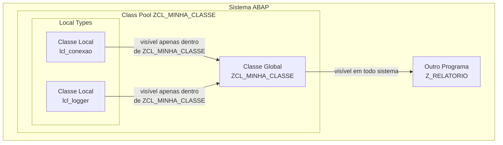

# Aula 01: Definindo uma Classe Local

## 🎯 Objetivos de Aprendizagem

Depois de completar esta aula, você será capaz de:

- Definir uma classe local dentro de uma classe global.

---

## 📖 Guia Passo a Passo: Criando Sua Primeira Classe Local

### 🧭 Antes de começar: classes locais vs. globais — onde vive o código ABAP?

No mundo .NET, você escreve classes em arquivos `.cs`. Todas as classes —
sejam `public`, `internal` ou `private` — vivem em arquivos de texto dentro
de uma estrutura de pastas. No ecossistema ABAP, a história é diferente:
classes podem ser **globais** ou **locais**, e isso muda completamente onde
e como você as cria.

Uma **classe global** ([Global Class](../../../GLOSSARY.md#classe-global-global-class))
é um [objeto de repositório](../../../GLOSSARY.md#objeto-de-desenvolvimento-development-object--repository-object)
independente, armazenado em um **class pool** próprio. Ela é visível para
qualquer outro programa ABAP no sistema (respeitando regras de
[pacote](../../../GLOSSARY.md#pacote-package)). É o tipo de classe que você
criou na [Aula 04 do Módulo 01](../../01-getting-started/04-developing-your-first-abap-application/).

Uma **classe local** ([Local Class](../../../GLOSSARY.md#classe-local-local-class))
é definida **dentro** de outro programa ABAP — tipicamente dentro de uma classe
global. Ela só existe no escopo daquele programa e não pode ser acessada por
nenhum outro código fora dele.

> 💡 **Analogia .NET:** Uma classe global ABAP é como uma classe `public` C#
> em seu próprio arquivo `.cs` — qualquer outro código pode referenciá-la.
> Uma classe local ABAP é como uma classe `private` aninhada dentro de outra
> classe C# — ela só existe para uso interno da classe que a contém.



Nesta aula, você vai aprender a criar uma classe local dentro de uma classe
global — a mesma estrutura que usará em todo o restante do curso.

---

### 🔧 O que você vai usar

| Ferramenta/Conceito | Para que serve | Análogo no mundo .NET |
|---|---|---|
| **Classe Global** (_Global Class_) | Objeto de repositório independente, visível em todo o sistema | Classe `public` em arquivo `.cs` próprio |
| **Classe Local** (_Local Class_) | Classe definida dentro de outro programa, visível só naquele escopo | Classe privada aninhada (_nested private class_) |
| **Class Pool** | Container que armazena uma classe global no repositório ABAP | Arquivo `.cs` que contém a classe |
| **DEFINITION** | Parte da classe que declara membros (atributos, métodos, tipos) | Assinatura da classe + declarações de membros |
| **IMPLEMENTATION** | Parte da classe que contém o código executável dos métodos | Corpo dos métodos em C# |
| **Seção de Visibilidade** (_Visibility Section_) | Define quem pode acessar cada membro: `PUBLIC`, `PROTECTED` ou `PRIVATE` | Modificadores `public`, `protected`, `private` do C# |
| **DATA** (_Attribute_) | Declara um atributo de instância — uma variável que pertence a cada objeto | Campo de instância em C# |
| **CLASS-DATA** (_Static Attribute_) | Declara um atributo estático — compartilhado por todas as instâncias da classe | Campo `static` em C# |
| **IF_OO_ADT_CLASSRUN** | Interface que dá à classe global um ponto de entrada `main` (F9) | `static void Main()` no .NET |
| **Local Types** | Aba do editor ADT onde se escrevem classes locais | Aba secundária em um editor de código |

---

### 📋 Pré-requisitos

Antes de começar esta aula, você precisa ter:

1. **Eclipse IDE** com o plugin [ADT](../../../GLOSSARY.md#adt-abap-development-tools) instalado.
2. Um [ABAP Cloud Project](../../../GLOSSARY.md#abap-cloud-project) conectado ao sistema SAP BTP.
3. Seu [pacote](../../../GLOSSARY.md#pacote-package) `ZS4D400_##` criado e
   adicionado aos **Favorite Packages**.
4. Saber criar uma [classe ABAP](../../../GLOSSARY.md#classe-abap-abap-class)
   global com a interface `IF_OO_ADT_CLASSRUN` ([Aula 04 do Módulo 01](../../01-getting-started/04-developing-your-first-abap-application/)).

---

### 🪜 Passo 1: Criar a classe global (o "container")

Antes de criar a classe local, você precisa de uma classe global para
hospedá-la. Esta classe global vai implementar a interface
[`IF_OO_ADT_CLASSRUN`](../../../GLOSSARY.md#if_oo_adt_classrun) —
a porta de entrada que permite executar o código com F9.

1. No **Project Explorer**, clique com botão direito no seu pacote
   `ZS4D400_##`.

2. Navegue até: **New → ABAP Class**.

3. Preencha os campos:

   | Campo | Valor |
   |---|---|
   | **Name** | `ZCL_##_LOCAL_CLASS` (substitua `##` pelo seu número de grupo) |
   | **Description** | `Local class demonstration` |

4. No grupo **Interfaces**, clique em **Add** e adicione `IF_OO_ADT_CLASSRUN`.

5. Clique **Next**, selecione sua [Transport Request](../../../GLOSSARY.md#transport-request) e clique **Finish**.

O Eclipse cria a estrutura básica da classe global. Por enquanto, o método
`if_oo_adt_classrun~main` está vazio — nós vamos preenchê-lo em aulas futuras.

> 💡 **Analogia .NET:** Criar uma classe global com `IF_OO_ADT_CLASSRUN` é
> como criar um `Program.cs` com `static void Main()`. A interface funciona
> como o contrato que diz ao ADT "esta classe pode ser executada diretamente".

---

### 🪜 Passo 2: Navegar para a aba Local Types

Com a classe global criada, você precisa acessar o espaço onde as classes
locais são definidas.

1. No editor da classe `ZCL_##_LOCAL_CLASS`, observe as abas na parte
   inferior:

   ```
   ┌──────────────────┬──────────────┐
   │  Global Class    │  Local Types  │
   └──────────────────┴──────────────┘
   ```

2. Clique na aba **Local Types**.

Aqui é onde você escreverá todas as classes locais deste curso. O conteúdo
atual deve ser apenas um comentário gerado automaticamente:

```abap
*"* use this source file for the definition and implementation of
*"* local helper classes, interface definitions and type
*"* declarations
```

> ⚠️ **Importante:** Não confunda as abas. A aba **Global Class** contém o
> código da classe global (`ZCL_##_LOCAL_CLASS`). A aba **Local Types** contém
> as classes locais que só essa classe global pode usar. É como ter dois
> arquivos `.cs` diferentes — um com a classe pública e outro com as classes
> internas.

---

### 🪜 Passo 3: Gerar o esqueleto da classe local com code completion

O ADT oferece um atalho para gerar a estrutura básica de uma classe local —
similar aos _code snippets_ do Visual Studio.

1. Na aba **Local Types**, digite `lcl` e pressione **Ctrl + Space**.

2. Uma lista de sugestões aparece. Dê um duplo clique em **lcl - Local class**.

   O ADT gera o seguinte código:

   ```abap
   CLASS lcl DEFINITION CREATE PRIVATE.

     PUBLIC SECTION.
     PROTECTED SECTION.
     PRIVATE SECTION.

   ENDCLASS.

   CLASS lcl IMPLEMENTATION.

   ENDCLASS.
   ```

3. Renomeie a classe de `lcl` para `lcl_connection`:
   - Enquanto o _frame_ de seleção ainda está visível em torno de `lcl`, digite
     `lcl_connection`.

4. **Remova** as palavras `CREATE PRIVATE` do final da linha
   `CLASS lcl_connection DEFINITION.`:

   ```abap
   CLASS lcl_connection DEFINITION.
   ```

   > ⚠️ **Importante:** O `CREATE PRIVATE` restringe a criação de instâncias
   > da classe. Para os exemplos deste curso, não precisamos dessa restrição.
   > Nas próximas aulas, você aprenderá como criar instâncias — e o
   > `CREATE PRIVATE` impediria isso.

> 💡 **Analogia .NET:** O code completion `lcl + Ctrl + Space` é equivalente
> aos _code snippets_ do Visual Studio — como digitar `ctor` e pressionar Tab
> para gerar um construtor, ou `prop` para gerar uma propriedade.

---

### 🪜 Passo 4: Declarar os atributos da classe

Agora que você tem o esqueleto da classe, vamos adicionar atributos. Declarações
de atributos devem ficar dentro de uma das três seções de visibilidade.

As três seções seguem a ordem obrigatória:


| Seção | Visibilidade | Análogo C# |
|---|---|---|
| `PUBLIC SECTION.` | Membros acessíveis de qualquer lugar | `public` |
| `PROTECTED SECTION.` | Membros acessíveis pela própria classe e subclasses | `protected` |
| `PRIVATE SECTION.` | Membros acessíveis apenas pela própria classe | `private` |

> ⚠️ **Importante:** Se uma classe tiver mais de uma seção, elas **precisam**
> estar nesta ordem: PUBLIC → PROTECTED → PRIVATE. O ABAP não permite outra
> ordem.

Vamos declarar três atributos para a classe `lcl_connection` — dois de
instância e um estático:

1. Após a linha `PUBLIC SECTION.` e **antes** da linha `PROTECTED SECTION.`,
   adicione:

   ```abap
   DATA carrier_id    TYPE /dmo/carrier_id.
   DATA connection_id TYPE /dmo/connection_id.

   CLASS-DATA conn_counter TYPE i.
   ```

   Explicação de cada linha:

   | Linha | Significado |
   |---|---|
   | `DATA carrier_id TYPE /dmo/carrier_id.` | Atributo de instância: cada objeto `lcl_connection` terá seu próprio `carrier_id` |
   | `DATA connection_id TYPE /dmo/connection_id.` | Atributo de instância: cada objeto terá seu próprio `connection_id` |
   | `CLASS-DATA conn_counter TYPE i.` | Atributo estático: **todas** as instâncias compartilham o mesmo `conn_counter` |

   > 💡 **Analogia .NET:** `DATA nome TYPE tipo.` = campo de instância C#
   > (`public string CarrierId;`). `CLASS-DATA nome TYPE tipo.` = campo
   > `static` C# (`public static int ConnCounter;`). O `CLASS-DATA` pertence
   > à classe, não a um objeto específico — exatamente como `static` no C#.

2. O código completo na aba **Local Types** deve ficar assim:

   ```abap
   *"* use this source file for the definition and implementation of
   *"* local helper classes, interface definitions and type
   *"* declarations

   CLASS lcl_connection DEFINITION.

     PUBLIC SECTION.

       DATA carrier_id    TYPE /dmo/carrier_id.
       DATA connection_id TYPE /dmo/connection_id.

       CLASS-DATA conn_counter TYPE i.

     PROTECTED SECTION.
     PRIVATE SECTION.

   ENDCLASS.

   CLASS lcl_connection IMPLEMENTATION.

   ENDCLASS.
   ```

---

### 🪜 Passo 5: Ativar a classe

Ativar (_activate_) significa compilar e registrar a classe no
[Repositório ABAP](../../../GLOSSARY.md#repositorio-abap-abap-repository).

1. Pressione **Ctrl + F3** para ativar a classe.

2. Verifique se não há erros no painel **Problems** (parte inferior do Eclipse).

> ⚠️ **Importante:** Neste momento, o método `if_oo_adt_classrun~main` está
> vazio — por isso, mesmo que você pressione **F9**, nada acontece no console.
> Nas próximas aulas, você aprenderá a **criar instâncias** de `lcl_connection`
> e a usar seus atributos. Por enquanto, o objetivo é apenas ter a classe
> local definida e ativada sem erros.

---

### ✅ Verificação: deu certo?

Para confirmar que sua classe local foi definida corretamente:

1. ✅ A aba **Local Types** contém o código exato mostrado no Passo 4.
2. ✅ A ativação com **Ctrl + F3** foi concluída **sem erros** no painel Problems.
3. ✅ As três seções estão na ordem correta: `PUBLIC SECTION` →
   `PROTECTED SECTION` → `PRIVATE SECTION`.
4. ✅ A linha `CREATE PRIVATE` foi removida da definição da classe.

Compare seu código com a [solução oficial](./solution.abap) se tiver dúvidas.

---

### ❓ Perguntas Frequentes

<details>
<summary><b>"Por que usar classes locais em vez de globais?"</b></summary>

Classes locais são ideais para funcionalidades auxiliares que só fazem sentido
dentro de um programa específico — como _helpers_, _builders_ ou _data
transfer objects_ internos. Elas reduzem a poluição do repositório com objetos
que nunca serão reutilizados por outros programas.

> 💡 **Analogia .NET:** É a mesma razão pela qual você cria classes privadas
> aninhadas em C# em vez de uma nova classe `public` em um arquivo separado:
> encapsulamento e coesão.

</details>

<details>
<summary><b>"Por que a ordem PUBLIC → PROTECTED → PRIVATE é obrigatória?"</b></summary>

É uma regra da sintaxe ABAP. A SAP projetou a linguagem para que a leitura
siga uma progressão natural: primeiro o que é visível para todos (PUBLIC),
depois o que é visível para subclasses (PROTECTED) e, por último, os detalhes
internos (PRIVATE).

> 💡 **Analogia .NET:** Em C# você pode colocar `public`, `protected` e
> `private` em qualquer ordem dentro de uma classe. O ABAP é mais rígido
> nesse aspecto — a ordem é imposta pelo compilador.

</details>

<details>
<summary><b>"Qual a diferença entre DATA e CLASS-DATA?"</b></summary>

- `DATA`: declara um **atributo de instância** — cada objeto criado a partir
  da classe tem sua própria cópia do atributo.
- `CLASS-DATA`: declara um **atributo estático** — o valor é compartilhado
  por **todas** as instâncias da classe.

> 💡 **Analogia .NET:** `DATA` = campo de instância (`public string Name;`).
> `CLASS-DATA` = campo estático (`public static int Counter;`).

</details>

<details>
<summary><b>"Por que a IMPLEMENTATION está vazia?"</b></summary>

A parte de implementação (`IMPLEMENTATION`) contém o código dos métodos. Como
esta aula foca apenas na definição da classe e declaração de atributos, ainda
não criamos nenhum método. Nas próximas aulas (como "Creating Instances of a
Class"), você preencherá a `IMPLEMENTATION` com código de métodos.

</details>

---

### 📚 O que aprendemos

| Conceito | Significado |
|---|---|
| **Classe Local** | Classe definida dentro de outro programa ABAP, visível apenas naquele escopo |
| **Classe Global** | Objeto de repositório independente, visível em todo o sistema |
| **DEFINITION** | Parte da classe que declara tipos, atributos, constantes e métodos |
| **IMPLEMENTATION** | Parte da classe que contém o código executável dos métodos |
| **PUBLIC SECTION** | Membros acessíveis de qualquer lugar |
| **PROTECTED SECTION** | Membros acessíveis pela própria classe e subclasses |
| **PRIVATE SECTION** | Membros acessíveis apenas pela própria classe |
| **DATA** | Declara um atributo de instância (cada objeto tem o seu) |
| **CLASS-DATA** | Declara um atributo estático (compartilhado entre todas as instâncias) |
| **Local Types** | Aba do editor ADT onde se definem classes locais |

---

### 📖 Novos Termos (Glossário)

Estes são os termos do ecossistema SAP que apareceram nesta aula.
Consulte o [glossário completo](../../../GLOSSARY.md) para ver todos os termos.

| Termo | Definição rápida |
|---|---|
| [Classe Local](../../../GLOSSARY.md#classe-local-local-class) | Classe definida dentro de um programa ABAP, visível apenas naquele escopo |
| [Classe Global](../../../GLOSSARY.md#classe-global-global-class) | Objeto de repositório independente armazenado em um class pool próprio |
| [Class Pool](../../../GLOSSARY.md#class-pool) | Container do repositório ABAP que armazena uma classe global |
| [CLASS-DATA](../../../GLOSSARY.md#class-data) | Declaração de atributo estático — compartilhado por todas as instâncias |
| [Atributo de Instância](../../../GLOSSARY.md#atributo-de-instancia-instance-attribute) | Variável que pertence a cada objeto individualmente (declarada com `DATA`) |
| [Atributo Estático](../../../GLOSSARY.md#atributo-estatico-static-attribute) | Variável compartilhada entre todas as instâncias da classe (declarada com `CLASS-DATA`) |
| [Definição de Classe](../../../GLOSSARY.md#definicao-de-classe-class-definition) | Parte da classe que declara membros — começa com `CLASS ... DEFINITION` |
| [Implementação de Classe](../../../GLOSSARY.md#implementacao-de-classe-class-implementation) | Parte da classe com código executável — começa com `CLASS ... IMPLEMENTATION` |
| [Seção de Visibilidade](../../../GLOSSARY.md#secao-de-visibilidade-visibility-section) | Define o nível de acesso: `PUBLIC SECTION`, `PROTECTED SECTION`, `PRIVATE SECTION` |

---

### ⏭️ Próxima aula

[Lesson 02: Creating Instances of a Class](../02-creating-instances-of-a-class/) — aprenda a instanciar objetos a partir da classe local que você acabou de definir.
