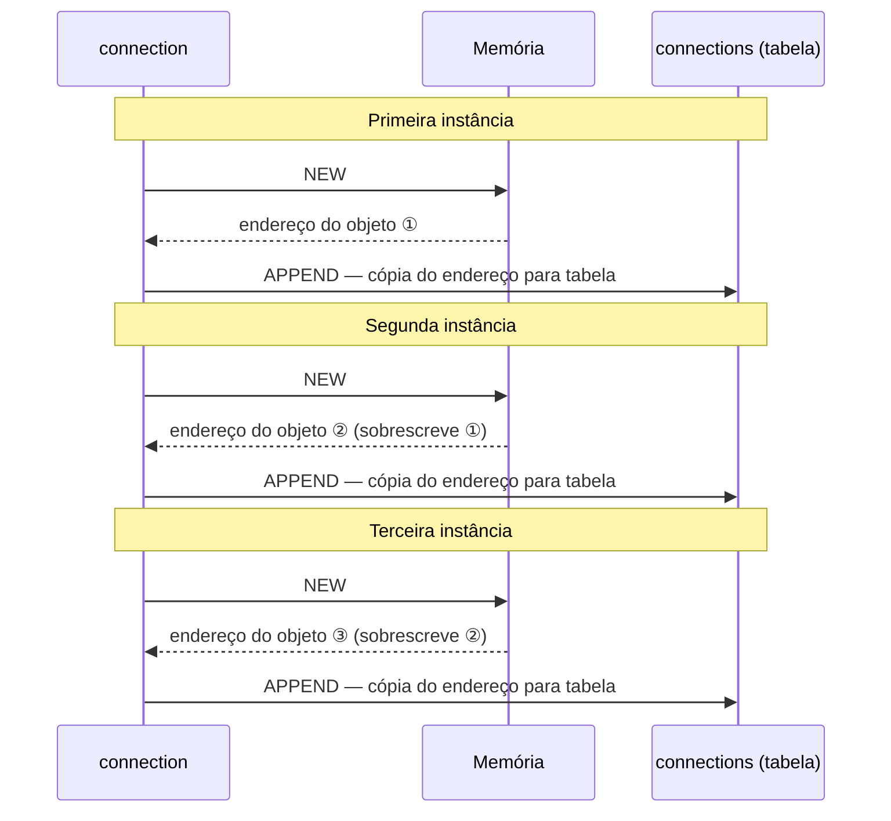
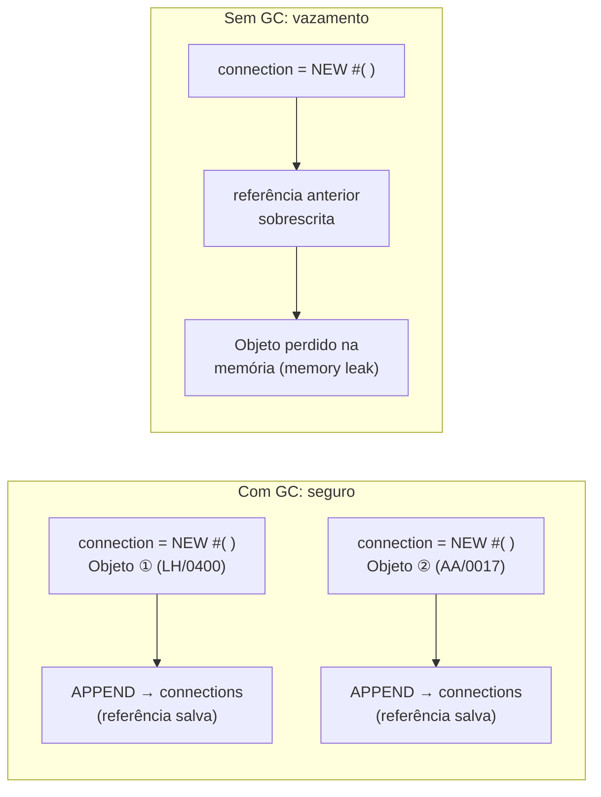

# Aula 02: Criando Instâncias de uma Classe

## 🎯 Objetivos de Aprendizagem

Depois de completar esta aula, você será capaz de:

- Criar instâncias de uma classe ABAP.

---

## 📖 Guia Passo a Passo: Do Modelo ao Objeto — Criando e Gerenciando Instâncias

### 🧭 Antes de começar: o que significa "criar uma instância"?

Na [Aula 01](../01-defining-a-local-class/), você definiu a planta de uma casa —
a [classe local](../../../GLOSSARY.md#classe-local-local-class) `lcl_connection`
com seus atributos. Mas uma planta não é uma casa — você precisa **construir**
a casa a partir da planta. No mundo da orientação a objetos, construir a casa
significa **criar uma instância** (_instance_) da classe.

> 💡 **Analogia .NET:** `new Person()` no C#. A classe é o molde (`class Person`),
> a instância é o objeto concreto criado com `new`. No ABAP, o conceito é
> idêntico: você usa o operador `NEW` para criar objetos a partir de classes.

Mas o ABAP tem uma particularidade importante: para manipular objetos, você
precisa de uma **variável de referência** ([Reference Variable](../../../GLOSSARY.md#variavel-de-referencia-reference-variable)).
Diferente de C#, onde uma variável do tipo `Person` já é uma referência, no
ABAP você declara explicitamente `TYPE REF TO <classe>`.

Nesta aula, você vai aprender a:

- Declarar variáveis de referência com `TYPE REF TO`
- Criar instâncias com o operador `NEW #( )`
- Acessar atributos com os seletores de componente (`->` e `=>`)
- Armazenar múltiplas instâncias em uma [tabela interna](../../../GLOSSARY.md#tabela-interna-internal-table)
- Entender o papel do [Garbage Collector](../../../GLOSSARY.md#garbage-collector-coletor-de-lixo) do ABAP

---

### 🔧 O que você vai usar

| Ferramenta/Conceito | Para que serve | Análogo no mundo .NET |
|---|---|---|
| **Variável de Referência** (_Reference Variable_) | Variável especial que armazena o endereço de memória de um objeto | Variável de tipo classe em C# (toda variável de objeto já é referência) |
| **TYPE REF TO** | Adição do `DATA` que declara uma referência para uma classe específica | Tipo da variável: `Person p;` |
| **NEW #( )** | Operador que cria uma nova instância em memória e retorna sua referência | `new Person()` |
| **Seletor de Instância `->`** | Operador para acessar atributos e métodos de um objeto (instância) | `.` (ponto) em C#: `obj.Name` |
| **Seletor Estático `=>`** | Operador para acessar atributos e métodos estáticos da classe | `.` (ponto) em membros `static` C#: `Person.Counter` |
| **TABLE OF REF TO** | Tipo de tabela interna que armazena referências para objetos | `List<Person>` em C# |
| **APPEND ... TO** | Adiciona uma linha (referência) ao final da tabela interna | `list.Add(item)` |
| **Garbage Collector** | Componente do runtime ABAP que remove objetos sem referência da memória | GC do .NET — automático, não precisa se preocupar |

---

### 📋 Pré-requisitos

Antes de começar esta aula, você precisa ter:

1. A classe global `ZCL_##_LOCAL_CLASS` (ou `ZCL_##_INSTANCES`) criada e ativada,
   implementando `IF_OO_ADT_CLASSRUN` ([Aula 01](../01-defining-a-local-class/)).
2. A [classe local](../../../GLOSSARY.md#classe-local-local-class) `lcl_connection`
   definida na aba **Local Types** com os atributos `carrier_id`, `connection_id`
   e `conn_counter` ([Aula 01](../01-defining-a-local-class/)).
3. Familiaridade com o [ABAP Debugger](../../../GLOSSARY.md#abap-debugger) — vamos
   usá-lo para visualizar as instâncias em memória.

> ⚠️ **Importante:** Se você completou o exercício da Aula 01, continue usando
> a classe `ZCL_##_LOCAL_CLASS`. Se preferir começar do template pronto, pode
> duplicar a classe `/LRN/CL_S4D400_CLS_LOCAL_CLASS` como `ZCL_##_INSTANCES`.

---

### 🪜 Passo 1: Declarar uma variável de referência

Para trabalhar com objetos no ABAP, você precisa de uma **variável de
referência** (_reference variable_). Ela não armazena o objeto em si — armazena
o **endereço de memória** onde o objeto reside.

A sintaxe é:

```abap
DATA <nome> TYPE REF TO <classe>.
```

1. Na aba **Global Class** da sua classe `ZCL_##_LOCAL_CLASS`, localize o
   método `if_oo_adt_classrun~main`.

2. Dentro do método, declare uma variável de referência chamada `connection`:

   ```abap
   METHOD if_oo_adt_classrun~main.

     DATA connection TYPE REF TO lcl_connection.

   ENDMETHOD.
   ```

   | Parte da declaração | Significado |
   |---|---|
   | `DATA connection` | Declara uma variável chamada `connection` |
   | `TYPE REF TO` | Indica que é uma **referência**, não um valor direto |
   | `lcl_connection` | A classe cujos objetos esta referência pode apontar |

> 💡 **Analogia .NET:** `DATA connection TYPE REF TO lcl_connection.` é
> equivalente a `lcl_connection connection;` em C#. A diferença é que no
> ABAP a palavra `REF TO` é explícita — você sempre sabe que está lidando
> com uma referência, nunca com um _value type_.

Neste momento, `connection` contém uma **referência NULA**
([NULL Reference](../../../GLOSSARY.md#referencia-nula-null-reference)) —
ela não aponta para objeto nenhum. É como declarar `Person p = null;` em C#.

---

### 🪜 Passo 2: Criar uma instância com NEW #( )

Agora que você tem uma variável de referência, precisa criar o objeto que ela
vai referenciar. O operador `NEW #( )` faz isso.

1. Após a declaração de `connection`, adicione:

   ```abap
   connection = NEW #( ).
   ```

   | Parte | Significado |
   |---|---|
   | `NEW` | Operador que cria uma nova instância em memória |
   | `#` | "Use o tipo da variável à esquerda do `=`" — o compilador sabe que `connection` é `TYPE REF TO lcl_connection` |
   | `( )` | Parênteses para passar parâmetros ao construtor (vazio por enquanto) |

> 💡 **Analogia .NET:** `connection = NEW #( ).` = `connection = new
> lcl_connection();` em C#. O `#` é uma inferência de tipo — como `var` no
> C#, mas aplicado ao `new`. O compilador deduz `lcl_connection` a partir do
> tipo da variável `connection`.

> ⚠️ **Importante:** O `#` só funciona quando o compilador consegue inferir
> o tipo. Se não houver contexto suficiente, você pode (e deve) escrever o
> nome da classe explicitamente: `NEW lcl_connection( )`. Para os exemplos
> deste curso, `NEW #( )` é suficiente e mais conciso.

---

### 🪜 Passo 3: Acessar atributos de instância com `->`

Com o objeto criado, você pode atribuir valores aos seus atributos. Para
atributos de instância (declarados com `DATA`), use o **seletor de componente
de instância** ([Instance Component Selector](../../../GLOSSARY.md#seletor-de-componente-component-selector)):
`->`.

1. Após a criação da instância, atribua valores aos atributos:

   ```abap
   connection->carrier_id    = 'LH'.
   connection->connection_id = '0400'.
   ```

   | Símbolo | Nome | Para que serve |
   |---|---|---|
   | `->` | Seletor de instância | Acessa membros de um **objeto** (instância) |
   | `=>` | Seletor estático | Acessa membros da **classe** (estáticos) |

   > 💡 **Analogia .NET:** `connection->carrier_id` = `connection.CarrierId`
   > em C#. O ABAP usa `->` para membros de instância e `=>` para membros
   > estáticos. C# usa `.` para ambos — o ABAP é mais explícito.

2. O código completo do método `main` até aqui:

   ```abap
   METHOD if_oo_adt_classrun~main.

     DATA connection TYPE REF TO lcl_connection.

     connection = NEW #( ).

     connection->carrier_id    = 'LH'.
     connection->connection_id = '0400'.

   ENDMETHOD.
   ```

---

### 🪜 Passo 4: Depurar para ver a instância em memória

Vamos usar o [ABAP Debugger](../../../GLOSSARY.md#abap-debugger) para visualizar
o que acontece em cada passo.

1. Ative a classe com **Ctrl + F3**.

2. Na margem esquerda do editor, dê um duplo clique ao lado da linha
   `connection = NEW #( ).` para definir um **breakpoint**.

3. Pressione **F9** para executar a classe. O debugger para no breakpoint.

4. Dê um duplo clique na palavra `connection`. Uma janela mostra o conteúdo
   atual: `NULL` — a variável ainda não referencia objeto nenhum.

5. Pressione **F5** (Step Into) para executar `connection = NEW #( ).`.
   Observe que o valor de `connection` mudou — agora mostra um endereço de
   memória (ex: `{O:...}`).

6. Na view **Variables**, expanda o nó `connection`. Você verá os atributos
   `CARRIER_ID` e `CONNECTION_ID` com seus valores iniciais (vazios).

7. Pressione **F5** mais duas vezes. A cada passo, um atributo recebe seu
   valor (`'LH'` e depois `'0400'`).

8. Pressione **F8** (Continue) para terminar a execução.

> 💡 **Analogia .NET:** Este fluxo é idêntico ao debugging no Visual Studio:
> F9 = Start Debugging, F5 = Step Into, F8 = Continue. A view **Variables**
> equivale às janelas **Locals** e **Autos** do VS.

---

### 🪜 Passo 5: Criar múltiplas instâncias

Uma das principais características da orientação a objetos é poder criar
**vários objetos** da mesma classe, cada um com seus próprios valores.

Vamos criar três conexões de voo diferentes. Para não perder a referência
a cada objeto criado, vamos armazená-las em uma
[tabela interna](../../../GLOSSARY.md#tabela-interna-internal-table).

1. Declare uma tabela interna para armazenar referências:

   ```abap
   DATA connections TYPE TABLE OF REF TO lcl_connection.
   ```

   > 💡 **Analogia .NET:** `DATA connections TYPE TABLE OF REF TO
   > lcl_connection.` = `List<lcl_connection> connections = new
   > List<lcl_connection>();` em C#.

2. Substitua o código do método `main` pelo seguinte:

   ```abap
   METHOD if_oo_adt_classrun~main.

     DATA connection  TYPE REF TO lcl_connection.
     DATA connections TYPE TABLE OF REF TO lcl_connection.

   * Primeira Instância
   **********************************************************************
     connection = NEW #( ).

     connection->carrier_id    = 'LH'.
     connection->connection_id = '0400'.

     APPEND connection TO connections.

   * Segunda Instância
   **********************************************************************
     connection = NEW #( ).

     connection->carrier_id    = 'AA'.
     connection->connection_id = '0017'.

     APPEND connection TO connections.

   * Terceira Instância
   **********************************************************************
     connection = NEW #( ).

     connection->carrier_id    = 'SQ'.
     connection->connection_id = '0001'.

     APPEND connection TO connections.

   ENDMETHOD.
   ```

3. Vamos entender o fluxo de cada bloco:



> ⚠️ **Importante:** A cada `NEW #( )`, a variável `connection` recebe um
> **novo** endereço, sobrescrevendo o anterior. Mas os objetos anteriores
> **não são perdidos** — a tabela `connections` mantém uma cópia de cada
> referência. Se você não armazenasse as referências na tabela, cada
> `NEW #( )` tornaria o objeto anterior inacessível.

---

### 🪜 Passo 6: Depurar a criação de múltiplas instâncias

Vamos visualizar a tabela interna crescendo a cada `APPEND`.

1. Remova o breakpoint anterior e coloque um novo na primeira linha
   `APPEND connection TO connections.`

2. Pressione **F9** para executar.

3. Dê um duplo clique em `connection` para ver o objeto atual.

4. Dê um duplo clique em `connections` para ver a tabela (vazia na primeira
   parada).

5. Pressione **F5**. Agora `connections` tem 1 linha.

6. Na view **Variables**, expanda `connections` → linha 1 → você verá os
   atributos do primeiro objeto (`LH` / `0400`).

7. Pressione **F5** até passar pelo terceiro `APPEND`. A tabela `connections`
   agora tem 3 linhas — cada uma apontando para um objeto diferente com seus
   próprios valores.

8. Pressione **F8** para terminar.

---

### 🧠 Entendendo o Garbage Collector

O ABAP, assim como o .NET, tem um **Garbage Collector** ([GC](../../../GLOSSARY.md#garbage-collector-coletor-de-lixo)) —
um componente do runtime que remove da memória objetos que não têm mais
nenhuma referência apontando para eles.



> 💡 **Analogia .NET:** O Garbage Collector do ABAP funciona como o GC do
> .NET — ele roda periodicamente, identifica objetos sem referências e os
> remove. Você **não** precisa (nem pode) chamar `Dispose()` ou `delete`
> manualmente. Quando um programa ABAP termina, todas as referências são
> liberadas e o GC limpa todos os objetos automaticamente.

> ⚠️ **Importante:** Diferente de C++, o ABAP (como C# e Java) não tem
> _deterministic destruction_. Você não controla exatamente **quando** o
> objeto é removido — apenas garante que ele **será** removido quando não
> houver mais referências.

---

### ✅ Verificação: deu certo?

Para confirmar que você criou e gerenciou instâncias corretamente:

1. ✅ O código não tem erros de ativação (**Ctrl + F3**).
2. ✅ No debugger, `connection` começa como `NULL` e muda para um endereço
   após `NEW #( )`.
3. ✅ Os atributos `carrier_id` e `connection_id` são populados com os
   valores corretos (visíveis na view **Variables**).
4. ✅ A tabela `connections` contém 3 linhas ao final da execução.
5. ✅ Cada linha da tabela tem valores diferentes para `carrier_id` e
   `connection_id`.

Compare seu código com a [solução oficial](./solution.abap) se tiver dúvidas.

---

### ❓ Perguntas Frequentes

<details>
<summary><b>"Por que o ABAP usa -> e => em vez de apenas . como no C#?"</b></summary>

O ABAP separa explicitamente o acesso a membros de instância (`->`) do acesso
a membros estáticos (`=>`). Isso deixa claro, só de olhar o código, se você
está acessando algo que pertence a um objeto específico ou à classe como um
todo.

> 💡 **Analogia .NET:** Em C#, `obj.Name` e `Person.Count` usam o mesmo `.`
> — você precisa saber de antemão que `Count` é static. No ABAP, o `=>` torna
> isso explícito: `obj->name` vs. `lcl_connection=>conn_counter`.

</details>

<details>
<summary><b>"O que acontece se eu não usar APPEND e fizer vários NEW #( )?"</b></summary>

Cada `NEW #( )` sobrescreve a variável `connection` com o endereço do novo
objeto. O objeto anterior **continua existindo em memória**, mas você perdeu
a única referência para ele. O Garbage Collector vai removê-lo na próxima
passagem.

> 💡 **Analogia .NET:** `p = new Person(); p = new Person();` — o primeiro
> `Person` fica sem referência e é coletado pelo GC.

</details>

<details>
<summary><b>"O # no NEW #( ) é obrigatório?"</b></summary>

Não. O `#` é um atalho que diz "use o tipo da variável à esquerda". Você
pode escrever o nome da classe explicitamente: `NEW lcl_connection( )`. O
resultado é o mesmo. Use `#` quando o compilador conseguir inferir o tipo;
use o nome explícito quando precisar de clareza extra ou quando o tipo não
for inferível.

</details>

<details>
<summary><b>"TABLE OF REF TO é diferente de uma tabela normal?"</b></summary>

Sim. Uma `TABLE OF REF TO lcl_connection` armazena **referências** (endereços
de memória), não os objetos em si. Isso significa que:
- A tabela é leve (armazena só ponteiros).
- Se você modificar um atributo do objeto após o `APPEND`, a mudança é visível
  através da referência na tabela também — porque ambas apontam para o mesmo
  objeto.

> 💡 **Analogia .NET:** `List<Person>` em C# — a lista armazena referências,
> não cópias dos objetos.

</details>

---

### 📚 O que aprendemos

| Conceito | Significado |
|---|---|
| **Variável de Referência** | Variável que armazena o endereço de um objeto, declarada com `TYPE REF TO` |
| **NEW #( )** | Operador que cria uma nova instância da classe em memória |
| **Seletor `->`** | Acessa atributos e métodos de uma instância (objeto) |
| **Seletor `=>`** | Acessa atributos e métodos estáticos da classe |
| **Referência NULA** | Valor inicial de uma variável de referência — não aponta para objeto nenhum |
| **TABLE OF REF TO** | Tabela interna que armazena referências para objetos |
| **APPEND ... TO** | Adiciona uma referência ao final da tabela interna |
| **Garbage Collector** | Remove automaticamente objetos sem referência da memória |
| **Múltiplas Instâncias** | Vários objetos da mesma classe, cada um com seus próprios valores de atributos de instância |

---

### 📖 Novos Termos (Glossário)

Estes são os termos do ecossistema SAP que apareceram nesta aula.
Consulte o [glossário completo](../../../GLOSSARY.md) para ver todos os termos.

| Termo | Definição rápida |
|---|---|
| [Variável de Referência](../../../GLOSSARY.md#variavel-de-referencia-reference-variable) | Variável declarada com `TYPE REF TO` que armazena o endereço de um objeto |
| [Operador NEW](../../../GLOSSARY.md#operador-new-new-operator) | Cria uma nova instância de classe em memória: `NEW #( )` ou `NEW classe( )` |
| [Seletor de Componente](../../../GLOSSARY.md#seletor-de-componente-component-selector) | Operadores `->` (instância) e `=>` (estático) para acessar membros de classes |
| [Referência NULA](../../../GLOSSARY.md#referencia-nula-null-reference) | Valor inicial de uma variável de referência — não aponta para objeto nenhum |
| [Garbage Collector](../../../GLOSSARY.md#garbage-collector-coletor-de-lixo) | Componente do runtime ABAP que remove objetos sem referência da memória |

---

### ⏭️ Próxima aula

[Lesson 03: Defining and Calling Methods](../03-defining-and-calling-methods/) — aprenda a declarar e implementar métodos na sua classe local.
