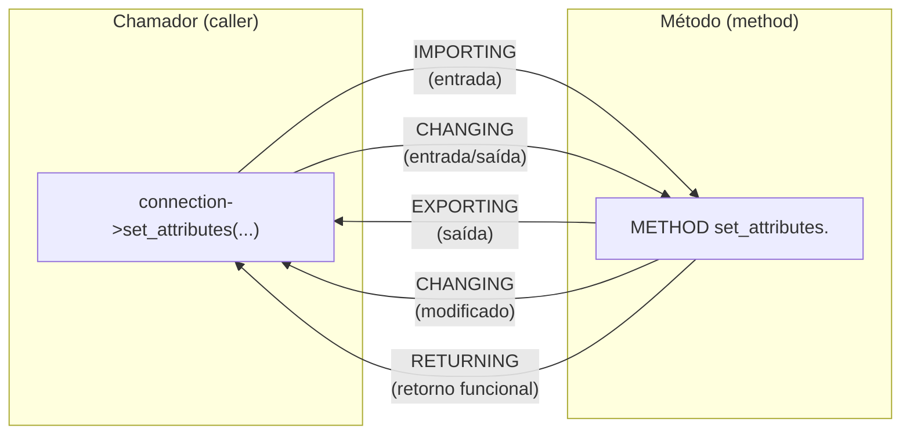
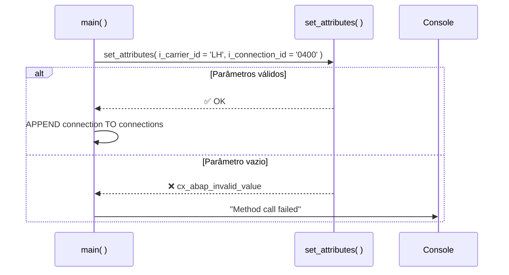

# Aula 03: Definindo e Chamando Métodos

## 🎯 Objetivos de Aprendizagem

Depois de completar esta aula, você será capaz de:

- Definir e chamar métodos.

---

## 📖 Guia Passo a Passo: Dando Comportamento às Suas Classes

### 🧭 Antes de começar: classes sem métodos são só estruturas de dados

Até agora, sua [classe local](../../../GLOSSARY.md#classe-local-local-class)
`lcl_connection` é essencialmente um agrupamento de variáveis — uma _struct_
glorificada. No mundo da orientação a objetos, classes de verdade têm **métodos**
([Method](../../../GLOSSARY.md#metodo-method)): blocos de código que implementam
comportamentos.

> 💡 **Analogia .NET:** Uma classe ABAP sem métodos é como uma classe C# que
> só tem campos públicos — tecnicamente válida, mas não segue os princípios de
> encapsulamento da OO. Adicionar métodos é como adicionar comportamento real
> às suas classes: `CalculateTotal()`, `Save()`, `Validate()`.

Nesta aula, você vai aprender a:

- Declarar métodos na [definição da classe](../../../GLOSSARY.md#definicao-de-classe-class-definition)
  com `METHODS`
- Definir [parâmetros](../../../GLOSSARY.md#parametro-de-metodo-method-parameter):
  `IMPORTING`, `EXPORTING`, `CHANGING` e `RETURNING`
- Implementar o corpo dos métodos na [IMPLEMENTATION](../../../GLOSSARY.md#implementacao-de-classe-class-implementation)
- Usar a referência automática `ME` para acessar atributos quando há conflito de nomes
- Criar [métodos funcionais](../../../GLOSSARY.md#metodo-funcional-functional-method)
  que podem ser usados diretamente em expressões
- Tratar exceções com [`TRY...CATCH`](../../../GLOSSARY.md#try--catch--endtry-exception-handling)

---

### 🔧 O que você vai usar

| Ferramenta/Conceito | Para que serve | Análogo no mundo .NET |
|---|---|---|
| **METHODS** | Declara um método de instância na definição da classe | Declaração de método em C#: `public void DoSomething()` |
| **CLASS-METHODS** | Declara um método estático (da classe, não do objeto) | `public static void DoSomething()` em C# |
| **IMPORTING** | Parâmetros que o método **recebe** do chamador (entrada) | Parâmetros de entrada: `void Do(string name)` |
| **EXPORTING** | Parâmetros que o método **devolve** ao chamador (saída) | Parâmetros `out`: `void Do(out int result)` |
| **CHANGING** | Parâmetros recebidos e **modificados** pelo método | Parâmetros `ref`: `void Do(ref int value)` |
| **RETURNING VALUE( )** | Valor de retorno único, usado em expressões | `int Do() { return 42; }` |
| **Método Funcional** (_Functional Method_) | Método com `RETURNING` que pode ser usado inline em expressões | Qualquer método com retorno não-void em C# |
| **ME** | Referência automática à instância atual dentro de um método de instância | `this` em C# |
| **RAISING** | Declara as exceções que o método pode lançar | Não tem equivalente direto em C# (checked exceptions do Java seriam o paralelo) |
| **RAISE EXCEPTION TYPE** | Lança uma exceção e interrompe a execução do método | `throw new Exception()` em C# |
| **TRY...CATCH...ENDTRY** | Captura e trata exceções lançadas por métodos | `try { } catch { }` em C# |
| **Quick Fix (Ctrl+1)** | Gera automaticamente a implementação de métodos declarados | `Ctrl+.` no Visual Studio para gerar stubs |

---

### 📋 Pré-requisitos

Antes de começar esta aula, você precisa ter:

1. A classe global `ZCL_##_LOCAL_CLASS` (ou `ZCL_##_INSTANCES` ou `ZCL_##_METHODS`)
   com `IF_OO_ADT_CLASSRUN` ([Aula 01](../01-defining-a-local-class/)).
2. A classe local `lcl_connection` definida na aba **Local Types** com os
   atributos `carrier_id`, `connection_id` e `conn_counter`.
3. O código de criação de instâncias e tabela interna funcionando no método
   `main` ([Aula 02](../02-creating-instances-of-a-class/)).
4. Familiaridade com o [ABAP Debugger](../../../GLOSSARY.md#abap-debugger)
   e com os seletores `->` e `=>`.

---

### 🪜 Passo 1: Entender os tipos de parâmetros ABAP

Antes de definir métodos, é essencial entender os **quatro tipos de parâmetros**
que um método ABAP pode ter. Eles são diferentes do C# — o ABAP é mais explícito
sobre a direção do fluxo de dados.



| Tipo de Parâmetro | Direção | Quem define o valor | Pode ser alterado pelo método? | Análogo C# |
|---|---|---|---|---|
| **IMPORTING** | Chamador → Método | Chamador | ❌ Não (syntax error) | Parâmetro normal: `void M(int x)` |
| **EXPORTING** | Método → Chamador | Método | ✅ Sim | `out` parameter: `void M(out int x)` |
| **CHANGING** | Chamador ⇄ Método | Chamador, modificado pelo método | ✅ Sim | `ref` parameter: `void M(ref int x)` |
| **RETURNING** | Método → Chamador | Método (funcional) | — (não se aplica) | Valor de retorno: `int M()` |

> ⚠️ **Importante:** `IMPORTING` e `CHANGING` são **obrigatórios por padrão**.
> Para torná-los opcionais, use `OPTIONAL` ou `DEFAULT <valor>`. `EXPORTING`
> é sempre opcional — o chamador só pega os valores que precisa.

> 💡 **Analogia .NET:** Em C#, você não rotula parâmetros como "importing" ou
> "exporting" — a distinção entre entrada, saída e entrada/saída é feita com
> palavras-chave no **tipo do parâmetro** (`out`, `ref`) ou pelo uso de
> `return`. No ABAP, a distinção é parte da **assinatura do método** — mais
> verbosa, porém mais explícita e auto-documentada.

---

### 🪜 Passo 2: Definir métodos na classe local

Vamos adicionar dois métodos à `lcl_connection`:

- **`set_attributes`**: recebe valores e os atribui aos atributos. Valida que
  os parâmetros não são vazios.
- **`get_output`**: retorna uma tabela de strings formatada com os dados da
  conexão (método funcional).

1. Na aba **Local Types**, localize a definição de `lcl_connection`.

2. Dentro da `PUBLIC SECTION`, após os atributos existentes, adicione:

   ```abap
   METHODS set_attributes
     IMPORTING
       i_carrier_id    TYPE /dmo/carrier_id
       i_connection_id TYPE /dmo/connection_id
     RAISING
       cx_abap_invalid_value.

   METHODS get_output
     RETURNING
       VALUE(r_output) TYPE string_table.
   ```

   | Elemento | Significado |
   |---|---|
   | `METHODS` | Declara um método de instância |
   | `IMPORTING` | Parâmetros que o método recebe |
   | `i_carrier_id` | Nome do parâmetro — prefixo `i_` indica "importing" |
   | `RAISING cx_abap_invalid_value` | Declara que este método pode lançar esta exceção |
   | `RETURNING VALUE(r_output)` | Parâmetro de retorno funcional — note `VALUE( )` obrigatório |

   > ⚠️ **Importante:** Para parâmetros `RETURNING`, o nome do parâmetro
   > **precisa** estar envolto em `VALUE(...)`, sem espaços. Exemplo:
   > `VALUE(r_output)` ✅ — `VALUE (r_output)` ❌.

   > 💡 **Analogia .NET:** A definição acima equivale aproximadamente a:
   > ```csharp
   > public void SetAttributes(string i_carrier_id, string i_connection_id)
   > // throws cx_abap_invalid_value
   >
   > public List<string> GetOutput()
   > ```
   > A diferença é que em C# você não declara `throws` — em ABAP, `RAISING`
   > documenta as exceções na assinatura.

---

### 🪜 Passo 3: Implementar os métodos

Definir o método é só metade do trabalho — você precisa implementá-lo na
seção `IMPLEMENTATION` da classe.

1. Posicione o cursor sobre o nome do método `set_attributes` e pressione
   **Ctrl + 1**. O ADT oferece um **Quick Fix**:

   ```
   💡 Add 2 unimplemented methods
   ```

2. Dê um duplo clique na sugestão. O ADT gera os esqueletos:

   ```abap
   METHOD set_attributes.

   ENDMETHOD.

   METHOD get_output.

   ENDMETHOD.
   ```

   > 💡 **Analogia .NET:** O Quick Fix `Ctrl+1` é equivalente ao `Ctrl+.` no
   > Visual Studio — "Generate method stub" ou "Implement interface".

3. Implemente `set_attributes` — com validação:

   ```abap
   METHOD set_attributes.

     IF i_carrier_id IS INITIAL OR i_connection_id IS INITIAL.
       RAISE EXCEPTION TYPE cx_abap_invalid_value.
     ENDIF.

     carrier_id    = i_carrier_id.
     connection_id = i_connection_id.

   ENDMETHOD.
   ```

   | Linha | Significado |
   |---|---|
   | `IF ... IS INITIAL` | Verifica se o parâmetro está vazio (valor inicial do tipo) |
   | `RAISE EXCEPTION TYPE cx_abap_invalid_value` | Lança a exceção — interrompe o método imediatamente |
   | `carrier_id = i_carrier_id` | Atribui o valor do parâmetro ao atributo da classe |

   > 💡 **Analogia .NET:**
   > ```csharp
   > public void SetAttributes(string i_carrier_id, string i_connection_id)
   > {
   >     if (string.IsNullOrEmpty(i_carrier_id) || string.IsNullOrEmpty(i_connection_id))
   >         throw new ArgumentException();
   >
   >     CarrierId = i_carrier_id;
   >     ConnectionId = i_connection_id;
   > }
   > ```

4. Implemente `get_output` — formato tabular:

   ```abap
   METHOD get_output.

     APPEND |------------------------------| TO r_output.
     APPEND |Carrier:     { carrier_id    }| TO r_output.
     APPEND |Connection:  { connection_id }| TO r_output.

   ENDMETHOD.
   ```

   Aqui, `r_output` é o parâmetro `RETURNING` — uma tabela de strings que o
   método preenche. Note que acessamos os atributos `carrier_id` e
   `connection_id` **diretamente pelo nome**, sem `me->`, porque não há
   conflito com nomes de parâmetros.

---

### 🪜 Passo 4: Chamar métodos de instância com `->`

Com os métodos implementados, vamos usá-los. Na aba **Global Class**, no método
`main`, substitua o acesso direto aos atributos por chamadas a `set_attributes`.

Antes (Aula 02):
```abap
connection->carrier_id    = 'LH'.
connection->connection_id = '0400'.
```

Depois (com método):
```abap
connection->set_attributes(
  EXPORTING
    i_carrier_id    = 'LH'
    i_connection_id = '0400'
).
```

> ⚠️ **Atenção à terminologia:** Do ponto de vista do **chamador**, você usa
> `EXPORTING` para passar valores aos parâmetros `IMPORTING` do método. Parece
> contraintuitivo, mas lembre-se: o que o chamador **exporta** é o que o
> método **importa**. O rótulo (`EXPORTING` / `IMPORTING`) sempre reflete o
> ponto de vista de **quem está falando**.

> 💡 **Analogia .NET:** `connection->set_attributes( EXPORTING i_carrier_id =
> 'LH' ... )` = `connection.SetAttributes(i_carrier_id: "LH", ...)` em C#
> com named parameters. O ABAP é mais verboso, mas elimina ambiguidades.

Use o code completion para gerar a chamada completa:

1. Digite `connection->` e pressione **Ctrl + Space**.
2. Escolha `set_attributes` e pressione **Shift + Enter**.
3. O ADT insere a assinatura completa, incluindo parâmetros opcionais
   comentados. Preencha os valores.

---

### 🪜 Passo 5: Tratar exceções com TRY...CATCH

O método `set_attributes` pode lançar `cx_abap_invalid_value` se os parâmetros
forem vazios. Precisamos tratar essa exceção.

1. Envolva cada chamada a `set_attributes` com `TRY...ENDTRY`:

   ```abap
   TRY.
       connection->set_attributes(
         EXPORTING
           i_carrier_id    = 'LH'
           i_connection_id = '0400'
       ).

       APPEND connection TO connections.

     CATCH cx_abap_invalid_value.
       out->write( `Method call failed` ).
   ENDTRY.
   ```

   | Bloco | Significado |
   |---|---|
   | `TRY.` | Inicia o bloco protegido |
   | `APPEND ...` | Só executa se `set_attributes` **não** lançar exceção |
   | `CATCH cx_abap_invalid_value.` | Captura a exceção específica |
   | `out->write(...)` | Mensagem de erro amigável no console |

   > ⚠️ **Importante:** Se você não colocar `TRY...CATCH` e o método lançar a
   > exceção, o programa **aborta com dump** (runtime error). Em ambiente de
   > produção, isso é catastrófico. Em desenvolvimento, é uma dor de cabeça
   > desnecessária.



---

### 🪜 Passo 6: Chamar um método funcional

`get_output` é um **método funcional** ([Functional Method](../../../GLOSSARY.md#metodo-funcional-functional-method))
— ele tem um parâmetro `RETURNING`. Isso significa que você pode usar o
resultado **diretamente em expressões**, sem precisar declarar uma variável
intermediária.

1. No final do método `main`, após criar as três instâncias, adicione:

   ```abap
   LOOP AT connections INTO connection.

     out->write( connection->get_output( ) ).

   ENDLOOP.
   ```

   Note que `connection->get_output( )` é usado **diretamente** como
   argumento de `out->write( )`. O ABAP executa o método, obtém o
   `r_output` (a `string_table`) e passa o resultado para `write`.

   > 💡 **Analogia .NET:** `out->write( connection->get_output( ) )` =
   > `Console.WriteLine(connection.GetOutput());` — você usa o retorno do
   > método inline, como em qualquer expressão C#.

2. Outras formas de usar métodos funcionais:

   ```abap
   " Em atribuição com declaração inline
   DATA(result) = connection->get_output( ).

   " Em expressão lógica
   IF connection->get_output( ) IS NOT INITIAL.
     ...
   ENDIF.
   ```

---

### 🪜 Passo 7: Entender o ME — a referência automática

Dentro de um método de instância, o ABAP oferece a variável implícita **`ME`**
([Self-Reference](../../../GLOSSARY.md#me-self-reference)). `ME` é uma
[variável de referência](../../../GLOSSARY.md#variavel-de-referencia-reference-variable)
tipada com a classe atual e preenchida automaticamente com o endereço da
instância corrente.

```abap
METHOD set_attributes.
  " i_carrier_id refere-se ao PARÂMETRO (mais próximo no escopo)
  " me->carrier_id refere-se ao ATRIBUTO da instância

  me->carrier_id = i_carrier_id.  " Explícito: atributo ← parâmetro
ENDMETHOD.
```

> 💡 **Analogia .NET:** `ME` é o `this` do C#. `me->carrier_id` =
> `this.CarrierId`. Assim como em C#, você **não precisa** usar `this.`
> quando não há ambiguidade — o ABAP permite omitir `me->` se o nome do
> atributo for único no escopo.

> ⚠️ **Importante:** Use `me->` apenas quando houver **conflito de nomes**
> entre um parâmetro e um atributo. No nosso exemplo, `i_carrier_id`
> (parâmetro) tem nome diferente de `carrier_id` (atributo), então não há
> conflito — `carrier_id = i_carrier_id.` funciona sem `me->`.

---

### ✅ Verificação: deu certo?

1. ✅ Os métodos `set_attributes` e `get_output` estão definidos na
   `PUBLIC SECTION` de `lcl_connection`.
2. ✅ Ambos os métodos têm implementação (não há erros "Implementation missing").
3. ✅ As três instâncias usam `set_attributes` em vez de acesso direto aos
   atributos.
4. ✅ Cada chamada está envolta em `TRY...CATCH`.
5. ✅ O `LOOP` final chama `get_output( )` e exibe o resultado no console.
6. ✅ A ativação com **Ctrl + F3** é bem-sucedida.
7. ✅ Ao executar com **F9**, o console mostra as três conexões formatadas.

**Saída esperada no console:**
```
------------------------------
Carrier:     LH
Connection:  0400
------------------------------
Carrier:     AA
Connection:  0017
------------------------------
Carrier:     SQ
Connection:  0001
```

Compare com a [solução oficial](./solution.abap) se necessário.

---

### ❓ Perguntas Frequentes

<details>
<summary><b>"Por que o ABAP tem 4 tipos de parâmetros em vez de só parâmetros e retorno como C#?"</b></summary>

O ABAP foi projetado para aplicações de negócio onde um método frequentemente
precisa retornar **múltiplos valores** (ex: uma função que valida dados e
retorna tanto um código de erro quanto uma mensagem). `EXPORTING` e `CHANGING`
resolvem isso sem a necessidade de criar classes DTO ou usar `out` parameters.
É uma escolha de design que prioriza expressividade em cenários de negócio.

> 💡 **Analogia .NET:** É como se todo método ABAP pudesse ter múltiplos
> `out` parameters nomeados. Em C# moderno, você usaria tuplas
> (`(bool success, string message)`), mas o ABAP resolve isso nativamente
> com `EXPORTING`.

</details>

<details>
<summary><b>"Qual a diferença entre EXPORTING e RETURNING?"</b></summary>

- `EXPORTING`: pode ter **vários** parâmetros de saída. O chamador escolhe
  quais receber. Não pode ser usado em expressões inline.
- `RETURNING`: **um único** valor de retorno. Pode ser usado diretamente em
  expressões (`DATA(x) = obj->method( )`). O parâmetro usa `VALUE( )`.

Use `RETURNING` quando o método naturalmente retorna um valor (ex: `get_output`).
Use `EXPORTING` quando precisa retornar múltiplos valores.

</details>

<details>
<summary><b>"Por que usar SET_ATTRIBUTES em vez de acessar os atributos diretamente?"</b></summary>

O método `set_attributes` valida os dados antes de atribuí-los — se um
parâmetro for vazio, lança exceção. Acesso direto (`connection->carrier_id = ''`)
não tem validação nenhuma. Isso é o princípio do **encapsulamento** — a
classe controla como seus dados são modificados. Na próxima aula você vai
aprofundar esse conceito.

</details>

<details>
<summary><b>"O que acontece se eu esquecer o TRY...CATCH?"</b></summary>

Se `set_attributes` lançar `cx_abap_invalid_value` e você não tiver
`TRY...CATCH`, o programa **aborta com um dump** (runtime error). A tela
mostra uma mensagem técnica como "Exception condition 'CX_ABAP_INVALID_VALUE'
raised". Em desenvolvimento é irritante; em produção, pode parar processos
de negócio.

</details>

---

### 📚 O que aprendemos

| Conceito | Significado |
|---|---|
| **METHODS** | Declara um método de instância na definição da classe |
| **IMPORTING** | Parâmetro que o método recebe do chamador — não pode ser alterado |
| **EXPORTING** | Parâmetro que o método devolve ao chamador — sempre opcional |
| **CHANGING** | Parâmetro recebido e modificado pelo método |
| **RETURNING VALUE( )** | Valor de retorno único — permite uso em expressões |
| **Método Funcional** | Método com `RETURNING` — resultado usado inline |
| **RAISING** | Declara as exceções que o método pode lançar |
| **RAISE EXCEPTION TYPE** | Lança uma exceção e interrompe o método |
| **TRY...CATCH...ENDTRY** | Captura e trata exceções |
| **ME** | Referência à instância atual — equivalente a `this` no C# |
| **Quick Fix (Ctrl+1)** | Gera automaticamente o esqueleto da implementação de métodos |

---

### 📖 Novos Termos (Glossário)

Estes são os termos do ecossistema SAP que apareceram nesta aula.
Consulte o [glossário completo](../../../GLOSSARY.md) para ver todos os termos.

| Termo | Definição rápida |
|---|---|
| [Método](../../../GLOSSARY.md#metodo-method) | Bloco de código que implementa comportamento — declarado com `METHODS` (instância) ou `CLASS-METHODS` (estático) |
| [Parâmetro de Método](../../../GLOSSARY.md#parametro-de-metodo-method-parameter) | `IMPORTING`, `EXPORTING`, `CHANGING` ou `RETURNING` — define o fluxo de dados entre chamador e método |
| [Método Funcional](../../../GLOSSARY.md#metodo-funcional-functional-method) | Método com `RETURNING` que pode ser usado inline em expressões |
| [ME](../../../GLOSSARY.md#me-self-reference) | Referência automática à instância atual dentro de um método — equivalente ao `this` do C# |

---

### ⏭️ Próxima aula

[Lesson 04: Using Encapsulation to Ensure Consistency](../04-using-encapsulation-to-ensure-consistency/) — aprenda a proteger seus atributos com `PRIVATE SECTION` e métodos de acesso.
