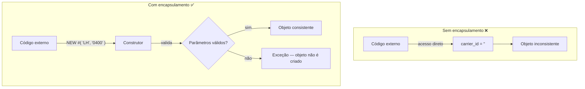

# Aula 04: Usando Encapsulamento para Garantir Consistência

## 🎯 Objetivos de Aprendizagem

Depois de completar esta aula, você será capaz de:

- Explicar encapsulamento.
- Definir e usar construtores.

---

## 📖 Guia Passo a Passo: Protegendo Seus Dados com Encapsulamento e Construtores

### 🧭 Antes de começar: o problema do acesso público descontrolado

Até agora, os atributos `carrier_id` e `connection_id` da sua classe
`lcl_connection` estão na `PUBLIC SECTION`. Isso significa que **qualquer**
código que tenha uma referência para um objeto `lcl_connection` pode:

- Ler os atributos diretamente: `DATA(lv) = connection->carrier_id.`
- Modificá-los a qualquer momento: `connection->carrier_id = 'XX'.`
- Deixá-los com valores iniciais vazios simplesmente nunca os preenchendo

No mundo real, uma conexão de voo **precisa** ter um `carrier_id` e um
`connection_id` válidos para existir. Um objeto `lcl_connection` com atributos
vazios representa um estado inconsistente — algo que não deveria existir.

> 💡 **Analogia .NET:** Em C#, você não expõe campos como `public` — você usa
> propriedades com `get`/`set` ou encapsula os campos como `private` e expõe
> métodos que validam as alterações. O ABAP segue o mesmo princípio: proteja
> seus dados e controle como eles são modificados.

Nesta aula, você vai aprender a:

- Tornar atributos **privados** (`PRIVATE SECTION`) ou **somente leitura**
  (`READ-ONLY`) para impedir acesso externo descontrolado
- Substituir o método `set_attributes` por um **construtor de instância**
  ([Instance Constructor](../../../GLOSSARY.md#construtor-constructor)),
  garantindo que todo objeto nasça com valores válidos
- Usar o **construtor estático** ([Static Constructor](../../../GLOSSARY.md#construtor-estatico-static-constructor--class-constructor))
  para inicializar atributos da classe uma única vez
- Passar parâmetros diretamente no `NEW #( )` e tratar exceções do construtor

---

### 🔧 O que você vai usar

| Ferramenta/Conceito | Para que serve | Análogo no mundo .NET |
|---|---|---|
| **Encapsulamento** (_Encapsulation_) | Princípio OO: esconder detalhes internos e controlar acesso aos dados | `private` fields + public methods em C# |
| **PRIVATE SECTION** | Seção onde membros são acessíveis apenas pela própria classe | `private` em C# |
| **READ-ONLY** | Adição ao `DATA` público que permite leitura mas bloqueia escrita externa | `{ get; }` (propriedade somente leitura) em C# |
| **Construtor de Instância** (_Instance Constructor_) | Método especial `constructor` chamado automaticamente ao criar objeto com `NEW` | Construtor da classe: `public Person(string name)` |
| **Construtor Estático** (_Static Constructor_) | Método `class_constructor` executado uma única vez quando a classe é acessada | Construtor estático: `static Person()` em C# |
| **Quick Fix (Ctrl+1)** | Atalhos: "Make attribute private", "Generate constructor" | `Ctrl+.` no Visual Studio |

---

### 📋 Pré-requisitos

Antes de começar esta aula, você precisa ter:

1. A classe global `ZCL_##_METHODS` (ou `ZCL_##_LOCAL_CLASS`) com os métodos
   `set_attributes`, `get_output` e o `LOOP` final funcionando
   ([Aula 03](../03-defining-and-calling-methods/)).
2. A classe local `lcl_connection` com atributos públicos e ambos os métodos
   implementados.
3. Familiaridade com [TRY...CATCH](../../../GLOSSARY.md#try--catch--endtry-exception-handling)
   e [parâmetros de método](../../../GLOSSARY.md#parametro-de-metodo-method-parameter).

---

### 🪜 Passo 1: Entender o encapsulamento

**Encapsulamento** ([Encapsulation](../../../GLOSSARY.md#encapsulamento-encapsulation))
é um dos pilares da orientação a objetos. O princípio é simples:

> Uma classe deve controlar o acesso aos seus próprios dados. Nenhum código
> externo deve poder colocar um objeto em estado inconsistente.



No ABAP, você implementa encapsulamento de duas formas:

| Técnica | Visibilidade | Leitura externa | Escrita externa |
|---|---|---|---|
| `PUBLIC SECTION` + `READ-ONLY` | Pública com restrição | ✅ Permitida | ❌ Bloqueada |
| `PRIVATE SECTION` | Privada | ❌ Bloqueada | ❌ Bloqueada |

> 💡 **Analogia .NET:** `READ-ONLY` = propriedade com `{ get; }` somente.
> `PRIVATE SECTION` = campo `private` — só acessível por métodos da própria
> classe. Em C# você também pode combinar: `public string Name { get; private
> set; }` — o `READ-ONLY` do ABAP é equivalente a `{ get; }`.

---

### 🪜 Passo 2: Tornar atributos privados

Vamos mover `carrier_id` e `connection_id` para a `PRIVATE SECTION`.

**Método 1 — Quick Fix (recomendado):**

1. Na aba **Local Types**, posicione o cursor sobre `carrier_id`.
2. Pressione **Ctrl + 1**.
3. Escolha **Make carrier_id private**.
4. Repita para `connection_id`.

**Método 2 — Manual:**

1. Recorte as linhas `DATA carrier_id ...` e `DATA connection_id ...` da
   `PUBLIC SECTION`.
2. Cole-as dentro da `PRIVATE SECTION`.

Após a mudança, a definição deve ficar assim:

```abap
CLASS lcl_connection DEFINITION.

  PUBLIC SECTION.

    CLASS-DATA conn_counter TYPE i.

    METHODS get_output
      RETURNING
        VALUE(r_output) TYPE string_table.

  PROTECTED SECTION.

  PRIVATE SECTION.

    DATA carrier_id    TYPE /dmo/carrier_id.
    DATA connection_id TYPE /dmo/connection_id.

ENDCLASS.
```

> ⚠️ **Importante:** Agora que `carrier_id` e `connection_id` são privados, o
> método `get_output` (que está na própria classe) **continua funcionando**
> normalmente — ele acessa os atributos de dentro da classe. Mas qualquer
> código externo que tentar `connection->carrier_id` receberá um erro de
> sintaxe.

---

### 🪜 Passo 3: Tornar o atributo estático READ-ONLY

O atributo `conn_counter` deve ser visível externamente (para leitura), mas
não modificável. Use `READ-ONLY`:

```abap
CLASS-DATA conn_counter TYPE i READ-ONLY.
```

> 💡 **Analogia .NET:** `CLASS-DATA conn_counter TYPE i READ-ONLY.` equivale a
> `public static int ConnCounter { get; }` em C#. Todos podem ver o valor, mas
> só a própria classe pode alterá-lo (no caso, o construtor).

---

### 🪜 Passo 4: Entender o construtor de instância

Agora que os atributos são privados, o método `set_attributes` era a única
forma de defini-los. Mas ele tem dois problemas:

1. **Nada obriga o chamador a usá-lo** — é possível criar um objeto e nunca
   chamar `set_attributes`, deixando atributos vazios.
2. **Pode ser chamado múltiplas vezes** — o mesmo objeto pode ter seus valores
   alterados repetidamente.

O **construtor de instância** ([Constructor](../../../GLOSSARY.md#construtor-constructor))
resolve ambos:

- É chamado **automaticamente** pelo runtime no momento do `NEW #( )`
- É executado **uma única vez** para cada instância
- Pode ter parâmetros `IMPORTING` e lançar exceções (`RAISING`)
- **Não pode** ser chamado explicitamente: `connection->constructor(...)` ❌

> 💡 **Analogia .NET:** Um construtor ABAP é equivalente ao construtor C#.
> `NEW #( i_carrier_id = 'LH' ... )` = `new lcl_connection(i_carrier_id: "LH",
> ...)`. A diferença é que no ABAP o construtor sempre se chama `constructor`
> (nome reservado) e só pode ter `IMPORTING` parameters — sem `EXPORTING`,
> `CHANGING` ou `RETURNING`.

---

### 🪜 Passo 5: Gerar e implementar o construtor

Vamos substituir `set_attributes` por um construtor.

1. **Comente ou remova** o método `set_attributes` (definição e implementação).

2. Posicione o cursor sobre o nome da classe `lcl_connection` e pressione
   **Ctrl + 1**.

3. Escolha **Generate constructor**.

4. Na janela de diálogo, selecione os atributos `carrier_id` e `connection_id`
   e clique **Finish**.

O ADT gera:

```abap
" Definição:
METHODS constructor
  IMPORTING
    i_carrier_id    TYPE /dmo/carrier_id
    i_connection_id TYPE /dmo/connection_id.

" Implementação:
METHOD constructor.

  me->carrier_id    = i_carrier_id.
  me->connection_id = i_connection_id.

ENDMETHOD.
```

> ⚠️ **Importante:** Note o uso de `me->` no construtor! Como os parâmetros
> têm os mesmos nomes que os atributos (com prefixo `i_`), neste caso não
> haveria conflito — mas o gerador usa `me->` por segurança.

5. **Adicione validação e `RAISING`:**

   ```abap
   " Definição:
   METHODS constructor
     IMPORTING
       i_carrier_id    TYPE /dmo/carrier_id
       i_connection_id TYPE /dmo/connection_id
     RAISING
       cx_abap_invalid_value.

   " Implementação:
   METHOD constructor.

     IF i_carrier_id IS INITIAL OR i_connection_id IS INITIAL.
       RAISE EXCEPTION TYPE cx_abap_invalid_value.
     ENDIF.

     me->carrier_id    = i_carrier_id.
     me->connection_id = i_connection_id.

     conn_counter = conn_counter + 1.

   ENDMETHOD.
   ```

   | Adição | Propósito |
   |---|---|
   | `RAISING cx_abap_invalid_value` | Declara que o construtor pode falhar |
   | `IF ... IS INITIAL` | Validação: rejeita parâmetros vazios |
   | `RAISE EXCEPTION TYPE` | Se inválido, o objeto **não é criado** |
   | `conn_counter = conn_counter + 1` | Incrementa o contador — garantido executar uma vez por instância |

   > 💡 **Analogia .NET:** O construtor com validação equivale a:
   > ```csharp
   > public LclConnection(string i_carrier_id, string i_connection_id)
   > {
   >     if (string.IsNullOrEmpty(i_carrier_id) || string.IsNullOrEmpty(i_connection_id))
   >         throw new ArgumentException();
   >
   >     CarrierId = i_carrier_id;
   >     ConnectionId = i_connection_id;
   >     ConnCounter++;
   > }
   > ```

---

### 🪜 Passo 6: Usar o construtor no NEW #( )

Com o construtor definido, você **precisa** passar os parâmetros no momento
da criação:

Antes (com `set_attributes`):
```abap
connection = NEW #( ).
connection->set_attributes(
  EXPORTING
    i_carrier_id    = 'LH'
    i_connection_id = '0400'
).
```

Depois (com construtor):
```abap
connection = NEW #(
  i_carrier_id    = 'LH'
  i_connection_id = '0400'
).
```

> ⚠️ **Importante:** Agora o `NEW #( )` **precisa** incluir o `TRY...CATCH`,
> porque o construtor pode lançar exceção. Mova o `TRY.` para **antes** do
> `NEW`:

```abap
TRY.
    connection = NEW #(
      i_carrier_id    = 'LH'
      i_connection_id = '0400'
    ).

    APPEND connection TO connections.

  CATCH cx_abap_invalid_value.
    out->write( `Method call failed` ).
ENDTRY.
```

Se o construtor lançar exceção, a variável `connection` **não recebe** uma
nova instância — o `APPEND` não é executado e o `CATCH` exibe a mensagem.

> 💡 **Analogia .NET:** `NEW #( i_carrier_id = 'LH' ... )` é como `new
> LclConnection("LH", "0400")` dentro de um `try` block. Se o construtor C#
> lançar exceção, a variável também não recebe o objeto.

---

### 🪜 Passo 7: Conhecer o construtor estático (CLASS_CONSTRUCTOR)

Além do construtor de instância, o ABAP oferece o **construtor estático**
([Class Constructor](../../../GLOSSARY.md#construtor-estatico-static-constructor--class-constructor)).

| Característica | Instance Constructor | Static Constructor |
|---|---|---|
| Nome reservado | `constructor` | `class_constructor` |
| Quando executa | Cada `NEW #( )` | **Uma vez**, no primeiro acesso à classe |
| Parâmetros | `IMPORTING` permitido | **Nenhum** (sem assinatura) |
| Exceções | `RAISING` permitido | **Não** pode lançar exceções |
| Uso típico | Inicializar atributos de instância | Inicializar atributos estáticos com valores não-iniciais |

```abap
" Definição (PUBLIC SECTION):
CLASS-METHODS class_constructor.

" Implementação:
METHOD class_constructor.

  conn_counter = 0.  " Inicialização explícita do contador

ENDMETHOD.
```

> ⚠️ **Importante:** O `class_constructor` não tem parâmetros porque o sistema
> não sabe **quando** a classe será acessada pela primeira vez — pode ser um
> `NEW`, um acesso a atributo estático ou uma chamada de método estático. Sem
> um momento determinístico, não há como passar parâmetros.

> 💡 **Analogia .NET:** `CLASS-METHODS class_constructor.` = `static
> LclConnection() { }` em C#. Ambos executam uma única vez, antes do primeiro
> uso da classe, e não recebem parâmetros.

---

### ✅ Verificação: deu certo?

1. ✅ `carrier_id` e `connection_id` estão na `PRIVATE SECTION`.
2. ✅ `conn_counter` tem `READ-ONLY` e é incrementado no construtor.
3. ✅ O método `set_attributes` foi removido/substituído pelo construtor.
4. ✅ O construtor tem `IMPORTING` + `RAISING cx_abap_invalid_value`.
5. ✅ O construtor valida parâmetros com `IS INITIAL` e lança exceção se vazios.
6. ✅ `NEW #( )` agora recebe parâmetros: `NEW #( i_carrier_id = 'LH' ... )`.
7. ✅ `TRY...CATCH` envolve o `NEW #( )`, não apenas o método.
8. ✅ Ativação com **Ctrl + F3** bem-sucedida.
9. ✅ `get_output( )` continua funcionando (método da própria classe acessa
   atributos privados normalmente).

**Teste de encapsulamento:** Tente escrever `connection->carrier_id = 'XX'` no
método `main`. O editor deve mostrar **erro de sintaxe** — o atributo é
privado e inacessível de fora da classe.

---

### ❓ Perguntas Frequentes

<details>
<summary><b>"Qual a diferença entre READ-ONLY e PRIVATE?"</b></summary>

- `READ-ONLY`: o atributo fica na `PUBLIC SECTION`. Leitura externa ✅,
  escrita externa ❌.
- `PRIVATE SECTION`: leitura externa ❌, escrita externa ❌. Só acessível
  por métodos da própria classe.

Use `READ-ONLY` quando o mundo externo precisa **ver** o valor (ex: um
contador). Use `PRIVATE` quando nem a leitura deve ser exposta.

</details>

<details>
<summary><b>"Por que o construtor não pode ter EXPORTING ou RETURNING?"</b></summary>

O construtor é chamado pelo runtime, não pelo seu código. O resultado do
construtor é sempre o novo objeto (a referência que `NEW` retorna). Não faz
sentido ter `EXPORTING` porque não há um chamador explícito para receber os
valores. Se precisar retornar algo além do objeto, use um método separado
ou um [método funcional](../../../GLOSSARY.md#metodo-funcional-functional-method).

</details>

<details>
<summary><b>"Por que o class_constructor não pode ter parâmetros?"</b></summary>

O runtime chama o `class_constructor` na primeira vez que a classe é
referenciada — mas o momento exato é imprevisível (pode ser um `NEW`, um
acesso a atributo estático, uma chamada de método estático...). Como não há
um "chamador" determinístico, não há como passar argumentos.

> 💡 **Analogia .NET:** Pela mesma razão que `static MyClass() { }` em C#
> não aceita parâmetros — o runtime chama automaticamente, sem intervenção
> do desenvolvedor.

</details>

<details>
<summary><b>"O que acontece se eu passar parâmetros vazios no NEW?"</b></summary>

O construtor detecta `IS INITIAL`, lança `cx_abap_invalid_value`, e o
`CATCH` exibe "Method call failed". O objeto **não é criado** — `connection`
permanece com o valor que tinha antes do `NEW` (possivelmente `NULL` ou a
referência anterior). O `APPEND` não executa. Nenhum _dump_ ocorre porque
a exceção está capturada.

</details>

---

### 📚 O que aprendemos

| Conceito | Significado |
|---|---|
| **Encapsulamento** | Princípio OO: atributos privados, acesso controlado por métodos/construtores |
| **PRIVATE SECTION** | Seção onde membros são inacessíveis de fora da classe |
| **READ-ONLY** | Adição que permite leitura pública mas bloqueia escrita externa |
| **Construtor de Instância** | Método `constructor` executado automaticamente em cada `NEW` |
| **Parâmetros no NEW** | `NEW #( i_carrier_id = 'LH' ... )` — passa valores direto ao construtor |
| **Validação no construtor** | `IF ... IS INITIAL. RAISE EXCEPTION TYPE.` — impede objetos inválidos |
| **Construtor Estático** | `class_constructor` — executado uma única vez no primeiro acesso à classe |
| **TRY em torno do NEW** | Se o construtor falha, o objeto não é criado e o `CATCH` trata o erro |

---

### 📖 Novos Termos (Glossário)

Estes são os termos do ecossistema SAP que apareceram nesta aula.
Consulte o [glossário completo](../../../GLOSSARY.md) para ver todos os termos.

| Termo | Definição rápida |
|---|---|
| [Encapsulamento](../../../GLOSSARY.md#encapsulamento-encapsulation) | Princípio OO: esconder dados internos e expor apenas comportamentos controlados |
| [Construtor](../../../GLOSSARY.md#construtor-constructor) | Método especial `constructor` chamado automaticamente ao criar instâncias com `NEW` |
| [Construtor Estático](../../../GLOSSARY.md#construtor-estatico-static-constructor--class-constructor) | Método `class_constructor` executado uma única vez no primeiro acesso à classe |
| [READ-ONLY](../../../GLOSSARY.md#read-only) | Adição ao `DATA`/`CLASS-DATA` público que bloqueia escrita externa mas permite leitura |

---

### ⏭️ Final do Módulo 03

Esta é a última aula do módulo **Working with Local Classes**. Para testar seus
conhecimentos, acesse o quiz do módulo no SAP Learning.

[Module 04: Reading Data from the Database](../../04-reading-data-from-database/) — aprenda a ler dados diretamente do banco com `SELECT`.
